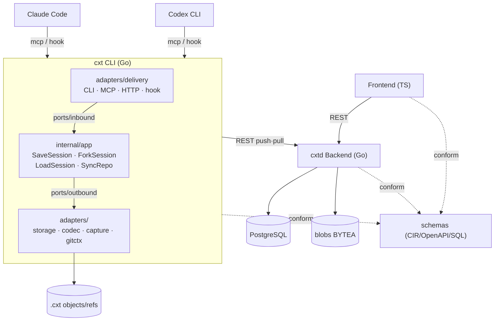
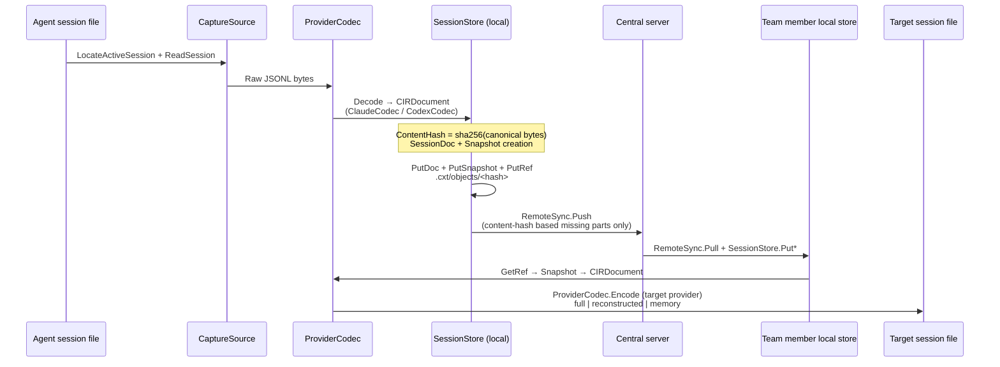

# cxthub

[](https://github.com/wnsdy95/cxthub/actions/workflows/ci.yml)
[](LICENSE)


> **"GitHub for coding-agent sessions."**
> Snapshot, fork, restore, and share Claude Code and Codex sessions through a
> familiar push/pull workflow.
>
> **cxthub** is the collaborative server and web interface; **`cxt`** is the
> local CLI. Their relationship mirrors GitHub and Git.

---

## Open Source and Official Hosting

`cxt`, `cxtd`, the web UI, schemas, and the self-hosting stack are licensed
under [Apache-2.0](LICENSE). The official `cxthub.com` service charges for
managed infrastructure, backups, upgrades, and operations—not for access to
the source. Self-hosting is supported on a best-effort community basis without
an SLA.

- Contribution: [`CONTRIBUTING.md`](CONTRIBUTING.md)
- Security Reporting: [`SECURITY.md`](SECURITY.md)
- Support Scope: [`SUPPORT.md`](SUPPORT.md)
- Trademarks and Official Distribution: [`TRADEMARKS.md`](TRADEMARKS.md)

---

## Core Concept Mapping (GitHub → cxthub)

| GitHub Concept | cxthub Domain | Description |
|---|---|---|
| **repo** | `Repo` | One context store per code repository, identified by its normalized Git remote URL. |
| **branch** | `Branch` | A context lineage named after the corresponding Git branch. |
| **commit** | `Snapshot` | Immutable session state at a point in time. `ID = sha256(canonical CIR bytes)`. |
| **tree/blob** | `SessionDoc` (CIR) | Content-addressed normalized conversation body. Identical content has the same hash and deduplicates automatically. |
| **fork** | `ForkSession` use case | Create a new branch from a snapshot without changing the original. |
| **HEAD** | `Ref{Kind: RefHEAD}` | Pointer to the latest snapshot of the current branch. |
| **tag** | `Ref{Kind: RefTag}` | Immutable label attached to a specific snapshot. |
| **push** | `RemoteSync.Push` | Send missing content-addressed objects, then advance remote refs. Non-fast-forward moves are rejected unless explicitly forced. |
| **pull** | `RemoteSync.Pull` | Fetch remote objects and fast-forward local refs. Diverged refs remain local unless `--force` explicitly adopts remote state. |
| **clone** | `SyncRepo` (initial pull) | Populate an empty local store from the remote repository. |
| **checkout / load** | `LoadSession` use case | Restore a provider session from a snapshot in `full`, `reconstructed`, or `memory` mode. |
| **diff** | `DiffSnapshots` use case | Compute the CIR event delta between two snapshots. |

> Core invariant: **Snapshot ID = content hash.** Equal normalized content has
> the same ID, enabling deterministic deduplication and integrity checks. Refs
> (branch, tag, and HEAD) are mutable pointers to snapshots.
>
> **Permanent record (P1):** PR merges, branch deletion, force pushes, and other
> ref changes never delete or rewrite context objects. There is no public delete
> API; only refs move.

---

## Team · Permissions · Secrets (Summary)

**Five role levels:** `viewer` (web read) < `puller` (download team assets) <
`member` (push context; default) < `maintainer` (manage settings, secrets, and
invites) < `owner` (workspace administration). Invite links carry an explicit
role.

- **Visibility:** workspaces are private by default. Public workspaces allow
  non-member reads, while writes still require membership. With GitHub
  visibility sync enabled, a workspace becomes public only when every linked
  GitHub repository is public, and the manual toggle is locked.
- **End-to-end encrypted secrets:** `.cxtsecrets` lists values that the CLI masks
  before capture and is never uploaded in plaintext. Team sharing stores only a
  PBKDF2-SHA256 (600k) + AES-256-GCM envelope; the server cannot decrypt it.
  Use the web repository settings or
  `cxt secrets pull -p <team-passphrase> --remember`.
- **Settings per snapshot:** `.claude`, `.agents`, and `.codex` settings can be
  attached to snapshots. Branch changes use a replace-and-backup stack, which
  can be inspected or restored with `cxt settings list` and
  `cxt settings restore`.

**Source of truth:** [SYNC-PROTOCOL §4](docs/SYNC-PROTOCOL.md) defines
authentication and roles; [schemas/openapi.yaml](schemas/openapi.yaml) is the
wire contract and is protected by route/schema drift tests.

## Installation

### Prerequisites

| Tool | Version | Purpose |
|---|---|---|
| Go | 1.26+ | Build the `cxt` CLI and `cxtd` server |
| Git | 2.28+ | Repository detection and optional automatic hooks, including `reference-transaction` |
| Node.js | 22+ | Build the React web UI in `frontend/web` |
| PostgreSQL | 16+ | Production `cxtd` metadata store; a filesystem store is available for development |

### Release Binary

```bash
curl -fsSL https://raw.githubusercontent.com/wnsdy95/cxthub/main/distrib/install | sh
```

The installer supports macOS and Linux on arm64 and amd64. Pin a release with
`CXT_VERSION=vX.Y.Z`.

### Build from Source

The module paths are `github.com/wnsdy95/cxthub/{cli,backend}`.

```bash
git clone https://github.com/wnsdy95/cxthub && cd cxthub
make build     # → bin/cxt, bin/cxtd
make install   # Install into $(go env GOPATH)/bin

# Server start: cxtd serve --addr 127.0.0.1:8907 --data ./cxt-data   (development authentication)
# Firebase authentication: CXT_AUTH=firebase CXT_FIREBASE_PROJECT=<id> cxtd serve …
```

### Integration (Claude Code · Codex)

Connect the assets in `integrations/` to each provider CLI. Detailed procedures
are in [`docs/GETTING-STARTED.md`](docs/GETTING-STARTED.md).

- **Claude Code** — `integrations/claude-code/`: plugin manifest, MCP registration, `/cxt-*` commands, and hooks
- **Codex CLI** — `integrations/codex/`: MCP configuration snippet and hooks

---

## Quick Start

### 1. Initialize a Repository and Connect an Origin

Like Git, cxt uses an `origin` URL as the repository identity. One URL determines
both the server API (`scheme://host/api/v1`) and the repository ID
(`sha256(normalize(url))`), so teammates who configure the same URL converge on
the same context repository.

```bash
cxt init                                                     # Create .cxt/ and install Git hooks
cxt remote add origin https://<host>/<username>/<workspace>   # Connect a cxt workspace URL
cxt login                                                    # One-time browser approval for writes
cxt remote -v                                                # Verify configuration

# cxt operates only inside Git repositories; .git is the source of truth.
# Without a cxt origin, snapshots remain local.
# Snapshots continue to accumulate before login and catch up on the next authenticated push.
```

### 1.5 Automatic Git Integration

`cxt init` installs six Git hooks (`post-commit`, `post-checkout`, `post-merge`,
`pre-push`, `reference-transaction`, and `post-rewrite`). After that, ordinary
Git commands keep code and context aligned:

| Git action | Automatic cxt action |
|---|---|
| `git commit` | Snapshot the active agent session, reuse the commit message, and attach a `[git <sha>]` link |
| `git checkout -b X` / `switch -c X` | Fork the current context onto branch X |
| `git branch X` without switching | Fork a ref from the context associated with X's Git commit, without changing the active session |
| `git checkout X` / `switch X` | Restore X's context and show a `claude --resume …` hint; use `cxt config checkout.mode prepare` for hint-only mode |
| `git push` | Run `cxt push`; reject non-fast-forward updates like Git unless `--force` is supplied |
| `git pull` / `merge` | Run `cxt pull`; leave a diverged local branch unchanged unless `--force` accepts the remote |
| Ref movement such as `git reset --hard` | Return automatically to the context associated with the new Git HEAD through the reference-transaction hook |
| `git rebase` / `commit --amend` | Record old→new mappings in `.cxt/rewrites.json` so `[git <sha>]` links follow rewrites |
| `git stash` / `stash pop` | Save the active session and return to branch-head context, or restore the saved session |

Hooks are fail-open: a cxt failure does not block Git, and existing hooks are
preserved through chaining. Use `cxt init --no-hooks` to opt out or
`cxt hooks uninstall` to remove them.

**Secret masking (`.cxtsecrets`):** create `.cxtsecrets` at the repository root
and place one secret value per line. Before saving a snapshot or stash, the CLI
deterministically replaces exact matches with
`{this is deleted by security policy}`. Masking happens before storage, so the
original value is never written to cxt or sent to the server. The file is
automatically excluded from Git.

**Shared team settings:** Upload folders named `claude` or `agents` (without a leading dot)
from the repository About settings in the web UI. Teammates can then run `cxt settings pull`
to update local `.claude/` and `.agents/` directories. This is the single distribution path
for shared CLAUDE.md files, commands, and agent configuration.

### 2. Save a Session

```bash
# Usually not needed — git commit creates a snapshot automatically via a hook (§1.5).
# Manual save (equivalent to cxt commit):
cxt save -m "Code analysis complete — auth module refactoring plan established"

# Claude Code slash command
/cxt-save

# Automatic save: register the Stop hook to capture a session when it ends
```

### 3. Fork a Session

```bash
# Fork from the current HEAD to a new branch
cxt checkout -b analysis/refactor

# Fork from a specific snapshot
cxt fork sha256:<hash> --as hotfix/auth
```

### 4. Load a Session

```bash
# Restore HEAD into the current provider's session file (full-context mode)
cxt load

# Inject a specific snapshot as provider memory (memory-form mode)
cxt load sha256:<hash> --mode memory

# Cross-provider load (replay Claude into Codex, reconstructed mode)
cxt load --provider codex
```

### 5. Synchronize with the Team

```bash
# Push local state to origin (the first push creates the repository on the server)
cxt push

# Pull origin state locally
cxt pull
```

### 6. Inspect History

```bash
# Branch snapshot list
cxt list

# Snapshot comparison is available through the web UI or the session_diff MCP tool.
```

---

## Architecture Diagram



### Data Flow (capture → CIR → store → sync → load)



---

## Component Map

### CLI (`cli/`, binary `cxt` — local tool, corresponds to git)

| Component | Package Import Path | Role |
|---|---|---|
| Entry Point | `cmd/cxt` | Composition root and command dispatch for the CLI, MCP server, and hooks. The server is the separate `cxtd` binary. |
| Domain | `internal/domain` | Entities, value objects, CIR types. Stateless. |
| Inbound Port | `internal/ports/inbound` | Use-case interfaces (SaveSession, etc.). |
| Outbound Port | `internal/ports/outbound` | Driven interfaces (SessionStore, etc.). |
| Use Cases | `internal/app` | Inbound-port implementations orchestrating outbound ports without adapter dependencies. |
| Local Store | `internal/adapters/storage` | Content-addressed `.cxt/` file store. |
| Codec | `internal/adapters/codec` | ClaudeCodec / CodexCodec — raw JSONL ↔ CIR. |
| Capture | `internal/adapters/capture` | Active-session discovery and hook-event capture scoped to the working directory. |
| Session Recovery | `internal/adapters/session` · `providerfs` | Snapshot → provider session file reconstruction. |
| Memory | `internal/adapters/memory` | Session distillation → provider memory injection. |
| Delivery | `internal/adapters/delivery/{cli,mcp,hook}` | User CLI / stdio MCP / hook handler. |
| Remote Client | `internal/adapters/backendclient` | Push/pull to `cxtd` (REST, non-FF rejection handling). |
| Git Context | `internal/adapters/gitctx` | Reads the worktree root, default branch, and origin from `.git`; fails outside a Git repository. |
| Remote Configuration | `internal/adapters/remotecfg` | `.cxt/config` — origin URL (server address+repo integrity), checkout mode, add staging. |
| Git Hooks | `internal/adapters/githooks` | Installs, chains, and removes six hooks; also manages `.git/info/exclude`. Fail-open. |

### Server (`backend/`, binary `cxtd` — central server, corresponds to GitHub)

| Component | Package Import Path | Role |
|---|---|---|
| Entry Point | `cmd/cxtd` | Composition root for `cxtd serve`. |
| Domain | `internal/domain` | CIR, repository, identity, workspace, invitation, and session types. |
| Inbound/Outbound Ports | `internal/ports/{inbound,outbound}` | Use-case and driven-adapter interfaces. |
| Use Cases | `internal/app` | Synchronization plus authentication, workspace, invitation, and session services. |
| Authentication | `internal/adapters/auth` | Firebase ID-token validation, development validation, and the legacy unused team-token adapter. |
| Store | `internal/adapters/store` | Filesystem store by default; PostgreSQL with `-tags postgres`. |
| REST Delivery | `internal/adapters/delivery/http` | REST handlers, HttpOnly cookie sessions, security middleware, and CORS. |
| Git Engine | `internal/adapters/gitengine` | Snapshot-DAG ancestry and reachability. |

### Frontend (TypeScript Clean Layered, `frontend/`)

| Layer | Directory | Role |
|---|---|---|
| Domain | `src/domain/` | Dependency-free TypeScript mirrors of SPINE §4 entities and CIR types. |
| Application | `src/application/` | Use-case interactors and outbound-port interfaces. |
| Infrastructure | `src/infrastructure/` | Fetch-based REST client (`cxtd` backend REST API calls). |
| Presentation | `src/presentation/` | Framework-independent view-model stubs. |

> The deployable web UI is in `frontend/web/` and uses React, Vite, Zustand,
> React Query, and Firebase login exchanged for an HttpOnly server session. The
> top-level `frontend/` package is a framework-independent layered contract.

### Integrations (integrations/)

| Directory | Target CLI | Provider |
|---|---|---|
| `integrations/claude-code/` | Claude Code | Plugin manifest + MCP registration + slash command + hook setup |
| `integrations/codex/` | Codex CLI | MCP server registration snippet (config.toml) + hook setup |

### Schema (schemas/)

| File | Role |
|---|---|
| `schemas/cir.schema.json` | CIR v1 JSON Schema (language-neutral contract) |
| `schemas/manifest.schema.json` | Manifest JSON Schema (push/pull negotiation catalog) |

---

## CLI/MCP Name Mapping Table

| CLI Subcommand | MCP Tool | Description |
|---|---|---|
| `cxt commit [-m]` / `cxt save` | `session_save` | Snapshot the active session; the Git commit hook invokes this automatically |
| `cxt add [claude\|codex]` | — | Stage provider sessions for the next commit (optional Git-add equivalent) |
| `cxt switch <branch> [-c]` | — | Checkout alias (git switch equivalent) |
| `cxt stash [push\|pop\|list]` | — | Save or restore active sessions (Git-stash equivalent, invoked automatically by Git stash hooks) |
| `cxt tag <name> [ref]` | — | Immutable tag creation/listing (git tag equivalent) |
| `cxt hooks install\|uninstall` | — | Manual management of git hooks (`cxt init` automatically installs) |
| `cxt config checkout.mode auto\|prepare` | — | Context action on git branch movement |
| `cxt list` | `session_list` | Snapshot/ref list retrieval |
| `cxt fork` | `session_fork` | Create a new branch from a specified snapshot |
| `cxt load` | `session_load` | Snapshot → Session file restoration |
| (Web/MCP specific) | `session_diff` | Delta of CIR events between two snapshots |
| `cxt memory save` | `memory_save` | Session distillation → MemoryDigest storage |
| `cxt load <ref> --mode memory` | `memory_load` | MemoryDigest → Provider memory injection |
| `cxt remote add origin <url>` | — | Connect a server repository URL that determines both API location and repository identity |
| `cxt push` | `sync_push` | Local → origin push (first push creates repo on server) |
| `cxt pull` | `sync_pull` | origin → Local pull |
| `cxtd serve` | — | Start the HTTP API (`cxtd` only; the web UI is deployed separately and there is no `cxt serve`) |
| `cxt mcp` | — | Start the stdio MCP server |
| `cxt hook` | — | Hook event handler (`--provider`, `--event`) |

---

## Dual CLI Compatibility

cxt is a **single Go binary** that connects to both the Claude Code and Codex CLI.

| Integration | Claude Code | Codex CLI |
|---|---|---|
| **MCP server** | Register `cxt mcp` in `.mcp.json` | Register `[mcp_servers.cxt]` in `~/.codex/config.toml` |
| **Automatic hook capture** | `.claude/settings.json` — SessionStart/UserPromptSubmit/Stop/SessionEnd | `~/.codex/hooks.json` — SessionStart/UserPromptSubmit/Stop |
| **Slash commands** | Definitions in `commands/*.md`, such as `/cxt-save` | Custom prompts in `prompts/cxt-*.md`, exposed as `/prompts:cxt-*` |
| **Session file location** | `~/.claude/projects/<cwd-encoded>/<sessionId>.jsonl` | `~/.codex/sessions/YYYY/MM/DD/rollout-<ts>-<uuid>.jsonl` |
| **Cross-provider load** | Claude session → CIR → Codex session file (`reconstructed` tier) | Codex session → CIR → Claude session file |

> Cross-provider replay limitation: `thinking.signature` (Claude) and
> `reasoning.encrypted_content` (Codex) are provider-locked. Cross-provider loads disable
> them and fall back to `redacted_summary`. Text and tool-call transcripts still replay,
> and the fidelity tier is reported as `reconstructed`.

---

## Further Reading

- [`docs/_SPINE.md`](docs/_SPINE.md) — Frozen historical architecture contract
- [`docs/_RESEARCH-FINDINGS.md`](docs/_RESEARCH-FINDINGS.md) — Empirical provider session-format research
- [`docs/ARCHITECTURE.md`](docs/ARCHITECTURE.md) — System-wide architecture (C4 level)
- [`docs/GETTING-STARTED.md`](docs/GETTING-STARTED.md) — Development environment setup
- [`docs/BACKEND-ARCHITECTURE.md`](docs/BACKEND-ARCHITECTURE.md) — Detailed Go hexagonal architecture
- [`docs/FRONTEND-ARCHITECTURE.md`](docs/FRONTEND-ARCHITECTURE.md) — Detailed TypeScript clean layered architecture
- [`docs/DATA-MODEL.md`](docs/DATA-MODEL.md) — Data model (git-inspired)
- [`docs/CROSS-COMPAT.md`](docs/CROSS-COMPAT.md) — Cross-compatibility design
- [`docs/SYNC-PROTOCOL.md`](docs/SYNC-PROTOCOL.md) — Synchronization protocol
- [`docs/CAPTURE.md`](docs/CAPTURE.md) — Session capture design
- [`docs/MEMORY.md`](docs/MEMORY.md) — Memory distillation design
- [`docs/PRICING-AND-QUOTAS.md`](docs/PRICING-AND-QUOTAS.md) — Approved v1 pricing plans and workspace quotas contract (implementation pending)
- [`docs/OPEN-SOURCE-RELEASE.md`](docs/OPEN-SOURCE-RELEASE.md) — Procedures for creating, validating, and setting up a new open repository on GitHub
- [`schemas/cir.schema.json`](schemas/cir.schema.json) — CIR v1 JSON Schema
- [`schemas/manifest.schema.json`](schemas/manifest.schema.json) — Manifest JSON Schema
