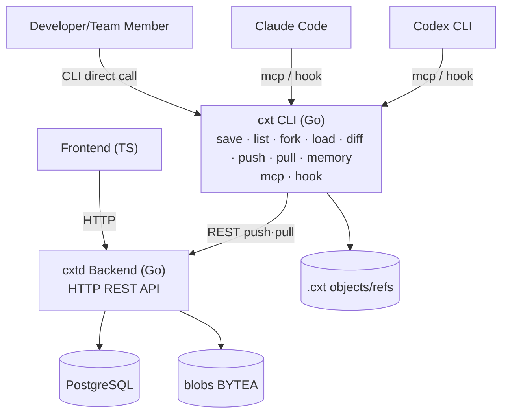
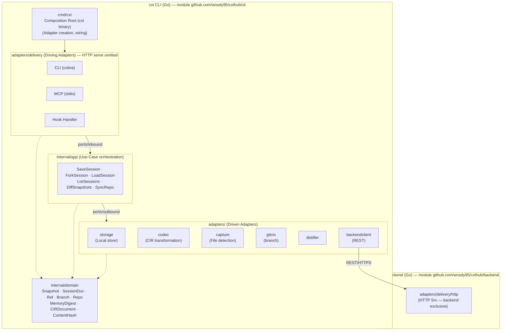
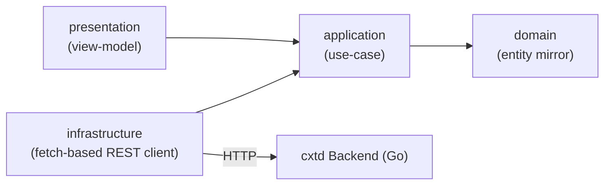
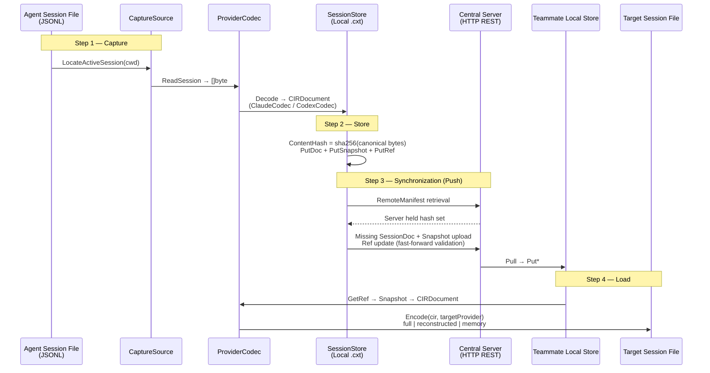

# cxthub — System Architecture

> This document provides a **C4 context/container-level** overview of cxt.
> Historical design contracts are preserved in [`_SPINE.md`](./_SPINE.md), while the current code and schemas are authoritative for implemented behavior.
> Empirical provider-format evidence is recorded in [`_RESEARCH-FINDINGS.md`](./_RESEARCH-FINDINGS.md).
> The document began as the design-and-scaffold contract in SPINE §9 and now includes the implemented system deltas described below.

---

## 0. One-Line Summary

cxt snapshots, forks, and restores Claude Code and Codex sessions, then synchronizes them with a central server through a Git-like push/pull workflow.
It ships as two binaries: `cxt` (CLI, MCP, and hook entry points; module `github.com/wnsdy95/cxthub/cli`) and
`cxtd` (HTTP server; module `github.com/wnsdy95/cxthub/backend`). The CLI does not embed the server.

---

## 1. C4 Context — System Boundary and External Actors



External Actor Roles:
- **Developer/Team Member**: Directly call the CLI or indirectly call MCP tools/slash commands within an agent.
- **Claude Code**: Connect to the MCP server (`cxt mcp`) and hooks (`cxt hook --provider claude`).
- **Codex CLI**: Connect to the MCP server via `[mcp_servers.cxt]` in `~/.codex/config.toml` and hooks via `~/.codex/hooks.json`.
- **Web Browser**: Access the team session browser UI through the HTTP API exposed by `cxtd`.

---

## 2. C4 Container — Internal Component Composition

### 2.1 Overview of the Container



### 2.2 Frontend Container (TypeScript Clean Layered)



---

## 3. Component Responsibility Details

### 3.1 Backend Components

| Package | Import Path (Module: `github.com/wnsdy95/cxthub/cli`) | Responsibility | Dependencies |
|---|---|---|---|
| cmd/cxt | `cmd/cxt` | Composition root. Adapter creation and injection, entry point branching. | Everything |
| domain | `internal/domain` | Entities, value objects, CIR types. Maintains invariants. | Standard lib only |
| ports/inbound | `internal/ports/inbound` | Use-case interfaces 6. | domain |
| ports/outbound | `internal/ports/outbound` | Driven interfaces 6. | domain |
| app | `internal/app` | Use-case orchestration. inbound implementation, outbound calls. | domain, ports |
| adapters/storage | `internal/adapters/storage` | FileStore(content-addressed), RemoteClient. | domain, ports/outbound |
| adapters/codec | `internal/adapters/codec` | ClaudeCodec, CodexCodec. JSONL ↔ CIR. | domain, ports/outbound |
| adapters/capture | `internal/adapters/capture` | Session file location detection, raw byte reading. | domain, ports/outbound |
| adapters/delivery | `internal/adapters/delivery` | CLI/MCP/HTTP/hook handlers. | domain, ports/inbound |
| adapters/gitctx | `internal/adapters/gitctx` | Repo/branch lookup (git CLI or libgit). | domain, ports/outbound |

Dependency Rules (Enforced):
1. `domain` does not import internal packages (dependency sink).
2. `ports/*` only imports `domain` (no mutual imports).
3. `app` only imports `domain` + `ports` (does not know adapters).
4. `adapters/*` only imports `domain` + `ports` (no direct imports of other adapters).
5. Only `cmd/cxt` can import everything (composition root).

### 3.2 Summary of Outbound Port Interfaces

| Interface | Responsibility | Implementation Location |
|---|---|---|
| `SessionStore` | Content-addressed snapshot/document/ref persistence | `adapters/storage` |
| `ProviderCodec` | Provider raw JSONL ↔ CIR bidirectional conversion | `adapters/codec` |
| `CaptureSource` | Active session file detection + raw byte reading | `adapters/capture` |
| `GitContext` | Current repo/branch lookup | `adapters/gitctx` |
| `RemoteSync` | Synchronization of snapshots/refs with central server | `adapters/storage` |
| `MemoryDistiller` | CIR → MemoryDigest distillation | `adapters/` (distiller) |

### 3.3 Inbound Port (Use-Case) Summary

| Interface | Core Method | Role |
|---|---|---|
| `SaveSession` | `Save(ctx, SaveInput) SaveOutput` | Active session → Snapshot commit |
| `ForkSession` | `Fork(ctx, ForkInput) ForkOutput` | Snapshot → New branch fork |
| `LoadSession` | `Load(ctx, LoadInput) LoadOutput` | Snapshot → Target session file restoration |
| `ListSessions` | `List(ctx, ListInput) ListOutput` | Snapshot/ref list retrieval |
| `DiffSnapshots` | `Diff(ctx, DiffInput) DiffOutput` | Two snapshots CIR delta |
| `SyncRepo` | `Push`, `Pull(ctx, SyncInput) SyncOutput` | Local ↔ Central server synchronization |

---

## 4. Data Flow — capture → CIR → store → sync → load



---

## 5. CIR v1 — Provider-Independent Regular Expression

CIR (Canonical Intermediate Representation) is a regular schema that represents claude/codex JSONL in a provider-independent manner.
The JSON Schema source of truth is [`../schemas/cir.schema.json`](../schemas/cir.schema.json).

```
CIRDocument
├── envelope: Envelope
│   ├── cir_version: "1"
│   ├── source_provider: "claude" | "codex"
│   ├── source_model: string
│   ├── captured_at: RFC3339
│   ├── cwd: string
│   ├── git_branch: string
│   ├── session_origin_id: string
│   └── fidelity: "full" | "reconstructed" | "memory"
└── events: Event[]
    ├── turn        { kind, id, ts, seq, role }
    ├── message     { kind, id, ts, seq, role, blocks: [{type:"text",text}] }
    ├── tool_call   { kind, id, ts, seq, call_id, tool_name, provider_tool_name, input }
    ├── tool_result { kind, id, ts, seq, call_id, output, is_error }
    └── reasoning   { kind, id, ts, seq, locked?, redacted_summary?, cross_replayable }
```

Cross-compatibility constraints:
- `thinking.signature` (Claude) / `reasoning.encrypted_content` (Codex) = provider-locked.
- Same-provider load: `locked.blob` original re-injection → `fidelity: full`.
- Cross-provider load: `locked` disabled, `redacted_summary` only fall back re-run → `fidelity: reconstructed`.

---

## 6. Integration Entry Points (integrations/)

```
integrations/
├── claude-code/
│   ├── .claude-plugin/plugin.json    # Plugin manifest
│   ├── .mcp.json                     # Register stdio MCP server: "cxt mcp"
│   ├── commands/                     # Slash commands (.md): /cxt-save, /cxt-load, ...
│   └── hooks/hooks.json              # SessionStart/Stop/SessionEnd/PreToolUse
│                                     #   → "cxt hook --provider claude --event <Name>"
└── codex/
├── config.snippet.toml           # [mcp_servers.cxt] block (merged into ~/.codex/config.toml)
    └── hooks.json                    # SessionStart/Stop/UserPromptSubmit
                                      #   → "cxt hook --provider codex --event <Name>"
```

Hook pattern (empirically verified, based on `_RESEARCH-FINDINGS.md`):
```json
{
  "hooks": {
    "Stop": [{
      "hooks": [{
        "type": "command",
        "command": "cxt hook --provider codex --event Stop",
        "timeout": 10
      }]
    }]
  }
}
```

---

## 6.5 Implementation Delta (2026-07) — Additional Axis After Scaffolding

1. **Git Native Automatic Integration (CLI)** — `cxt init` installs 6 git hooks (post-commit·post-checkout·post-merge·
   pre-push·reference-transaction·post-rewrite) to synchronize context automatically with git commands (commit/checkout/branch/reset/rebase/
   stash/push/pull). `.git` is the sole source of truth (fails in non-git folders, `.cxt` is fixed to the worktree root). Details: CLI-ARCHITECTURE §1·§6.
2. **Authentication·Multi-tenancy (backend + web)** — Firebase(RS256)/dev verification → DB session (HttpOnly `cxt_session`
   cookie, 30 days) → workspace/membership/share invitations. URLs are GitHub style `/<username>/<workspace-slug>`.
   Repos are automatically bound to the workspace on push and filtered by membership.
   Advanced: Session tokens are stored as **at-rest hashes** (sha256, `tkh_`), CLI login uses **device flow**
   (`cxt login` → browser approval → polling receipt), dev verifier denies startup outside loopback binding unless
   `CXT_AUTH=dev` is explicitly set (safety guard).
3. **Git Policies (server+client)** — ref movement fast-forward only (409 rejection, `--force` exception), tag immutability,
   pull conflict cancellation (local retention), stash local exclusive. Diverged push is `--append` to server head
   **lossless graft** (snapshot loss prevention — unlike Force, protects policy targets). SYNC-PROTOCOL §5.
4. **Web UI (frontend/web)** — React+Vite. Path routing (History API), workspace tabs (context|member|connection),
   context browser (branch dropdown·commit log·commit graph·branch/tag badges·CIR conversation viewer —
   prompt-only viewing·search(`GET /repos/{id}/search`)·fork/compare(diff) actions included),
   AI attribution bar (AIBar — models snapshot), About/Team settings/secret rail, public browsing (PublicBrowse),
   settings modal (Settings — session/token device name), CLI pairing approval page (/login/device).
   Zustand+React Query. FRONTEND-ARCHITECTURE §8.
5. **Role 5-Step Ladder (backend + web)** — `viewer < puller < member < maintainer < owner`
   (`domain.RoleRank`/`AtLeast`/`ValidRole`). All repo REST routes have role gates (guards),
   invitations are **only to equal or lower roles** (preventing role upgrades), role changes (`UpdateMemberRole`) are owner-only.
6. **Context Switch Boundary (CLI)** — Branch switch: **checkpoint→isolation→seed→execution**:
   Snapshot and push previous session to previous branch → isolate (rename+permanent exclusion) old session file →
   Creating a new branch seed session materialization → Isolate the session by terminating the agent (lsof/kill).
   The agent wrapper `cxt claude`/`cxt codex` monitors `.cxt/boundary.json` and automatically restarts as a seed.
   CLI-ARCHITECTURE §5·§6.
7. **load_mode Personal Setting** — Account-wide load fidelity (web Settings → `PATCH /me` save). CLI performs
   a short timeout pull at the consumption point (load/checkout), falling back to cache if offline. Priority:
   `--mode` flag > local `load.mode` > server personal setting > full.
8. **Notification Webhook (backend)** — Workspace webhook (Slack incoming webhook compatible) for ref updates,
   member joins, and secret refreshes (best-effort, idempotent retries are silent). SSRF is defended at the dialer
   level IP pinning (`safeWebhookClient`, self-hosted exception `CXT_ALLOW_PRIVATE_WEBHOOK=1`).

## 7. Design Document Index

| Document | Content |
|---|---|
| [`_SPINE.md`](./_SPINE.md) | **Single Source of Truth** — Directory tree/entity/port/CIR/name/rules contract |
| [`_RESEARCH-FINDINGS.md`](./_RESEARCH-FINDINGS.md) | Empirically verified session format (ground truth) |
| [`ARCHITECTURE.md`](./ARCHITECTURE.md) | This document — System overview |
| [`BACKEND-ARCHITECTURE.md`](./BACKEND-ARCHITECTURE.md) | Go hexagonal backend details |
| [`CLI-ARCHITECTURE.md`](./CLI-ARCHITECTURE.md) | cxt CLI hexagonal architecture details (cmd/mcp/hook, adapter map) |
| [`FRONTEND-ARCHITECTURE.md`](./FRONTEND-ARCHITECTURE.md) | TypeScript clean layered frontend details |
| [`DATA-MODEL.md`](./DATA-MODEL.md) | Git-inspired data model (Snapshot DAG, store layout) |
| [`CROSS-COMPAT.md`](./CROSS-COMPAT.md) | Claude ↔ Codex JSONL ↔ CIR bidirectional transformation contract |
| [`SYNC-PROTOCOL.md`](./SYNC-PROTOCOL.md) | Central server ↔ local sync protocol (REST/have-want) |
| [`CAPTURE.md`](./CAPTURE.md) | Session capture facet design (auto/manual entry, pipeline) |
| [`MEMORY.md`](./MEMORY.md) | Memory distillation (MemoryDistiller) + two load mode design |
| [`PRICING-AND-QUOTAS.md`](./PRICING-AND-QUOTAS.md) | Approved v1 pricing plans·seats·storage·transmission quotas contract (implementation pending) |
| [`PRIMARY-USE-CASE.md`](./PRIMARY-USE-CASE.md) | User confirmed primary journey (init→save→fork→load→push) |
| [`GETTING-STARTED.md`](./GETTING-STARTED.md) | Development environment setup guide |
| [`OPEN-SOURCE-RELEASE.md`](./OPEN-SOURCE-RELEASE.md) | New public repository export·security validation·GitHub setup procedures |
