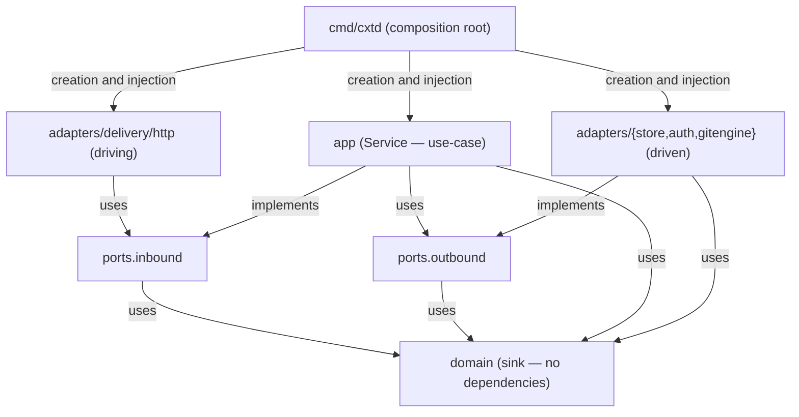

# cxthub — Backend Architecture (`cxtd` server, Go Hexagonal Architecture)

This document describes the architecture implemented by the **backend module** (`backend/internal/**`, `backend/cmd/cxtd`). Historical module separation is recorded in [`_ARCHITECTURE-R2.md`](./_ARCHITECTURE-R2.md); wire and persistence contracts live in [`schemas/`](../schemas).

**Scope:** module `github.com/wnsdy95/cxthub/backend`, binary `cxtd`, entry point `serve`. CLI-only concerns—provider codecs, capture, materialization, memory I/O, Git worktree integration, and the local store—are documented in [`CLI-ARCHITECTURE.md`](./CLI-ARCHITECTURE.md).

**Core separation:** the backend never parses raw Claude or Codex session formats. It stores and validates provider-neutral CIR and content hashes, and implements Git-like commit, branch, fork, diff, and ref semantics over that representation.

**Implementation status (2026-07):** synchronization, storage, Git graph operations, REST delivery, authentication, and workspace management are implemented. The filesystem store is the default development adapter; PostgreSQL is enabled by the `postgres` build tag. Ref updates are fast-forward only unless the caller explicitly requests `force` or the lossless `append` overlay. Tags are immutable.

---

## 0. Summary (At a Glance)

`cxtd` is the central server binary (_ARCHITECTURE-R2 §1: Go, container) and its internal structure is composed of **Hexagonal Architecture (ports & adapters)**. Dependencies always flow in the direction **from outside (adapters/delivery) to inside (domain)**, and `domain` is a sink (nothing imports it).

- **domain** (`internal/domain`) — Server-side entities/value objects/CIR types. Depends only on stdlib (`time`). Shape (wire/JSON) is derived from the `schemas/` source of truth (no CLI or code sharing, complete separation).
- **ports** (`internal/ports/{inbound,outbound}`) — Interface contracts. inbound = server use-cases (REST delivery calls), outbound = driven capabilities (app requires infrastructure).
- **app** (`internal/app`) — `Service` (all synchronization use-cases) + `IdentityService` (authentication·workspace·membership·invitation·DB session). Does not depend on adapters.
- **adapters** (`internal/adapters/*`) — Concrete implementations of ports: `store` (FSStore default / PostgresStore tag), `auth` (FirebaseVerifier·DevVerifier — `TeamTokenAuth` is legacy/unused, SYNC-PROTOCOL §4.1), `gitengine` (git meaning engine), `delivery/http` (REST + HttpOnly cookie session + 5-tier role guard + CORS + device flow).
- **cmd/cxtd** — The unique composition root. Creates and injects adapters and starts the HTTP server with the `serve` subcommand.

The server's responsibilities are **object storage · integrity validation · ref policy (ff-only CAS) · push/pull negotiation · authentication (Firebase/session — tokens are stored as at-rest hashes) · workspace visibility (5-tier role ladder)** (SYNC-PROTOCOL §0–6). Session capture, codec transformation, memory distillation, and session file synthesis are not the server's responsibility (all handled by CLI).

---

## 1. Layer Responsibilities

import path is based on the module `github.com/wnsdy95/cxthub/backend`.

### 1.1 domain (`internal/domain`) — The backbone of entities
- **Files**: `entities.go`, `values.go`, `cir.go`, `identity.go`.
- **Dependencies**: stdlib only. No internal package imports (sync).
- **Value Objects/Enums** (`values.go`): `ContentHash`(`sha256:<hex>`), `ProviderKind`(`claude|codex|unknown`), `FidelityTier`(`full|reconstructed|memory`), `RefKind`(`head|branch|session|tag`), constant `HeadRefName="HEAD"`, value object `TeamIdentity{Name,Email,Team}`.
- **Entities** (`entities.go`): `Repo`, `Snapshot`, `Branch`, `Ref`, `Manifest`, `MemoryDigest`. Each type has invariant documentation in the doc comment (e.g., Snapshot S-ID/H1, Ref REF1–4, Manifest M1/M2/C1).
- **CIR Types** (`cir.go`): `CIRDocument`(=`CIREnvelope`+`[]CIREvent`), `CIREvent`(kind tag flattened union), `ContentBlock`, `LockedBlob`, `SessionDoc`(snapshot body = `Hash`+`CIR`), enum `EventKind`/`Role`. The server does not interpret the CIR meaning and simply round-trips the body, recalculating only the `canonical_bytes` hash for integrity verification.
- **Authentication/Multi-tenancy Types** (`identity.go`): `User`(username handle, nickname, `LoadMode` personal settings), `Workspace`(slug·visibility·policy·archive·webhook_url), `Membership`, `Invite`, `Session`. **Role Ladder** `MemberRole`(`viewer<puller<member<maintainer<owner`) and `RoleRank`/`AtLeast`/`ValidRole`(unknown value rank 0 — permissive rejection). Session token at-rest hash `HashToken`(sha256, `tkh_` prefix)·`TokenHint`(last 8 characters).

**Server domain differs from CLI**: `Repo.LocalPath` is always an empty string on the server (local-only field). Fidelity (`FidelityTier`) is stored in the Snapshot metadata by the server **without generating** it (loaded by the CLI). `LockedBlob`(claude=signature, codex=encrypted_content) is also stored opaquely and not interpreted or cross-injected.

### 1.2 ports (`internal/ports/{inbound,outbound}`) — contract
- **inbound** (`inbound/inbound.go`): Server use-case (driving) interface + DTO. Business entry point called by the REST delivery layer.
- **outbound** (`outbound/outbound.go`): Driven capability interfaces (`MetadataStore`/`BlobStore`/`AuthProvider`/`GitEngine`).
- **Dependency**: `domain` only. inbound/outbound do not import each other.

### 1.3 app (`internal/app`) — use-case service
- **files**: `service.go` (single `Service`), `errors.go` (`errNotImplemented` sentinel).
- **Responsibility**: inbound port implementation + outbound port invocation. Many use-cases involve combining multiple ports (e.g., Commit = GitEngine.VerifyIntegrity + BlobStore.PutDoc + MetadataStore.PutSnapshot, write order W1). **Grouped into one `Service`**.
- **Dependency**: `domain` + `ports`. Adapter imports forbidden.

### 1.4 Adapters (`internal/adapters/*`) — Port Implementation
- **Responsibility**: Driven adapters (`store`/`auth`/`gitengine`) implement outbound ports, while driving adapters (`delivery/http`) call inbound ports.
- **Dependencies**: `domain` + `ports`. Adapters do not directly import other adapter packages (collaboration via ports only). Default build is stdlib only (pgx is behind the `postgres` tag).

### 1.5 cmd/cxtd (`cmd/cxtd`) — Composition Root
- **File**: `main.go`.
- **Responsibility**: Adapter creation → `app.Service` injection → `delivery/http.Server` injection → HTTP server startup. DI is limited to here. The only subcommand is `serve`.

---

## 2. Dependency Rules (Hexagonal Architecture, Enforced)

Arrows indicate compile-time import direction, always from outside → inside.



Immutable Rules:
1. `domain` does not import any internal packages (only stdlib `time`).
2. `ports.inbound` / `ports.outbound` only import `domain` (mutual import is forbidden).
3. `app` only imports `domain` + `ports`. Adapter imports are forbidden.
4. `adapters/*` only import `domain` + `ports`. Direct imports of other `adapters/*` are forbidden.
5. Only `cmd/cxtd` can import everything. DI is limited to here.

**Basic build is stdlib only**: FSStore is the default, so it is GREEN without external services. pgx is imported only in the `//go:build postgres` file and is activated with `go build -tags postgres` (`store.Open` factory selects based on build tag/DSN).

---

## 3. Domain — Server Entities and Invariants

Move the types and their invariant doc comments declared in the code (`entities.go`/`values.go`/`cir.go`) to the schema files. The structural schema is [`schemas/cir.schema.json`](../schemas/cir.schema.json) · [`schemas/manifest.schema.json`](../schemas/manifest.schema.json), and the semantic schema is [`DATA-MODEL.md`](./DATA-MODEL.md) · [`SYNC-PROTOCOL.md`](./SYNC-PROTOCOL.md).

| Type | Fields (Yoga) | Core Invariants |
|---|---|---|
| `Repo` | `ID(ContentHash)`, `RemoteURL`, `LocalPath`(server is always ""), `DefaultBranch` | ID is a multi-tenant isolation key (generated by CLI, server is trusted). |
| `Snapshot` | `ID`, `RepoID`, `Branch`, `Branches[]`, `Parents[]`, `GraftParents[]`, `GraftSeq`, `DocHash`, `MemoryHash`(opt), `Provider`, `Fidelity`, `Message`, `Author`, `CreatedAt`, `SessionID`, `Models[]`, `CompactionCount` | **S-ID/H1**: `ID == DocHash == ContentHash(canonical_bytes(SessionDoc.CIR))`. The body and natural `Parents` are immutable. `Branches` and `(GraftParents,GraftSeq)` etc. are merged and CAS updated via hash outside projection/overlay. Reachability is `Parents ∪ GraftParents`; high graft seq replaces the entire set, and legacy seq=0 union. |
| `Branch` | `Name`, `RepoID`, `Head` | B1: `Head == Ref(branch,Name).Target`(read view, source is Ref). |
| `Ref` | `Kind(RefKind)`, `Name`, `RepoID`, `Target`, `Symbolic`(opt) | REF1 target exists, REF2 tag is immutable, REF3 one head per repo (Name="HEAD"), REF4 tip forward only ff/explicit. |
| `Manifest` | `RepoID`, `Refs[]`, `SnapshotIndex[]`, `Version`, `UpdatedAt` | M1 dangling ref forbidden, M2 Version monotonic increase, C1 write requires version-CAS. |
| `MemoryDigest` | `SnapshotID`, `Summary`, `KeyFacts[]`, `OpenTasks[]`, `Provider` | Derived. Target snapshot must exist before upload (422 if not). CIR-neutral. |
| `SessionDoc` | `Hash`, `CIR(CIRDocument)` | H1: `Hash == ContentHash(canonical_bytes(CIR))`. Wire `docs/{hash}`. |
| `CIRDocument` | `Envelope(CIREnvelope)`, `Events[]CIREvent` | Server interprets nothing but round-trip + hash recalculation. |

**Value enums**: `ProviderKind = claude|codex|unknown`, `FidelityTier = full|reconstructed|memory`, `RefKind = head|branch|session|tag`, `EventKind = turn|message|tool_call|tool_result|reasoning`, `Role = user|assistant|system|developer`.

ContentHash determinism is tied to canonical serialization (`canonical_bytes`, RFC 8785 JCS-oriented: key sorting, whitespace removal, event seq sorting, NFC, number normalization). This algorithm must be **byte-for-byte identical** to the client codec (DATA-MODEL §3.1).

---

## 4. Outbound Port — Driven Interface (Actual Signature)

> This is the actual interface in `internal/ports/outbound/outbound.go`. It only references `domain` types, and the first argument is `context.Context`.

```go
package outbound

// MetadataStore persists metadata (immutable snapshot metadata + mutable ref/manifest).
// Implementation (impl): PostgreSQL. The body (CIR doc/memory) is stored in BlobStore (metadata/body separation).
type MetadataStore interface {
	GetRepo(ctx, id ContentHash) (Repo, error)
	PutRepo(ctx, repo Repo) (Repo, error)            // idempotent (same id means existing return)
	ListRepos(ctx, team string) ([]Repo, error)

	GetSnapshot(ctx, repoID, id ContentHash) (Snapshot, error)
	PutSnapshot(ctx, snap Snapshot) error            // content-addressed dedup(idempotent upsert)
	ListSnapshots(ctx, repoID ContentHash, branch string) ([]Snapshot, error)
	HasSnapshots(ctx, repoID ContentHash, ids []ContentHash) (have []ContentHash, err error)

	GetRef(ctx, repoID ContentHash, kind RefKind, name string) (Ref, error)
	ListRefs(ctx, repoID ContentHash) ([]Ref, error)
	CompareAndSwapRef(ctx, repoID ContentHash, next Ref, expected ContentHash) error // optimistic locking
	GetManifest(ctx, repoID ContentHash) (Manifest, error)

	GetMemoryMeta(ctx, repoID, snapshotID ContentHash) (MemoryDigest, error)
	PutMemoryMeta(ctx, repoID ContentHash, digest MemoryDigest) error
}

// BlobStore stores content-addressed immutable bodies (v1 = Postgres BYTEA, later S3).
type BlobStore interface {
	PutDoc(ctx, repoID ContentHash, doc SessionDoc) (stored bool, err error) // dedup: already exists, stored=false
	GetDoc(ctx, repoID, hash ContentHash) (SessionDoc, error)
	HasDocs(ctx, repoID ContentHash, hashes []ContentHash) (have []ContentHash, err error)

	PutMemory(ctx, repoID ContentHash, digest MemoryDigest) (hash ContentHash, err error)
	GetMemory(ctx, repoID, hash ContentHash) (MemoryDigest, error)
}

// AuthProvider (legacy/unused — team token model discarded, SYNC-PROTOCOL §4.1): Originally verified team tokens and determined visibility boundaries.
type AuthProvider interface {
	ResolveTeam(ctx, token string) (team string, err error)        // invalid → 401
	RepoVisible(ctx, team string, repoID ContentHash) (bool, error) // inaccessible → 403
}

// IdentityVerifier verifies IDP tokens (Firebase ID token / dev token) and returns a User.
type IdentityVerifier interface { Verify(ctx, idToken string) (User, error) }

// WorkspaceStore persists user, workspace, membership, invitations, and DB sessions (0002~0004 schemas).
// Includes GetUserByUsername (handle unique), GetWorkspaceByPath (owner_username+slug — repo binding),
// CreateSession/GetSession/DeleteSession (HttpOnly cookie session).

// GitEngine is a git semantics engine (CIR/hash-based, provider format agnostic).
type GitEngine interface {
	IsAncestor(ctx, repoID, ancestor, descendant ContentHash) (bool, error)
	MergeBase(ctx, repoID, a, b ContentHash) (ContentHash, error)
	AncestorsClosure(ctx, repoID ContentHash, ids []ContentHash) ([]ContentHash, error)
	ClassifyRefMove(ctx, repoID, old, next ContentHash) (RefMoveClass, error)
	VerifyIntegrity(ctx, snap Snapshot, doc SessionDoc) error
}
// RefMoveClass = fast_forward | up_to_date | non_fast_forward | diverged
```

Each outbound port's caller and implementation adapter:

| Port | Implementation Adapter (§6) | Primary Calling Use-Case (§5) |
|---|---|---|
| `MetadataStore` | `store.PostgresStore` | Commit · CreateBranch · Fork · UpdateRef · List · Negotiate · Send |
| `BlobStore` | `store.PostgresBlobStore` | Commit · Send · (memory PUT) |
| `AuthProvider` | `auth.TeamTokenAuth` (legacy/unused) | Authenticate (team token) — discarded (§4.1); current authentication is IdentityVerifier + guard |
| `IdentityVerifier` | `auth.FirebaseVerifier`(RS256, Google public key) / `auth.DevVerifier`("dev:<email>:<name>") | IdentityService.Authenticate/Login |
| `WorkspaceStore` | `store.FSStore` / `store.PostgresStore` | IdentityService all + Service.EnsureRepo (workspace binding) |
| `GitEngine` | `gitengine.Engine` | Commit (VerifyIntegrity) · UpdateRef (ClassifyRefMove) · Fork · Diff · Negotiate (AncestorsClosure) |

> **Metadata/Body Separation** (DATA-MODEL §6.2): `MetadataStore` handles metadata tables (`repos`/`branches`/`refs`/`snapshots`/`memories`/`team_identities`), while `BlobStore` handles content bodies (CIR doc · memory digest, `blobs(hash PK, bytes BYTEA)`). Both use `sha256:<hex>` key deduplication.

---

## 5. Inbound Port + app `Service` — Use-Case (Actual Signature)

> `internal/ports/inbound/inbound.go`'s interfaces/DTOs and `internal/app/service.go`'s `Service` implementation (implementation complete).

`app.Service` generates 5 outbound ports (`meta`/`blobs`/`auth`/`engine`/`ws`) via constructor injection and implements all 9 inbound ports (compile-time `var _ inbound.X = (*Service)(nil)` assertion).

```go
type Service struct { meta MetadataStore; blobs BlobStore; auth AuthProvider; engine GitEngine; ws WorkspaceStore }
func NewService(meta, blobs, auth, engine, ws) *Service
// EnsureRepo: parses remote URL path (/<owner_username>/<slug>/…) to auto-bind repo.workspace_id.
```

The authentication and workspace use-case is handled by a separate `IdentityService` (`identity_service.go`):
- Authenticate (IDP token → User upsert, auto-assign unique username on first login)
- Login/Logout/ResolveSession (30-day DB session — **store only `HashToken` hash**, original in issuance response/cookie; `Hint`(last 8 characters)+`Kind`(web|cli) for identification)
- ResolveUser (session or IDP token)
- UpdateProfile (username·nickname·**load_mode** partial PATCH)
- CreateCLIToken/ListCLITokens/RevokeCLIToken (CLI session tokens)
- ListWebSessions/RevokeWebSession
- CreateWorkspace (auto slug, owner membership)
- UpdateWorkspaceSettings (visibility·policy·archive·webhook — owner-only)
- TransferOwnership
- Invite (maintainer or higher + **only assign roles below your own** — permission promotion blocked)/AcceptInvite (shared token, idempotent)
- **UpdateMemberRole (owner-only)**/RemoveMember
- ListMembers/RevokeInvite
- Legacy slug backfill.

| inbound port | method | DTO | collaborating outbound · contract (SYNC-PROTOCOL) |
|---|---|---|---|
| `CommitSnapshot` | `Commit(CommitInput) CommitOutput` | in: RepoID, Snapshots[], Docs[] / out: Stored/Deduped {Snapshots,Docs} | GitEngine.VerifyIntegrity → BlobStore.PutDoc → MetadataStore.PutSnapshot (write order W1). Validation failure returns 422, entire batch rejected. Deduplication is idempotent. (§3.2 B, §3.4) |
| `PushReceive` | `Negotiate(PushNegotiateInput) PushNegotiateOutput` | in: RepoID, SnapshotHaves[], DocHaves[] / out: SnapshotWants[], DocWants[] | want = haves \ HasSnapshots/HasDocs(owned). (§3.2 A) |
| `PullSend` | `Send(PullSendInput) PullSendOutput` | in: RepoID, SnapshotWants[], DocWants[] / out: Snapshots[], Docs[] | responds with meta + body of wants. Read-only (server immutable). (§3.3 B) |
| `UpdateRef` | `UpdateRef(UpdateRefInput) UpdateRefOutput` | in: RepoID, Ref, ExpectedTarget, **Force**, **Append** / out: Result(…\|forced\|appended), … | **git policy**: ff/up-to-date only CAS advance. non-ff is 409, `Force` is an exception. `Append` is a lossless overlay that adds the server head to the boundary snapshot's `GraftParents`, while natural `Parents` are never rewritten. Tags are immutable. (§5) |
| `JoinSnapshot` | `Join(JoinInput) JoinOutput` | in: RepoID, TargetBranch, Snapshot(X), IncludeDescendants / out: Branch, Head, ForkBranch(session ref) | Reorders sessions within the same actual git branch. The server calculates the X→leaf first-parent segment and `ApplyJoin` atomically revalidates and reflects attachment/topology, cross-branch, and graft seq with refs. Partial joins preserve scoped session refs of natural descendants branched from X. |
| `CreateBranch` | `CreateBranch(CreateBranchInput) Ref` | in: RepoID, NewBranch, FromSnapshot | FromSnapshot falls back to tip to create a new branch ref (F2 name unique). (DATA-MODEL §2.4) |
| `ForkSnapshot` | `Fork(ForkInput) ForkOutput` | in: RepoID, FromSnapshot, NewBranch, Author / out: Branch, Head | Add new branch ref (no data duplication, O(1)), original unchanged (F1). (§2.8, §5.3) |
| `DiffSnapshots` | `Diff(DiffInput) DiffOutput` | in: RepoID, Left, Right / out: Left, Right, Events[] (delta placeholder) | LCA-based event delta. Uses MergeBase. (§2.8) |
| `ListSnapshots` | `List(ListSnapshotsInput) []Snapshot` | in: RepoID, Branch (empty = all) | Per-branch metadata list. (§2.4) |
| `Authenticate` | `Authenticate(AuthInput) AuthOutput` | in: TeamToken, Identity, RepoID / out: Team, Identity | **Deprecated** (Team Token model discarded — SYNC-PROTOCOL §4.1). Current authentication and authorization handled by `identity.go` (session/CLI token) + `guard` (5-tier roles). Original design: ResolveTeam → identity.team match check → RepoVisible. |

`RefUpdateResult`(inbound enum) = `fast_forward | up_to_date | non_fast_forward | diverged_forked | forced | appended`. In the current policy, non-FF/diverged results are rejected with a **409 error**, while `forced` is the result of a `--force` move, and `appended` is the result of a `--append` graft.

When a branch ref update (ff/forced/appended) is successful, `notifyRefUpdate`(`webhook.go`) notifies the workspace `webhook_url` (compatible with Slack incoming webhook) asynchronously and with best-effort. Outbound communication uses `safeWebhookClient` (sync.Once singleton): it checks the **actual IP** that the dialer has interpreted before connecting against `blockedIP` (loopback/private/link-local/CGNAT/unspecified), and only pins the connection to passing IPs — blocking DNS rebinding, internal network redirection, and SSRF (with the exception of self-hosted setups where `CXT_ALLOW_PRIVATE_WEBHOOK=1`). Any new outbound path that accepts user-controlled URLs must go through this client.

---

## 6. Adapters — Port Implementation (Real File)

> Each struct ensures port implementation at compile time with `var _ outbound.X = (*T)(nil)`. The default store is FSStore (file), and PostgreSQL is implemented behind build tags (both are implemented).

### 6.1 store (`internal/adapters/store`) — MetadataStore + BlobStore + WorkspaceStore
- **`FSStore`** (`fs_store.go`, `fs_store_workspace.go`) — **Default Implementation**. `dataDir/repos/<hex>/…`(repo.json·snapshots·refs·objects) + `users/·workspaces/·members/·invites/·sessions/`. `PutRepo` is idempotent + lazy merge (workspace_id binding·default_branch update). stdlib only — works end-to-end without external services.
- **`PostgresStore`** (`postgres_store*.go`, `//go:build postgres`) — pgx implementation (same port). Activated with `CXT_POSTGRES_DSN` + `-tags postgres`.
- **`store.Open(dataDir, dsn)`** factory selects the implementation based on build tags/DSN. `Store` = MetadataStore+BlobStore+WorkspaceStore union.
- **Atomicity of join** — FS applies the plan for recovery of prepared/committed journal bundles within the repo graph lock, and PostgreSQL ensures the same contract with repo advisory lock + single transaction/row CAS. If the topology changes after a service lookup, it is closed with a 409 before applying.

### 6.2 auth (`internal/adapters/auth`) — AuthProvider + IdentityVerifier
- **`TeamTokenAuth`** (`team_token.go`) — **Legacy/Unused** implementation of `outbound.AuthProvider`. The "team token" authentication model has been deprecated (SYNC-PROTOCOL §4.1), and the current authentication is handled by session cookies + CLI token (`identity.go`·`guard` + `FirebaseVerifier`/`DevVerifier`). The files remain but are not used in the authentication path.
- **`FirebaseVerifier`** (`firebase.go`) — Verifies Firebase ID token (RS256 JWT): signs with Google securetoken x509 public key (cache, respecting Cache-Control), and verifies `aud` (project), `iss`, `exp`, and `sub`. Uses only stdlib crypto.
- **`DevVerifier`** (`dev.go`) — Verifies `"dev:<email>:<name>"` tokens locally. Default when `CXT_AUTH=firebase` is not set. **Safety Guard**: To bind to an address other than loopback with the dev verifier, explicitly set `CXT_AUTH=dev` (unconfigured + external binding → `log.Fatalf` rejection, `cmd/cxtd`).

### 6.3 gitengine (`internal/adapters/gitengine`) — GitEngine
- **`Engine`** (`engine.go`) — `outbound.GitEngine` implementation. **Does not use the actual git object DB (zlib/packfile)**; instead, it calculates reachability/LCA by following the `Parents` links of the snapshot DAG (DATA-MODEL §2.5, SYNC-PROTOCOL §5.2). DAG traversal is sufficient with just the metadata (parents); the document body is unnecessary. `IsAncestor` (ff-based BFS/DFS), `MergeBase` (LCA), `AncestorsClosure` (transitive closure), `ClassifyRefMove` (ff/up-to-date/non-ff/diverged), and `VerifyIntegrity` (S-ID/H1 invariant verification, violation 422). Implementation: `MetadataStore` injection for parent retrieval. Constructor `NewEngine()`.

### 6.4 delivery/http (`internal/adapters/delivery/http`) — REST driving adapter
- **`Server`** (`server.go`) — Combines sync use-case union `Backend`(=`app.Service`) and `IdentityBackend`(=`app.IdentityService`) into REST handlers with `NewServer(b, id)`. Other fields: session cookie settings (`cookie`), CORS whitelist, device flow pairing status (`device`), GH sync inflight guard. `Handler()` returns a go 1.22+ method-pattern routing `http.ServeMux` with CORS/role guard middleware applied.
- **The frontend static assets are not served** (_ARCHITECTURE-R2 §1: The frontend is hosted separately on CDN/Vercel). Therefore, all handlers are API-specific, and the CORS middleware receives calls from other origin frontends.
- Error envelopes are defined in SYNC-PROTOCOL §8 (`{"error":{"code","message","details"}}`). `mapError` projects domain sentinel → HTTP(404/401/403/409/422), and nil slices in list responses are forced to `[]`.
- **Authentication** (`identity.go`): `POST/DELETE /auth/session` (IDP token ↔ **HttpOnly `cxt_session` cookie**, 30 days), `requireUser` middleware (cookie first, then Bearer fallback for CLI compatibility), `/me` (GET/PATCH — username, nickname, load mode), `/me/cli-tokens`, `/me/sessions` (issue/list/revoke, with a stored hash suffix for identification), and `/workspaces` (members/invites/accept/transfer/sync-visibility). CORS uses credential mode with validated origin echoing, `Allow-Credentials`, and the `CXT_CORS_ORIGINS` allowlist. Cookie attributes use the `CXT_COOKIE_*` environment variables.
- **Role Gate**(`guard(min, fn)`): repo path-wide 5-level role minimum declaration(viewer=viewer / puller=team assets/objects pull / member=context write / maintainer=team shared assets write). viewer level GET is anonymous allowed for public workspaces. UI gating is for convenience, always enforced by server.
- **Device Flow**(`device_flow.go`): CLI token issuance automation(RFC 8628 pattern) — `POST /auth/device/start`(short code+`dpoll_` poll_token, unauthenticated·rate limit) → web `/login/device` where login user `approve` → CLI `poll` to receive token once. Approval authority (code) and receipt authority (poll_token) are separated, code is one-time use+5min TTL, pairing state is in-memory (poll_token stored only as hash).

**Registration Path** (`Handler()`, base `/api/v1`; OpenAPI source [`schemas/openapi.yaml`](../schemas/openapi.yaml), frontend `api-routes.ts` 1:1 — RECONCILIATION §G):

```
Resources (§2) — Parentheses denote guard minimum role:
  GET  /repos (?workspace= → login+membership required, repo filter by ownership)   POST /repos
  GET  /repos/{repoID} · /manifest · /branches · /refs                       (viewer)
  GET  /repos/{repoID}/snapshots (?branch=) · /snapshots/{id} · /docs/{hash} (viewer)
  GET  /repos/{repoID}/memories/{snapshotID} (viewer)   PUT … (member)
  PUT  /repos/{repoID}/refs/{kind}/{name...}   (member; ff-only CAS + force/append; slash branch names)
  PATCH /repos/{repoID}/about (maintainer)
  GET  /repos/{repoID}/settings/{kind} · /settings-objects/{hash} · /secrets (puller)
  PUT  /repos/{repoID}/settings/{kind} · /secrets (policy gate)   PUT /settings-objects/{hash} (member)
push/pull(§3):
  POST /repos/{repoID}/push/negotiate · /push/objects  (member)
  POST /repos/{repoID}/pull/objects                    (puller)
actions(§2.8, web UI):
  POST /repos/{repoID}/diff (viewer)   POST /repos/{repoID}/fork (member)
  POST /repos/{repoID}/load (501 not implemented — load is CLI responsibility)
authentication·account(identity.go):
  POST/DELETE /auth/session            POST /auth/device/{start|approve|poll}
  GET/PATCH /me                        POST/GET /me/cli-tokens   DELETE /me/cli-tokens/{suffix}
  GET /me/sessions                     DELETE /me/sessions/{suffix}
workspaces:
  POST/GET /workspaces                 PATCH /workspaces/{wsID} (owner)
  POST /workspaces/{wsID}/transfer · /sync-visibility (owner)
  GET /workspaces/{wsID}/members       PATCH/DELETE /workspaces/{wsID}/members/{userID} (owner)
  POST/GET /workspaces/{wsID}/invites  POST …/invites/{token}/revoke   POST /invites/{token}/accept
  GET /public/workspaces/{username}/{slug} (anonymous — public workspace viewing)
```

---

## 7. cmd/cxtd — composition root + startup

`cmd/cxtd/main.go` is the only entry point. Subcommands consist of `serve` (separate from cli/mcp/hook).

```
main():
  os.Args[1] != "serve" → usage("cxtd serve [--addr :8080]"), exit 2
  serve(ctx)

serve(ctx):
  st     := store.Open(dataDir, dsn)            // FSStore default / -tags postgres + DSN means PG
  engine := gitengine.NewEngine(st)
  svc    := app.NewService(st, st, auth.NewTeamTokenAuth(), engine, st)  // ws=st: repo→workspace binding
  verifier := DevVerifier | FirebaseVerifier(CXT_AUTH=firebase + CXT_FIREBASE_PROJECT)
            // dev guard: dev verifier + loopback addr binding without CXT_AUTH=dev explicitly denies startup (Fatalf)
  idSvc  := app.NewIdentityService(verifier, st)
  api    := delivery.NewServer(svc, idSvc)      // Backend + IdentityBackend
  srv := &http.Server{ Addr: --addr|CXT_ADDR|:8080, Handler: api.Handler() }
  graceful shutdown(ctx) followed by srv.ListenAndServe()
```

- DI occurs only within the `serve` function (Hexagonal Architecture Rule 5). It uses only the `net/http` standard library.

---

## 8. Persistent Model (PostgreSQL + BYTEA blob)

The backend storage is separated into **metadata + body(content-addressed blob)**. The default is FSStore(file), and the production is PostgreSQL(build tags).

**Source of Truth DDL**: [`schemas/db/migrations/`](../schemas/db/migrations/) — `0001~0027` extends the basic repo/identity/workspace/setting/pending metadata, `0028_reflog`, `0029_snapshot_compaction`, `0030_snapshot_graft_parents`, `0031_repo_content_isolation`, `0032_doc_chunks`, `0033_snapshot_graft_seq`, `0034_session_refs`, `0035_graft_seq_range` in sequence. On startup, applies the `schema_migrations` history in order.
- **Body**: `blobs(hash PK, bytes BYTEA)` — CIR doc + memory digest. v1 BYTEA, later S3/MinIO.
- **Mutable State** (ref/manifest) is protected by manifest version or ref target's CAS (immutable constraint C1/M2/REF4).

The source-of-truth ER diagram is in **[`DATA-MODEL.md` §6 "Storage Layout"](./DATA-MODEL.md#6-storage-layout-self-store-content-addressed-blob--refs)**, so it is not duplicated here. The `erDiagram` reflects `0001_init.sql`.

---

## 9. R1 → R2 Change Notes (This document has been corrected)

The previous version (R1) described the backend as a **single binary**, but the actual code and the _ARCHITECTURE-R2 source of truth were corrected as follows:

- ~~"Single Go binary `github.com/wnsdy95/cxthub/cli` / binary `cxt`"~~ → backend = module **`github.com/wnsdy95/cxthub/backend`**, binary **`cxtd`**, with `serve` as its only entry point. `cxt serve` does not exist; the CLI exposes CLI, MCP, and hook entry points.
- ~~codec / capture / gitctx / materializer / MemoryDistiller to be recorded as backend adapters~~ → **all under cli**. The backend accepts only provider-neutral CIR/hash, and these adapters do not exist in the backend code. (The open question regarding the location of MemoryDistiller has been resolved to cli.)
- ~~outbound ports `SessionStore`/`ProviderCodec`/`CaptureSource`/`GitContext`/`RemoteSync`/`MemoryDistiller`~~ → actual backend outbound = **`MetadataStore`/`BlobStore`/`AuthProvider`/`GitEngine`** 4 only.
- ~~inbound use cases `SaveSession`/`LoadSession`/`SyncRepo` (client workflow)~~ → the backend exposes **nine server-side operations** (`CommitSnapshot`/`PushReceive`/`PullSend`/`UpdateRef`/`CreateBranch`/`ForkSnapshot`/`DiffSnapshots`/`ListSnapshots`/`Authenticate`). Save and load workflows live in the CLI.
- ~~local store root `~/.cxt/` (objects/fs + SQLite index)~~ → it is the cli's localstore. backend persistence is **PostgreSQL + BYTEA blob**.
- ~~HTTP delivery serving web UI static assets~~ → frontend is CDN/Vercel hosting, backend is API-only + CORS.

> The client-side architecture (codec/capture/materializer/memory-io/gitctx/localstore/backendclient/delivery cli·mcp·hook) is referenced in [`docs/CLI-ARCHITECTURE.md`](./CLI-ARCHITECTURE.md).

---

## 10. Implementation Delta (2026-07) — Authentication, Authorization, Policy Enhancement

Additional axis summary on top of the synchronization core (§4–§6) (details are reflected in each section):

**Role 5-Step Ladder** — `viewer<puller<member<maintainer<owner`(`domain.RoleRank/AtLeast/ValidRole`, §1.1). HTTP `guard(min)` declares the minimum role for all repo paths (§6.4). Invitations are limited to the invitee's role or below (preventing role upgrades), and role changes are restricted to owners only (§5 IdentityService).
- **Session Token at-rest Hash** — In the DB, only `HashToken`(sha256, `tkh_`) is stored; the original is in the issuance response/cookie. Identification is done using `Hint`(last 8 characters)+`Kind`(web|cli). Migration 0015.
- **Device Flow CLI Login** — `POST /auth/device/{start|approve|poll}`(§6.4). Separates approval code and poll_token permissions, with a one-time use, 5-minute TTL, and in-memory handling.
- **Dev Authentication Guard** — Loopback binding is denied unless explicitly set with `CXT_AUTH=dev` (§7).
- **Notification Webhook + SSRF Defense** — Asynchronously fires workspace webhooks on ref refresh. The `safeWebhookClient` (sync.Once singleton) performs IP validation and pinning (`blockedIP`) at the dialer level to block rebinding/redirect SSRF, with an exception for `CXT_ALLOW_PRIVATE_WEBHOOK=1` (§5).
- **Diverged Push `--append`(graft)** — Maintains the 409 principle for non-FF pushes but ensures diverged branches can always be successfully rebased (`appendDiverged`, `RefAppended`, `Snapshot.Grafted`). §5.
- **Participating AI Attribution** — `Snapshot.SessionID`/`Models`(Envelope promoted copy, 0018/0019) — Consumed by web AIBar and commit graph without doc loading.
- **load_mode User Settings** — `User.LoadMode`(0020), stored via `PATCH /me`. Consumption occurs during cli load (pull).
- **Workspace Operations** — Visibility (public/private), GH public sync, archive (read-only), policy (secrets/settings), ownership transfer.
