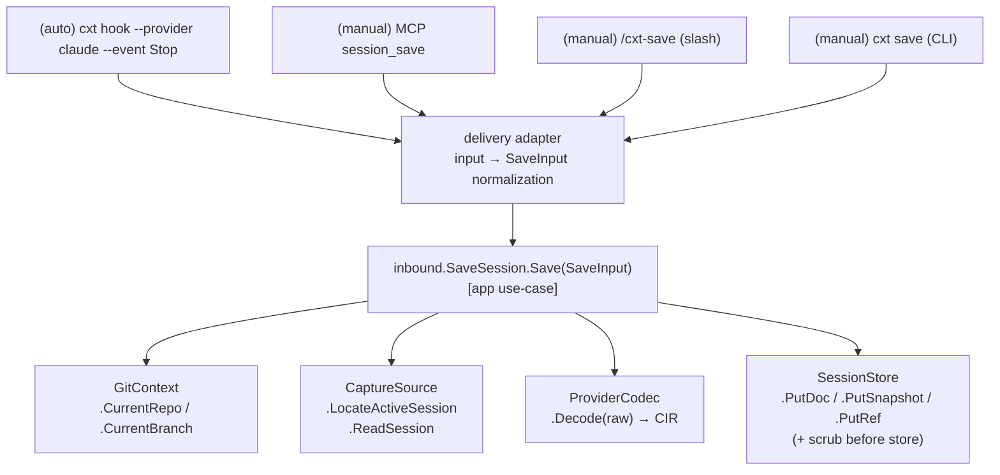

# cxthub — CAPTURE (Session Capture Facet Design)

> This document is the design document for the **session capture (capture)** facet. It specifies what, when, and how to read from disk and normalize into CIR snapshots. This document **subcontracts** to the [`_SPINE.md`](./_SPINE.md) contract (directory tree/entity/port signature/CIR/name), and in case of conflict, SPINE takes precedence.
>
> Ground truth: [`_RESEARCH-FINDINGS.md`](./_RESEARCH-FINDINGS.md) (empirically verified session format). No speculation allowed.
> **Implementation Status (2026-07)**: The capture pipeline (locate/read/decode → snapshot) is complete. Additional capture triggers include git hooks (post-commit — commit message·SHA link) beyond agent hooks (SessionStart/Stop, etc.) (CLI-ARCHITECTURE §1·§6).

Related SPINE contract anchors:
- Directory: `cli/internal/adapters/capture` ([SPINE §2](./_SPINE.md)) — "cwd-based active session file detection, hook event reception" (capture is CLI-specific).
- Port: `outbound.CaptureSource` ([SPINE §6.1](./_SPINE.md)).
- Use-case: `inbound.SaveSession` / `inbound.SyncRepo` ([SPINE §6.2](./_SPINE.md)).
- Delivery: CLI/MCP/hook handlers in `adapters/delivery` ([SPINE §2, §7](./_SPINE.md)).
- Name contract: MCP `session_save` etc. ([SPINE §7.1](./_SPINE.md)), CLI `cxt hook ...`/`cxt save` etc. ([SPINE §7.2](./_SPINE.md)).

---

## 0. Overview of the Capture Facet

Capture is a process that "finds and reads the disk log of the coding agent session currently running in this working directory, normalizes it into CIR, and commits it as a content hash snapshot." There are two entry methods.

| Method | Trigger | Entry Point | Human Intervention |
|---|---|---|---|
| **Automatic (automatic)** | CLI hook events (SessionStart/Stop/...) | `cxt hook --provider X --event Y` | None (background) |
| **Manual (manual)** | User intentional call | MCP tool `session_save` / slash `/cxt-save` / `cxt save` | Yes |

Both approaches converge to the **same core pipeline** (no duplicate logic):

```
[trigger] → CaptureSource.LocateActiveSession(cwd) → ReadSession(path)
          → (scrub secrets: raw JSONL bytes) → ProviderCodec.Decode(raw) → CIRDocument
          → (incremental diff vs last snapshot)
          → SaveSession.Save(...) → SessionStore.PutDoc + PutSnapshot + PutRef(HEAD/branch)
```

Responsibility boundaries of the capture facet:
- **Responsibilities**: Active session file detection, raw byte reading, hook event reception/throttling, incremental determination, secret scrub trigger.
- **Non-responsibilities (other facets)**: JSONL↔CIR transformation implementation (`codec`), content-addressed storage (`storage`),
  git repo/branch lookup (`gitctx`), memory distillation (`MemoryDistiller`).
  Capture consumes these via **port channels** only (SPINE §3.2 dependency rules).

---

## 1. Active session file detection algorithm (Core)

The specific algorithm for `CaptureSource.LocateActiveSession(ctx, cwd) (path string, err error)`.
Since provider-specific directory layouts differ ([RESEARCH §Claude/§Codex](./_RESEARCH-FINDINGS.md)), adapter implementations are
divided. Both implementations satisfy `outbound.CaptureSource`.

### 1.1 Common Prerequisites

- The input `cwd` must be an **absolute path**. The caller (delivery hook handler) should use `os.Getwd()` or the hook payload's
  cwd is normalized (`filepath.Abs` + symlink resolution `EvalSymlinks`) before being passed.
- "Active" is defined as the session file currently bound to the cwd and **most recently modified (mtime latest)**.
- Detection failure is distinguished from an empty path + sentinel: `ErrNoActiveSession`
  (Public sentinel, SPINE §8 naming rules). Auto hooks terminate silently as no-op (no exit) upon encountering this.

### 1.2 Claude Code Detection (`ClaudeCaptureSource`)

Location Convention ([RESEARCH](./_RESEARCH-FINDINGS.md)): `~/.claude/projects/<cwd-encoded>/<sessionId>.jsonl`.

```
function locateActiveClaude(cwd):
root        = expanduser("~/.claude/projects")          # Consider XDG/HOME override
    encoded     = encodeCwd(cwd)                            # §1.4
    dir         = join(root, encoded)
    if not exists(dir): return "", ErrNoActiveSession
    candidates  = glob(dir + "/*.jsonl")                    # Multiple sessions possible in one directory
    candidates = filter(candidates, size > 0)  # Exclude empty files
    if empty(candidates): return "", ErrNoActiveSession
    winner = argmax(candidates, key=mtime)  # mtime latest = active estimate
    return winner, nil
```

Rationale: RESEARCH did not confirm "multiple `<sessionId>.jsonl` possible in one directory. Active session detection estimates the jsonl with the most recent mtime in the cwd-encoded directory."

Enhancement heuristic (placeholder documentation comment with TODO; implementation deferred):
- In case of a tie (mtime within 1 second), read the `sessionId`/`timestamp` of the last record and select the more recent one.
- If the hook payload contains `session_id`/transcript path (below §2.4), **skip detection and trust that path**.

### 1.3 Codex CLI Detection (`CodexCaptureSource`)

LOCATION SPECIFICATION([RESEARCH](./_RESEARCH-FINDINGS.md)): `~/.codex/sessions/YYYY/MM/DD/rollout-<ISO_ts>-<uuid>.jsonl`.
Since the filename alone does not provide the current working directory (cwd), **read the first `session_meta` line of each file to match `payload.cwd`**.

```
function locateActiveCodex(cwd):
    root        = expanduser("~/.codex/sessions")
    # 1st: Only consider the last few days of directories (skip full tree scan) — default lookbackDays=3
    dirs        = recentDateDirs(root, lookbackDays)        # .../YYYY/MM/DD
    candidates  = glob(dirs + "/rollout-*.jsonl")
    matched     = []
    for f in candidates:                                   # Iterate in descending order of mtime (early exit)
        meta = readFirstSessionMeta(f)                     # Parse only the first session_meta line
        if meta == nil: continue
        if samePath(meta.payload.cwd, cwd):                # Compare after EvalSymlinks
            matched.append((f, mtime(f)))
    if empty(matched): return "", ErrNoActiveSession
    return argmax(matched, key=mtime).path, nil
```

The implemented detector walks rollout files, matches `session_meta.payload.cwd`, and chooses the latest mtime. A future optimization may consult `~/.codex/session_index.jsonl` first and skip the walk when the index has an exact mapping.

### 1.4 `encodeCwd` — cwd Encoding (Claude Specific)

RESEARCH: "`<cwd-encoded>` replaces `/`, `.`, and similar characters in the absolute working directory with `-`." Example: `/Users/work/foo` → `-Users-work-foo`.

```
function encodeCwd(absPath):
    # Replace the entire path including the leading slash with '-'. Replace unsafe characters like '.' with '-'.
    return replaceEach(absPath, ['/', '.'], '-')
```

**Note (Open Question §10-A):** Empirically verified samples originally covered only `/` and `.`. `encodeCwd` remains isolated and is validated against actual provider paths so future encoding changes can be contained.

### 1.5 `SessionFilePath` (Reverse — Load Target Path)

`CaptureSource.SessionFilePath(ctx, cwd, provider)` calculates where "a new session file should be written for this provider/cwd" during the load (restore) operation (the reverse operation of capture). The load facet consumes this, but the port is owned by the capture.
- **Claude:** `~/.claude/projects/<encodeCwd(cwd)>/<newSessionId>.jsonl` (new UUID issued).
- **Codex:** `~/.codex/sessions/<today path>/rollout-<now ISO>-<newUuid>.jsonl`.
- This facet is responsible for **path calculation only**. Actual writing is done by the Load use-case, which records the result of `ProviderCodec.Encode`.

---

## 2. Automatic Capture — Hook Trigger

The pattern of calling a single Go binary with `cxt hook --provider <claude|codex> --event <Name>` has been confirmed as **an already used form** in RESEARCH. The hook handler in the delivery adapter serves as the entry point.

### 2.1 Integration Manifest (Integration Assets)

SPINE §2 has been confirmed. This document specifies the **meaning of event→command mapping** (file creation is for the integrations facet).

**Claude Code** — `integrations/claude-code/hooks/hooks.json` (Conceptual form):
```json
{ "hooks": {
    "SessionStart": [{ "matcher": "startup|resume",
      "hooks": [{ "type": "command",
                  "command": "cxt hook --provider claude --event SessionStart", "timeout": 10 }]}],
    "UserPromptSubmit": [{ "hooks": [{ "type": "command",
                  "command": "cxt hook --provider claude --event UserPromptSubmit", "timeout": 10 }]}],
    "Stop":        [{ "hooks": [{ "type": "command",
                  "command": "cxt hook --provider claude --event Stop", "timeout": 10 }]}],
    "SessionEnd":  [{ "hooks": [{ "type": "command",
                  "command": "cxt hook --provider claude --event SessionEnd", "timeout": 10 }]}]
}}
```

**Codex CLI** — `integrations/codex/hooks.json` (RESEARCH empirically verified form and equivalent):
```json
{ "hooks": {
    "SessionStart":     [{ "matcher": "startup|resume",
      "hooks": [{ "type": "command",
                  "command": "cxt hook --provider codex --event SessionStart", "timeout": 10 }]}],
    "Stop":             [{ "hooks": [{ "type": "command",
                  "command": "cxt hook --provider codex --event Stop", "timeout": 10 }]}],
    "UserPromptSubmit": [{ "hooks": [{ "type": "command",
                  "command": "cxt hook --provider codex --event UserPromptSubmit", "timeout": 10 }]}]
}}
```

### 2.2 Actions by Event — "What to Store in the Trigger"

Explicitly defines the capture meaning of each event. `commit?` = Should a new snapshot be created?

| provider | event | Timing Meaning | Capture Action | commit? |
|---|---|---|---|---|
| claude | `SessionStart` | Session start/resume (startup\|resume) | Register active session + **baseline marking** (record offset at start time), repo/branch warming up | no |
| claude | `Stop` | End response turn | **Snapshot capture** (debounced 1 snapshot). Most frequent commit point | Yes (debounced) |
| claude | `SessionEnd` | End session | **Final flush capture** — Ignore debounce and force last incremental commit | Yes (forced) |
| codex | `SessionStart` | Start/restart session | Same as claude (baseline marking) | No |
| codex | `UserPromptSubmit` | Before user prompt submission | **Turn boundary marking** (groups next Stop into one turn). Lightweight — no commit | No |
| codex | `Stop` | Agent response end | **Snapshot capture** (debounced 1 snapshot) | Yes (debounced) |

Design Principles:
Stop this commit point. It is the most meaningful "turn unit checkpoint".
**pending channel (implementation confirmed, 2026-07-05)**: Hook capture does **not move the branch ref** — snapshot/doc
  The object is stored the same way, but with session-specific mutable pointers (`.cxt/pending/<sessionID>.json`, server
`/repos/{id}/pending/{sessionID}` only performs an upsert. The branch DAG is maintained using commit snapshots only, and
  The UI renders pending as a "continuing conversation tail" (list with `● in progress` badge) if it is the tip commit of the same session,
  otherwise it renders in the Uncommitted tab (orphan sessions, saved until manual deletion). Commit-based storage is up to that point.
"Joins the entire session to resolve the pending by **deleting** it ('moves the tail to a new commit')."
  Server synchronization is handled by the detached `pending-sync` helper (a post-hook process; see §2.5 Delayed Contract Compliance).
  Perform an objects-only push with pointer upsert, and commit resolution propagates with `--resolve`/push.
**unsync (push pending) channel (implementation confirmed, 2026-07-05)**: symmetric to pending commit. Locally committed but
  The pre-push chain is represented by the unsync pointer (`/repos/{id}/unsync/{branch}`) for (authenticated user, branch) key.
  is shown on the server — the pending-sync helper compares the local branch ref with the server ref and propagates the chain if ahead.
Pushes the object as a shadow (ref immutable) and updates the pointer, resolving sync/behind issues. `cxt push` (ref forward)
  Releases even on success. The Web On Hold tab manages [push pending commit chain + uncommitted session (pending orphans)].
  The Context tab displays only the shared timeline, with a `● Hold N items` badge on the tip. Thus, the meaning of push is
  "Upload" is not "Confirm Shared Timeline" — the object goes first, and the ref waits for git push.
- **SessionStart does not commit.** Records only the baseline offset to set the incremental base for the next Stop.
- **SessionEnd(claude) forces flush.** Commits the last state even if the debounce timer is still alive.
  Ensure session tail is not lost. In Codex, SessionEnd is not mapped (Requirement 3 events).
Codex's final Stop essentially serves as a termination commit (Open Question §10-B).
**UserPromptSubmit(codex) is a meta marker.** It indicates the start of a new user prompt, signaling the following Stop.
  Use the previous prompt summary to fill in the `Message` (snapshot description) of the snapshot.
**UserPromptSubmit is also a channel for emitting pull briefing (Implementation confirmed, 2026-07-06 — claude registered).**
  If git pull(post-merge) summarizes the team member snapshot intervals introduced from the remote into `.cxt/briefing.json`,
  Next UserPromptSubmit(Helper: SessionStart) consumes `hookSpecificOutput.additionalContext` once.
  Emits JSON to stdout — Claude Code·Codex CLI common convention, not visible to users.
  Passed only to the live session model (4KB limit, 24h expiration). **Raw sessions are never merged.**
  (Non-convergent policy): Briefing is unidirectional in the summary layer. Note: CLAUDE.md/AGENTS.md session.
  Modifications are not reflected in the live session (two-way official confirmation) — Hook injection is the only live channel.
  Codex requires one-time approval in the hook trust model TUI `/hooks`.

### 2.3 Hook Handler Flow (delivery → app)

The hook handlers in `adapters/delivery` should be **thin**. They should only parse, debounce, and delegate the core logic to the use-case.

```
cxt hook --provider P --event E:
  1. read stdin payload (JSON, if present) + os.Getwd()/payload.cwd → normalize cwd
  2. classify(E) → {baseline | mark-turn | commit | flush | noop}
  3. baseline    : CaptureCoordinator.MarkBaseline(P, cwd)            ; exit 0
     mark-turn   : CaptureCoordinator.MarkTurn(P, cwd, promptHint)    ; exit 0
     commit      : CaptureCoordinator.RequestCapture(P, cwd, debounce=true)  ; exit 0
     flush       : CaptureCoordinator.RequestCapture(P, cwd, force=true)     ; exit 0
  4. all errors reported to stderr and exit 0 (hook must not block the CLI main body — §2.5)
```

`CaptureCoordinator.RequestCapture` goes through debouncing/throttling/scrubbing and ultimately calls the `SaveSession.Save` (inbound port). Thus, the automatic and manual paths **converge to the same use case**.

> Implementation note: `CaptureCoordinator` is an adapter-internal coordinator, not a port. It receives the inbound `SaveSession` through constructor injection wired in `cmd/cxt`.

### 2.4 Hook Payload Reliability

Both CLIs can pass a JSON context to the hook via stdin (session id, transcript path, cwd, etc.). If the payload contains a transcript path, **skip §1 detection and use that path directly** (accurate and low-cost). The payload schema may vary depending on the CLI version (Open Question §10-C), so the handler performs **best-effort parsing**: Extract known keys (`session_id`, `transcript_path`/`rollout_path`, `cwd`), and if not present, fall back to §1 detection.

### 2.5 Hook Safety Contract (Immutable)

- **Non-blocking/Low-latency**: hooks.json `timeout: 10` (seconds) to completion. Heavy tasks (remote push, distillation) are never executed synchronously from the hook path. Pushes can be done via separate `cxt push` / `sync_push` or subsequent asynchronous jobs.
- **Always exit 0**: Capture failures should not disrupt the user's coding session. Failures should be logged only.
- **Reentrancy safety**: Multiple hooks can occur in the same cwd → debouncing (§4) + file locking for serialization.
- **Inactive no-op**: Silently exit if `ErrNoActiveSession`.
- **Repo opt-in gate (implementation confirmed, 2026-07-05)**: In repos without a `.cxt` store, capture and state file creation are not performed. Agent hooks are globally registered (especially codex `~/.codex/hooks.json`), so they fire in all repos, adhering to the same opt-in semantics as git hooks (repo-specific installation) to prevent pollution of irrelevant repos.

---

## 3. Manual Capture — MCP Tool + Slash Command + CLI

Automated capture and **same core** are used, but the user intentionally calls it and receives a human-readable result.

### 3.1 MCP Tool Signature (Name = SPINE §7.1 Final Draft)

MCP tools directly belonging to the capture facet are `session_save` and `memory_save`. (`session_list/fork/load/diff`, `sync_*`, `memory_load` are use-cases related to other facets or for wiring alignment, and are explicitly specified only when the capture is called.)

MCP tools are adapted as inbound use-cases by the MCP handlers in `adapters/delivery`. **No new ports are created.**

#### `session_save`
- Description: Saves the active session in the current cwd as a snapshot (branch auto-detection). (SPINE §7.1)
- Input Schema (JSON):
  | Field | Type | Required | Meaning |
  |---|---|---|---|
  | `provider` | `"claude"\|"codex"` | No (inferred from the calling context if not specified) | Capture target provider |
  | `message` | `string` | No | Snapshot description (commit message). Automatically generated if not provided |
  | `cwd` | `string` | No (inferred from the server cwd if not specified) | Absolute working directory |
- Output Schema (JSON): `{ "snapshot_id": "sha256:<hex>", "branch": string, "fidelity": "full" }`
- Mapping: `inbound.SaveSession.Save(SaveInput{Cwd, Provider, Message, Author})` →
  `SaveOutput{SnapshotID, Branch}`. (SPINE §6.2 DTO)
  - `Author domain.TeamIdentity` is set by delivery in the environment (not exposed in the MCP input).

#### `memory_save`
- Description: Distills the current session into a MemoryDigest and stores it. (SPINE §7.1)
- Input Schema: Same as `session_save` (`provider?`, `message?`, `cwd?`).
- Output Schema: `{ "snapshot_id": "sha256:<hex>", "fidelity": "memory" }`
- Mapping: Capture (same pipeline to acquire CIR) → `outbound.MemoryDistiller.Distill(cir)` →
  Stores a snapshot with the body as MemoryDigest (fidelity=`memory`). Distillation is heavy, so **manual path only**
  (does not trigger in auto hooks — §2.5 Non-blocking Principle).

> The MCP delivery adapter registers these schemas and delegates implemented handlers to the same application services used by the CLI.

### 3.2 Slash Commands (Claude `commands/*.md` + Codex `prompts/cxt-*.md`)

SPINE §2: `.md` files in `integrations/claude-code/commands/` define Claude slash commands.
Codex turns `~/.codex/prompts/<name>.md` custom prompts into slash `/prompts:<name>` commands (`integrations/codex/prompts/cxt-*.md`). Both providers have slash commands with a symmetric structure.
Slash commands related to captures (writing is in the integrations facet, here only the mapping contract):

| Slash Command | Delegate Target | Description |
|---|---|---|
| `/cxt-save` | MCP `session_save` or `cxt save` | Snapshots the current session |
| `/cxt-memory-save` | MCP `memory_save` | Distills the current session into memory and stores it |

Slash commands are internally reduced to MCP tool calls or CLI calls (no separate code path).

### 3.3 CLI Subcommand (SPINE §7.2)

- `cxt save` ↔ `session_save`. Flags: `--provider`, `--message/-m`, `--cwd`(default current).
  Output: one line for human reading + `--json` for above output schema.
- `cxt memory save` ↔ `memory_save`.

CLI·MCP·Slash·Hook **All four entry points** converge to `inbound.SaveSession.Save`. The delivery adapter's role is "surface input → normalized to `SaveInput`, `SaveOutput` → surface output format".

---

## 4. Incremental Capture · Partial Capture · Debounce

### 4.1 Debounce

Problem: `Stop` event occurs every response turn → committing as is leads to snapshot bloat and excessive disk I/O.

Policy:
- Key: `(provider, cwd)` independent debounce window. Default **`debounceWindow = 60s`**
  (`cxt config capture.debounce <seconds>` to set. The original 5s was essentially a per-turn capture — the hook capture's
  purpose is a backup store, and combined with sliding checkpoints, a 60s debounce window is sufficiently narrow).
- `RequestCapture(debounce=true)` call:
  1. Reset the timer for this key (combining consecutive Stop calls into one).
  2. Execute a real capture once the window expires.
- `force=true`(SessionEnd flush, manual save) ignores the timer and **immediately** captures.
- Debounce state must be **inter-process** shared (hooks are run in new processes each time). Therefore, it is implemented using
  a **marker file + mtime comparison** approach:
    - The last capture time is recorded in `<store>/.cxt/capture/<repoID>/<branch>.last`.
    - If the new Stop hook has `now - lastCaptureAt < debounceWindow`, **skip** (no-op exit 0).
    - This method works in stateless hook processes without a daemon (a design core).

> Open Question §10-D: More precise "trailing debounce" (after the last event for N seconds) is provided by `cxtd`.
> Only possible with a resident process. Daemonless default uses the "leading + mtime gate" approximation.

### 4.2 Incremental Capture

Problem: Each capture involves full JSONL re-read and full CIR re-computation, which is inefficient in long sessions.

Policy (2-step):
1. **Cheap Change Detection**: Record the file `size`, `mtime`, and the **byte offset** of the last read
   in `<branch>.cursor`. If no change, immediately no-op.
2. **Incremental Decoding**: JSONL is append-only (line addition), so only read and parse **new lines** after the last offset.
   Merge the accumulated changes into CIR events from the baseline (offset recorded at SessionStart).
   - Note that **the snapshot body (`SessionDoc.CIR`) always contains "the entire conversation up to that point"** (commit = full state).
     Incremental capture is an optimization for "new data to read", not the meaning of the snapshot.
   - Cache the previous snapshot's CIR (`<branch>.head.cir`) and append only new events → rehash.

3. **Content Hash Dedup (final safety net)**: SPINE invariant `Snapshot.ID == ContentHash(canonical(CIR))`.
   If the newly calculated CIR hash is the same as the previous HEAD snapshot, **do not create a new snapshot** (no-op).
   This step prevents duplicate commits even if the incremental determination is incorrect.

### 4.3 Partial Capture

Problem: Capturing a moment CLI might be **writing** the last line of a JSONL file (incomplete JSON line).

Policy:
- The JSONL parser performs **line-by-line best-effort**: If the last line is not a valid JSON, it **drops that line** and captures only the complete line before it (offsets also advance only to that point).
- The next Stop capture reads the completed line again, ensuring no loss (at-least-once convergence).
- A `tool_call` and its corresponding `tool_result` (or vice versa) are preserved in CIR with `status`/dangling indicators. The codec owns that classification; capture passes the **incomplete input** through without deciding it.
- "Partial capture mode (user storing only some turns)" is outside the v1 scope (Open Question §10-E). v1 partial captures only mean "safe truncation of the file being written."

### 4.4 Concurrency

- Captures for the same `(provider, cwd)` are serialized using **file locks** (`<branch>.lock`, `flock`).
  Hook processes run one at a time.
- If lock acquisition fails (already captured), **exit immediately with no-op 0** (another process is handling it).

---

## 5. Secrets Scrub Policy

Snapshots are **pushed to the central server** (SPINE: push/pull), so secrets would leak if they were directly included in the CIR.
Scrubbing is **applied within the capture pipeline, just before the codec decoding** (raw JSONL bytes).

### 5.1 Scrub Location (Immutable)

```
ReadSession → [SCRUB raw bytes] → Decode → Save(snapshot)
```
- Scrubbing is **applied before decoding** the raw JSONL bytes (not in normalized CIR). `save_session.go` calls `capture.ScrubSecrets(raw, repo.LocalPath)` before `codec.Decode`. Deterministic string replacement, independent of the provider.
- The original disk file is **not modified** (read-only). Scrubbing is applied only to our snapshot body.

### 5.2 Scrub Target (What) — Actual Implementation: `.cxtsecrets` Exact Match Replacement

The implementation (2026-07, `cli/internal/adapters/capture/cxtsecrets.go`) is **not based on patterns/regex**. Instead, it performs an exact match replacement (no regex, entropy, or key type inference) of the values listed in the repo root `.cxtsecrets`. One value per line (e.g., values from `.env`), `#` comments and blank lines are ignored.

| Item | Action |
|---|---|
| Matching Mode | Replace only with `.cxtsecrets` value, **byte-for-byte match** (no regex, entropy, key type inference) |
| JSON Escaped | Replace with `json.Marshal` escaped value (excluding quotes) — cover special character secrets in JSONL |
| Minimum Length | Values less than `secrets.minlen` (default 4) are ignored to prevent excessive substitution |
| Replacement Order | **Longest values first** (longest-first) — Prevents tail exposure when shorter values are substrings of longer ones |
| Seed | `.cxtsecrets` is initially generated from `.env` values using `GenerateFromEnv` (idempotent — preserves if already exists, does not create if `.env` is absent) |
| Team Sharing | `cxt secrets push`/`cxt secrets pull` — End-to-end encrypted envelopes (PBKDF2-SHA256 600k + AES-256-GCM, server does not decrypt in plaintext) |

Masking format: values are replaced with `{this is deleted by security policy}` (default). Customizable via `cxt config secrets.redact <phrase>`. Deterministic simple replacement, so **no "kind" tagging of redacted values** (values cannot be restored).

### 5.3 Scrub Strength (Policy Tier)

The `off`, `standard`, and `strict` tiers are implemented in `secret_scrubber.go` and applied after CIR decode through `ScrubDoc`. The default `standard` tier masks known credential formats, URL credentials, PEM keys, JWTs, and bearer tokens. `strict` additionally masks secret-like environment assignments and high-entropy base64-like runs; `off` disables this pattern layer. Exact `.cxtsecrets` replacement from §5.2 still runs before decode.

- Configuration location: **repo-specific `.cxt/config` (JSON, managed by `remotecfg`)** only — there is no global configuration file like `~/.config/cxt/config`. Implemented knobs: `secrets.redact` (replacement phrase), `secrets.minlen` (minimum exact-match length), and `secrets.scrub` (`off|standard|strict`).
  (Open Question §10-F is **resolved** within this scope.)
- Pre-push blocking based on a separate denylist/allowlist is not implemented; capture-time exact and pattern scrubbing are the active defenses.

### 5.4 Limitations of Scrubbing (Explicit)

- Scrubbing is **best-effort**. It only captures values listed in `.cxtsecrets` — random plain text secrets not in the list are not replaced.
- Works with raw byte exact matches, regardless of CIR structure. Reasoning's `locked.blob` (signature/ciphertext) is an opaque value and does not actually match (not plain text).

### 5.5 Scrub Component Location

- The actual scrub logic is **not** in the port but in the capture adapter's internal utility `cxtsecrets.go`'s
  `ScrubSecrets(raw []byte, repoRoot string) ([]byte, int)` function — it takes raw JSONL bytes as input and returns
  bytes with `.cxtsecrets` values replaced and the number of replacements made, as a pure function.
- `secret_scrubber.go` provides the CIR-level pattern scrub described in §5.3. It deliberately leaves `reasoning.locked.blob` untouched because that field is opaque signature/ciphertext data.

---

## 6. Capture Facet Scaffold File Plan (`cli/internal/adapters/capture`)

> This section preserves the original documentation-only scope and the file contract that guided the subsequent scaffold.
> These files implement the contract that originated in the scaffold plan.

| File | Role | Key Symbols |
|---|---|---|
| `doc.go` | Package doc. Describes the responsibilities and dependencies of the capture facet | `// Package capture` |
| `claude_capture.go` | Claude `CaptureSource` implementation | `ClaudeCaptureSource`, active-session lookup |
| `codex_capture.go` | Codex `CaptureSource` implementation | `CodexCaptureSource`, rollout cwd matching |
| `encode_cwd.go` | `encodeCwd` — converts cwd absolute path to Claude directory name (§1.4) | `encodeCwd` |
| `coordinator.go` | Coordinates automatic and manual capture, including debounce, growth, and lock gates (there is no separate `debounce.go`) | `CaptureCoordinator`, `RequestCapture`, `MarkBaseline`, `MarkTurn`, `acquireLock` |
| `secret_scrubber.go` | CIR credential-pattern scrubbing | `ScrubTier`, `Scrub`, `ScrubDoc` |

> `debounce.go` does not exist as a separate file. Marker-file debounce and cursor logic live in `coordinator.go` (RECONCILIATION §H).

`SessionMaterializer` flow (RECONCILIATION §C.1): `coordinator.go` calls `SaveSession.Save` to commit the CIR as a snapshot. `LoadSession` can then synthesize a target-provider session through `SessionMaterializer.Materialize` and resume it natively.

Dependency rule compliance (SPINE §3.2):
- capture imports only `domain` + `ports.outbound` (the `CaptureSource` it implements) + `ports.inbound` (`SaveSession` consumed by the coordinator).
  **Does not directly import other adapters packages**.
- Cooperation with codec/storage/gitctx is through the cmd/cxt wired port interfaces.

---

## 7. Automatic/Manual → Core Convergence Sequence (Summary Diagram)



- Branch auto-detection: claude uses CIR envelope.git_branch (recorded internally), codex uses `GitContext.CurrentBranch` (RESEARCH §Codex: gitBranch field not directly confirmed).
- Repo identification: `GitContext.CurrentRepo` → remote URL normalization, falls back to cwd if not present (SPINE §1.2).

---

## 8. Debounce/State File Layout (Capture Sidecar)

A capture-specific sidecar (separate from the snapshot body) under the store root. The implementation (2026-07-05) already treats `.cxt` as a unit per repo, so we **simplified** the `<repoID>/<branch>` hierarchy — branch switching causes session termination, so the cursor does not get contaminated when it crosses branches:

```
<repo>/.cxt/capture/
  ├── <provider>.last      # Last capture timestamp (mtime) — debounce gate
  ├── <provider>.cursor    # {path, size} — growth detection (cheap gate)
  ├── <provider>.turn      # UserPromptSubmit prompt hint (next capture message, one-time consumption)
  ├── <provider>.baseline  # {path,size,at} at SessionStart — diagnosis/incremental (§4.2)
  └── <provider>.lock      # O_CREATE|O_EXCL — concurrent capture serialization (2-minute stale threshold)
```

The optional `head.cir` incremental cache from §4.2 is not implemented in v1. Full reads plus content-hash deduplication are currently sufficient; an incremental cache should be added only if profiling justifies it. These sidecars are local and reproducible, and are never pushed.

---

## 9. Security/Safety Invariants of Capture Facet (Checklist)

1. Hooks must always exit with `exit 0`, terminate within 10 seconds, and prohibit heavy work (§2.5).
2. The original session file is **read-only** (never modified or deleted).
3. Pushed snapshots must pass the scrub policy (§5). The final scan before push is the safety net.
4. The `Snapshot.ID == ContentHash(canonical(CIR))` invariant automatically prevents duplicate commits (§4.2-3).
5. Partial/simultaneous captures are safe with truncation/locks (§4.3-4); loss is at-least-once recovered in the next capture.
6. Provider-locked reasoning blobs are preserved without scrubbing or modification (not plaintext), cross-replay only disabled (SPINE §5.4).

---

## 10. Open Questions (SPINE Discrepancies/Unresolved — Record Only)

Open questions identified during the facet design process. **The SPINE contract has not been violated**, and the following are items requiring subsequent decisions.

- **§10-A — `encodeCwd` Precision Rule**: RESEARCH only empirically verifies `/`·`.`→`-`. Handling of `_`/whitespace/Unicode/continuation separators must match Claude's core encoding exactly (round-trip validation required). Confirm implementation by empirically verifying the directory.
- **§10-B — Absence of Codex Termination Event**: The requirements limit Codex hooks to SessionStart/Stop/UserPromptSubmit. There is no Codex event corresponding to Claude's SessionEnd forced flush, making "last Stop" the actual termination commit. Additional recommendation if Codex has SessionEnd/Shutdown hooks.
- **§10-C — Hook Stdin Payload Schema**: The hook payload keys (transcript paths, etc.) of the two CLIs may vary by version, so the design is for best-effort parsing. Confirm empirically captured payload captures.
  - Partial confirmation (empirically verified on 2026-07-05, codex-cli 0.142.2): Codex reads `~/.codex/hooks.json` natively — the hook approval status for `config.toml` `[hooks.state."~/.codex/hooks.json:session_start:0:0"]` is confirmed (session_start/user_prompt_submit/stop 3 types). Thus, the assumption that `integrations/codex/hooks.json` is the same as Claude's is valid in this version. The `notify` setting is in a separate channel (notification purposes) and is not a hook substitute. Confirming the stdin payload keys during handler implementation.
- **§10-D — Daemonless Trailing Debounce Limitation**: Without a daemon process (`cxtd`), precise trailing debounce is impossible → "leading + mtime gate" approximation adopted. Improvement with the introduction of a daemon.
- **§10-E — User Selective Partial Capture**: UX for partial capture like "save specific turns" is out of the v1 scope.
- **§10-F — Scraping Policy Setting Location/Format**: `~/.config/cxt/config` vs repo `.cxt/config`, format (TOML/JSON) is unconfirmed. No setting file contract in SPINE → Define in the settings facet.
- **§10-G — Domain Promotion of Scraping**: Should secret scraping be adapted as an adapter utility (current design) or promoted as a domain rule? Adapter batching was done due to regex/setting dependency, but "no team disclosure" also has domain policy characteristics.
- **§10-H — Exclusion of `memory_save` Auto Trigger**: Distillation is costly and excluded from auto hooks (manual-only). Periodic background distillation is needed as a separate asynchronous job (outside hook path).
