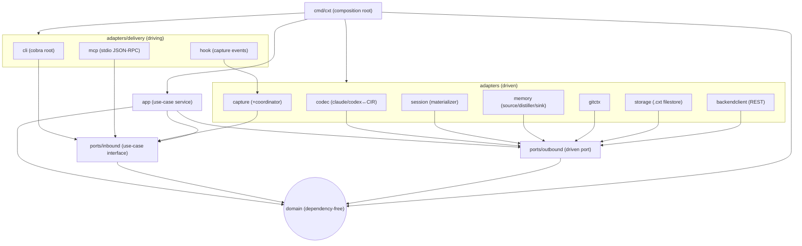
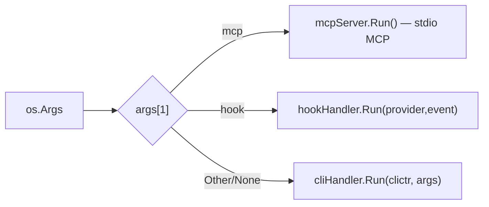
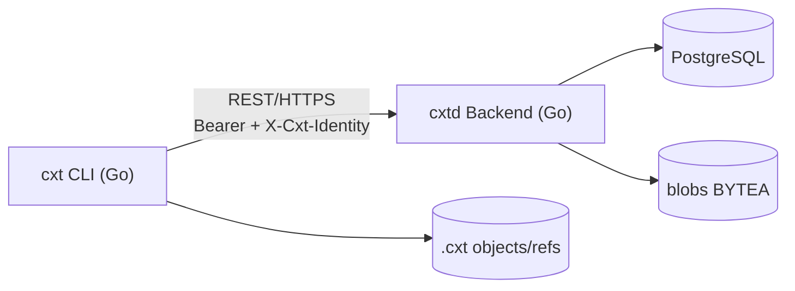
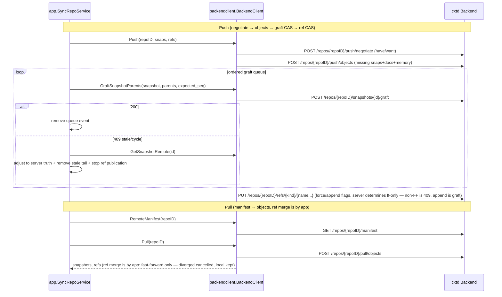

# CLI Architecture — `cxt` Client (Go)

> Authority Reference: [`_ARCHITECTURE-R2.md`](./_ARCHITECTURE-R2.md) (3-Module Source of Truth).
> This document is **empirically verified** code (`cli/internal/**`, `cli/cmd/cxt`). Code is the source of truth.

## 1. Target Module (Source of Truth)

| Item | Value |
|---|---|
| Go module | `github.com/wnsdy95/cxthub/cli` |
| Binary | `cxt` |
| Entry point | `cmd/cxt/main.go` (Branch: **cli / mcp / hook**) |
| `serve` | **None** (Central Server is a separate `cxtd` backend module) |

`cxt` is **client-specific** and acts as "git's shadow". It has five responsibilities:
1. **Local File I/O** — content-addressed `.cxt/` object DB (`adapters/storage`) at the root of the git worktree.
2. **Provider Format Conversion** — claude/codex raw JSONL ↔ provider-neutral CIR (`adapters/codec`).
3. **REST Synchronization** — negotiation with the central server (`cxtd`) for push/pull (`adapters/backendclient`).
4. **Git Auto-Integration** — context synchronization during git usage via 6 hooks (post-commit·post-checkout·post-merge·pre-push·reference-transaction·post-rewrite) (`adapters/githooks` + `delivery/cli` git-hook handlers).
5. **Context Transition Boundary** — **checkpoint→isolation→seed→execution** (`adapters/boundary` + `providerfs` session journal, §6). Agent wrapper `cxt claude`/`cxt codex` monitors `.cxt/boundary.json` and automatically restarts child agents as seed sessions during branch transitions.

**`.git` is the only source of truth**: the CLI reads the repository root (`rev-parse --show-toplevel`), default branch, and origin from local Git metadata, and fails like Git outside a repository (`ErrNotGitRepo`).

The provider format knowledge exists **only in the CLI**. In the backend, only CIR/hash is uploaded.

## 2. Dependency of Hexagonal Architecture (Actual Package)

The arrows represent compile-time dependencies (outer → inner). `domain` is stateless, and `cmd/cxt` is the unique composition root.



Core rules (verified by code): All driven adapters must implement the outbound port using `var _ outbound.X = (*Impl)(nil)`, and all app services must implement the inbound port using `var _ inbound.Y = (*Svc)(nil)`. Delivery and app share sentinel errors from `domain` (`ErrNotFound`, `ErrNoActiveSession`, `ErrHashMismatch`, `ErrInvalidCIR`, `ErrUnsupportedProvider`, `ErrUnsupportedFidelity`, `ErrSyncConflict`, `ErrNoActiveSession`, `ErrBranchExists`, `ErrNotGitRepo`).

## 3. Domain (`internal/domain`, stateless)

Values Objects/Entities (files: `values.go`, `entities.go`, `cir.go`, `hash.go`, `errors.go`):

- **Value Objects** (`values.go`): `ContentHash`(=`string`, `"sha256:<hex>"`), `ProviderKind`(`claude`/`codex`/`unknown`), `FidelityTier`(`full`/`reconstructed`/`memory`), `RefKind`(`head`/`branch`/`session`/`tag`).
- **Entities/Structs** (`entities.go`): `TeamIdentity`, `Repo`, `Branch`, `Snapshot`(immutable body/natural parent + `GraftParents/GraftSeq` version overlay), `Ref`(HEAD/branch/session/tag integration), `SessionDoc`, `MemoryDigest`, `Manifest`, `StashEntry`, `Unsync`, `Pending`, `SettingsFile`/`SettingsBundle`.
- **CIR** (`cir.go`): `CIRDocument{Envelope, []Event}`, `Event`(Kind union: `turn`/`message`/`tool_call`/`tool_result`/`reasoning`), `ContentBlock`, `LockedBlob`(provider-locked original — opaque preservation, cross-injection forbidden).
- **Hash** (`hash.go`): `HashContent([]byte) ContentHash`(SHA-256), `CanonicalBytes(CIRDocument) ([]byte, error)`(canonical bytes = Snapshot.ID source single).

## 4. Ports (`internal/ports`)

### 4.1 Inbound (use-case interfaces, `ports/inbound/ports.go`)

| Interface | Method | Trigger |
|---|---|---|
| `InitRepo` | `Init(ctx, InitInput) (InitOutput, error)` | CLI `init`/`repo create`, MCP `repo_init` |
| `SaveSession` | `Save(ctx, SaveInput) (SaveOutput, error)` | CLI `save`, MCP `session_save`, hook Stop/SessionEnd |
| `ForkSession` | `Fork(ctx, ForkInput) (ForkOutput, error)` | CLI `fork`, MCP `session_fork` |
| `CheckoutSession` | `Checkout(ctx, CheckoutInput) (CheckoutOutput, error)` | CLI `checkout`, MCP `session_checkout` |
| `LoadSession` | `Load(ctx, LoadInput) (LoadOutput, error)` | CLI `load` (`--mode memory` included), MCP `session_load`/`memory_load` |
| `ListSessions` | `List(ctx, ListInput) (ListOutput, error)` | CLI `list`/`log`, MCP `session_list` |
| `DiffSnapshots` | `Diff(ctx, DiffInput) (DiffOutput, error)` | Web/MCP `session_diff` (CLI not implemented) |
| `Memorize` | `Memorize(ctx, MemorizeInput) (MemorizeOutput, error)` | CLI `memorize`, MCP `memorize`/`memory_save` |
| `SyncRepo` | `Push/Pull(ctx, SyncInput) (SyncOutput, error)` — `SyncInput.Force` (Git `--force`), `Append` (lossless graft for divergence), and `SyncOutput.Conflicts` (canceled pull updates); also `Connect` (immediate origin registration and remote confirmation), `SyncPendings` (synchronize/resolve in-progress pointers), and `ResolveRemoteBranch` (remote branch-ref lookup) | CLI `push [--force\|--append]` / `pull [--force]`, MCP `sync_push` / `sync_pull`, Git pre-push/post-merge hooks |
| `TagRef` | `Tag(ctx, TagInput)` · `Tags(ctx, cwd)` — immutable tags (reassignment rejected) | CLI `tag` |
| `StashSession` | `Stash` · `StashPop` · `StashList` — active session storage→head restoration/recovery | CLI `stash`, git stash automatic(reference-transaction) |
| `SeedBranch` | `Seed(ctx, SeedInput) (SeedOutput, error)` — new branch seed genesis(§5) | git post-checkout hook(new branch), CLI `checkout -b` path |

DTOs are defined in the same file (fields are contracts): `SaveInput/Output`, `ForkInput/Output`, `LoadInput/Output`(`Fidelity`+`ResumeCmd` returned), `ListInput/Output`, `DiffInput/Output`(+`DiffEntry`), `SyncInput/Output`, `InitInput/Output`, `CheckoutInput/Output`, `MemorizeInput/Output`.

### 4.2 Outbound (driven ports, `ports/outbound/ports.go`)

| Port | Core Methods | Implementation Adapter |
|---|---|---|
| `SessionStore` | `PutDoc/GetDoc`, `PutSnapshot/GetSnapshot/ListSnapshots`, `PutRef/GetRef/ListRefs`, `Manifest`, `PutMemory/GetMemory`, `StashPush/StashPop/StashList`, `PutSettingsObject/GetSettingsObject`, `PutPending/ListPendings/DeletePending`, `DeleteSnapshot/DeleteDoc`(pending GC exclusive) | `storage.FileStore` (local `.cxt`) |
| `ProviderCodec` | `Provider()`, `Decode(raw)→CIR`, `Encode(CIR, target)→[]byte` | `codec.ClaudeCodec`, `codec.CodexCodec` |
| `CaptureSource` | `Provider()`, `LocateActiveSession(cwd)`, `ReadSession(path)`, `SessionFilePath(cwd, provider)` | `capture.ClaudeCaptureSource`, `capture.CodexCaptureSource` |
| `GitContext` | `CurrentRepo(cwd)`(.git required — non-git throws `ErrNotGitRepo`), `CurrentBranch(cwd)` | `gitctx.GitContextAdapter` + `remotecfg.GitContextWithRemote`(origin registration URL re-establishment) |
| `RemoteSync` | `Push(repoID, snaps, docs, refs, force, appendDiverged)`, `Pull(repoID)`, `RemoteManifest(repoID)`, `RegisterRepo(repo)`, `PushMemory/PullMemory`, `PullSettings`, `PushSecrets/PullSecrets`, `PushSettingsObject/PullSettingsObject`, `PushPending/DeletePendingRemote`, `PushUnsync/DeleteUnsyncRemote` | `backendclient.BackendClient` (REST) — non-FF rejections (409) are collected for git-style reporting |
| `MemorySource` | `Provider()`, `ReadNative(cwd)→(NativeMemory, found)` | `memory.ClaudeMemorySource`, `memory.CodexMemorySource` |
| `MemoryDistiller` | `Distill(CIR, *NativeMemory)→MemoryDigest` | `memory.RuleDistiller` |
| `MemorySink` | `Provider()`, `Inject(digest, cwd)→writtenPath` | `memory.ClaudeMemorySink`, `memory.CodexMemorySink` |
| `SessionMaterializer` | `Provider()`, `Materialize(CIR, cwd)→(sessionPath, resumeCmd)` | `session.ClaudeMaterializer`, `session.CodexMaterializer` |

`SessionStore` write invariant (W1): `doc → snapshot meta → ref` (dangling prevention). `RemoteSync` simulates git push/pull semantics with content-hash deduplication, and ref merging is performed by the caller (app) (port separation).

## 5. App Use-Case Service (`internal/app`)

Each service implements inbound ports and accepts outbound ports via constructors (implementation complete). Dependency injection graph (`main.go` wiring matches):

| Service | Implementation Inbound | Injected Dependencies |
|---|---|---|
| `InitRepoService` | `InitRepo` | `GitContext`, `SessionStore` |
| `SaveSessionService` | `SaveSession` | `GitContext`, `captures` map, `codecs` map, `SessionStore` |
| `ForkSessionService` | `ForkSession` | `SessionStore` (local ref replication, O(1)) |
| `LoadSessionService` | `LoadSession` | `SessionStore`, `codecs`, `materializers`, `memSources`, `MemoryDistiller`, `memSinks` |
| `CheckoutSessionService` | `CheckoutSession` | **inbound** `ForkSession` + `LoadSession` (use-case combination) |
| `ListSessionsService` | `ListSessions` | `SessionStore` |
| `DiffSnapshotsService` | `DiffSnapshots` | `SessionStore` |
| `MemorizeService` | `Memorize` | `GitContext`, `captures`, `codecs`, `memSources`, `MemoryDistiller`, `SessionStore` |
| `SyncRepoService` | `SyncRepo` | `SessionStore`, `RemoteSync`, `GitContext` — pull is FF-only determined by local DAG `isAncestor` |
| `TagService` | `TagRef` | `GitContext`, `SessionStore` (tag = immutable ref) |
| `StashService` | `StashSession` | `GitContext`, `captures`, `codecs`, `SessionStore`, **inbound** `LoadSession` |
| `BranchSeedService` | `SeedBranch` | `GitContext`, `SessionStore`, `MemoryDistiller`, `codecs`, `materializers` |

# Representative sequences (derived from implementation comments):
- **Save**: `CurrentRepo` → `LocateActiveSession`/`ReadSession` → `Decode` → CIR → add `git_branch` → `CanonicalBytes` + `HashContent` → `PutDoc` → read parent HEAD → `PutSnapshot` → `PutRef`.
- **Load**: resolve ref → `GetSnapshot`/`GetDoc` → branch by mode. For full/reconstructed mode: `Encode` → `Materialize` (→ `ResumeCmd`), with a **memory fallback if materialization fails**. For memory mode: `ReadNative` → `Distill` (self-distill the CIR when native memory is nil) → `Inject`.
- **Memorize**: capture → `Decode` → `ReadNative` (native memory first) → `Distill` → `PutMemory` → attach `MemoryHash` to the current branch HEAD snapshot. A snapshot may therefore contain both raw context and memory.
- **Sync.Push**: local `Manifest` → collect snapshots/docs (excluding snapshots labeled `"(stash)"`) → upload objects → commit the ordered graft queue with an `expected_seq` CAS → publish refs. On a graft 409, reconcile the local register from the server snapshot as the source of truth, remove the stale queue tail for that snapshot, and stop ref publication (fail-closed). A server non-fast-forward rejection is reported in Git style as `! [rejected]`. `--append` preserves lineage through the `GraftParents` overlay without changing natural parents.
  **Pull**: `RemoteSync.Pull` → `PutDoc`/`PutSnapshot` (deduplicated, objects first) → merge refs **fast-forward only**, using the local DAG's `isAncestor` check. A divergence cancels the update and preserves the local ref while reporting `Conflicts`; `Force` adopts the remote ref.
- **Stash**: capture → CIR → doc/snapshot (label `"(stash)"`, no ref) → push onto `.cxt/stash.json` → `Load` the branch HEAD context, analogous to Git restoring the working tree to HEAD. **StashPop** pops the stack and loads that snapshot; if loading fails, it restores the stack entry.
- **Checkout**: when `NewBranch != ""`, run `Fork` and then `Load` (equivalent to `checkout -b`); otherwise run only `Load`.
- **Seed** (new branch creation, `branch_seed.go`): copy only three layers rather than the full context — the main HEAD's `MemoryDigest` (long-term memory), an on-the-fly distillation of the source branch lineage (medium-term summary, with duplicates from the main layer removed), and the raw tail of the source HEAD's latest commit (at most 120 events, preserving the original reason for the transition). The seed is **committed as the new branch's first snapshot** and materialized as a session file. It is recorded in the ledger and excluded from capture until a person resumes it and the file grows.
- **Two branch-creation intents (agreed 2026-07-06)** — A fork is always based on a **Git commit**, because code and context must move together from the same commit while context is at or behind Git:
  - `git checkout -b` / `git switch -c` (create and switch) means "branch from my work" and therefore **always creates a seed**. If a same-named web fork exists on the server, the seed wins deterministically and idempotently; push only announces the relocation.
  - `git branch <name>` (create without switching) creates a local landing point for a web fork. Ref sync spawns the detached `fork-connect` helper. If HEAD indicates a create-and-switch flow, the helper backs off; otherwise it queries the server. When a same-named web fork exists, it aligns code to the snapshot's `[git X]` marker with **`git branch -f <name> X`** and connects the local fork ref. If X does not exist in local Git (for example, another user's On Hold fork), it defers and informs the user. If no web fork exists, it follows the existing local `[git oid]` matching path. A later `git switch <name>` treats a fork-only ref as an existing branch and materializes its context; a seed never overwrites that fork connection.
  - The web On Hold tab can also create forks from unpushed commits. Local connection still uses `git branch`.

## 6. Adapters (`internal/adapters`)

### driven (outbound implementation)
- **codec** (`ClaudeCodec`/`CodexCodec`): JSONL ↔ CIR. Claude `thinking{signature}` and Codex `reasoning{encrypted_content}` become an opaque `LockedBlob` with `cross_replayable=false`. Tool names such as `tool_use`, `shell`, and `apply_patch` are normalized through `tool_mapping.go`. Encoding to the source provider uses full mode and reinjects the original representation; encoding to another provider uses reconstructed mode.
- **capture** (`ClaudeCaptureSource`/`CodexCaptureSource`): locates and reads the active session file for the current working directory (Claude: `~/.claude/projects/<cwd-enc>/<id>.jsonl`; Codex: `~/.codex/sessions/.../rollout-*.jsonl`). `CaptureCoordinator` in `coordinator.go` converges hook, MCP, and CLI captures on `SaveSession.Save`, with debouncing, incremental capture, `MarkBaseline`, and `MarkTurn`. The hook safety contract always exits with status 0.
- **session** (`ClaudeMaterializer`/`CodexMaterializer`): CIR → native session file synthesis + resume command (`claude --resume <id>` / `codex resume <id>`).
- **memory** (`ClaudeMemorySource`+`Sink`, `CodexMemorySource`+`Sink`, `RuleDistiller`): native memory (MEMORY.md / rollout_summary) ingestion, deterministic distillation, CLAUDE.md/AGENTS.md injection.
- **gitctx** (`GitContextAdapter`): `.git` is the source of truth — required `rev-parse --show-toplevel`, default branch resolution (origin/HEAD → init.defaultBranch → current branch → main), and origin URL normalization (`NormalizeRemoteURL`) → RepoID.
- **remotecfg**: `.cxt/config` management — origin remote URL (server address `scheme://host/api/v1` + RepoID `sha256(normalize(url))` derived), `checkout.mode` (auto|prepare), `cxt add` staging. `GitContextWithRemote` decorator re-establishes repo integrity based on URL when origin is registered.
- **githooks**: Install/remove 6 git hooks (`cxt init` auto, chain existing hooks `.pre-cxt`, embed binary absolute paths, fail-open). Special templates for reference-transaction/post-rewrite capture and re-supply. Register `.cxt/` in `.git/info/exclude`.
- **storage** (`FileStore`): `.cxt/` content-addressed object DB. **Client-only, no SQL**.
- **backendclient** (`BackendClient`): `RemoteSync` REST implementation (net/http stdlib). Ref PUT with `force`/`append`, collect non_fast_forward responses into `ErrSyncConflict`. baseURL/token are **lazy evaluated** (request time — remote add/`cxt login` after startup).
- **boundary**: Context transition boundary (`.cxt/boundary.json`) — `Record` (last transition record), `Supersede` (session file `.superseded` rename + journal permanent exclusion), `Notify` (OS notification — osascript/notify-send), `EnforceKill` (isolate session file to kill agent process — POSIX lsof/kill, `cxt config boundary.enforce` kill|none).
- **providerfs**: Session journal (`.cxt/session-ledger.json`) — adjust "active = mtime latest" assumption. Materialized entries (restoration/seed file — exclude capture before growth, reactivate if grows), superseded entries (transition isolate — exclude permanent capture).
- **authcfg**: CLI login token storage (`~/.cxt/auth.json`, 0600) — git credential store compatibility. Host-wise storage (multiple servers), `CXT_TOKEN` env always prioritized (CI).
- **secretscrypto**: `.cxtsecrets` inter-process encryption (PBKDF2-SHA256 600k + AES-256-GCM, AAD=`cxtsecrets:v1:<repoID>`) — web `secretscrypto.ts` byte compatibility, server-side only ciphertext envelope.

### driving (delivery; client-specific)
- **cli** (`Run(*Container, []string)`): User CLI + **git-hook handler**(`githook.go`) — post-commit(snapshot + `[git <sha>]` link), **post-checkout(context transition boundary: checkpoint→isolation→seed→execution — previous branch live session snapshot·push(fail on append retry) → cwd session files isolated → existing branch restored on checkout / new branch seed born → boundary.json recorded·OS alert·`boundary.enforce=kill` then detached helper isolates session agent)**, ref-sync(branch move → chain snapshot restore, in-progress guard), post-rewrite(`.cxt/rewrites.json` old→new mapping), stash-sync(git↔cxt stack depth reconcile), pre-push/post-merge. git 1:1 commands: `add`/`commit`/`switch`/`tag`/`stash`/`remote`/`config`/`hooks`.
- **Agent Wrapper**(`agent_wrapper.go`, default execution path): `cxt claude`/`cxt codex` — Spawns the agent as a child (stdio inheritance, `CXT_WRAPPED=1`) and polls boundary.json every second. Auto-restarts the child with a new seed session (`SeedID`) upon transition detection.
  - **login/logout**(`device_login.go` except): `cxt login` uses default **device flow** (server `POST /auth/device/start` → browser approval → polling for token — token does not pass screen/clipboard), `cxt login <token>` for manual fallback, CI uses `CXT_TOKEN`. Tokens are stored host-by-host in authcfg(`~/.cxt/auth.json`).
  - **config keys**: `checkout.mode`(auto|prepare) | `load.mode`(full|reconstructed|memory — load fidelity) | `boundary.enforce`(kill|none) | `secrets.redact`/`secrets.minlen`. Load fidelity priority: `--mode` flag > local `load.mode` > **server personal settings**(`server_prefs.go` — 400ms timeout pull of `GET /me`, cache fallback to `.cxt/server-prefs.json`) > full.
  - Other: `secrets`(E2E encrypted push/pull), `settings`(team default settings bundle list/pull/restore).
- **mcp** (`Server`): stdio JSON-RPC, 12 tools(9 + repo_init/session_checkout/memorize) → inbound port.
**hook** (`Handler`): `cxt hook --provider X --event Y` → `CaptureCoordinator` delegation (SessionStart→MarkBaseline, Stop→RequestCapture(debounce), SessionEnd→force flush, UserPromptSubmit→MarkTurn).

## 7. Local `.cxt/` Layout (content-addressed, `.git`-like)

`storage.FileStore(repoRoot)` manages `repoRoot/.cxt/`. Not SQLite/SQL.

```
<git worktree root>/.cxt/          # Fixed next to .git (hidden in .git/info/exclude for subdirectory runs)
├── objects/…                  # Immutable blob: SessionDoc(CIR) / Snapshot meta / MemoryDigest
├── refs/heads/<branch>        # branch ref → target Snapshot.ID (slash branch name support)
├── refs/sessions/<name>       # partial join residual tip. name=fork/v1/<branch-byte-length>/<branch>/<short-tip>
├── refs/tags/<name>           # tag ref (immutable — reassignment requires --force on server)
├── HEAD                       # symbolic ref (e.g., "ref: refs/heads/main")
├── config                     # remotes(origin URL) · checkout/load/boundary mode · staged(cxt add)
├── stash.json                 # stash stack (latest first, local-only — excludes push)
├── rewrites.json              # rebase/amend old→new commit mapping ([git <sha>] link chain interpretation)
├── boundary.json              # Last context switch boundary (seed/segment list — wrapper/consumer)
├── session-ledger.json        # Session ledger (materialized/superseded — capture pollution prevention)
└── server-prefs.json          # Server personal settings cache (load_mode — offline fallback)
```

CLI login token is stored outside the repo in `~/.cxt/auth.json` (0600, host-specific) (`authcfg`).

Immutable objects use write-temp + atomic-rename, mutable ref/HEAD uses atomic-rename last. Native `.claude/`·`AGENTS.md` are not hijacked and are loaded with `MemorySink` only.

## 8. cmd/cxt Branch (Composition Root, `cmd/cxt/main.go`)

`run(args)` → `buildContainer(cfg)` for all adapter/service wiring (DI unique entry point), branching by argument:



`buildContainer` creates adapters (`storage.NewFileStore`, `backendclient.NewBackendClient`, `gitctx`, codec/capture/memory/materializer registry map) → use-case services → `CaptureCoordinator` → drivers (`mcp.NewServer`, `hook.NewHandler`, `cli.Container`) in sequence. `loadConfig` interprets RepoRoot as the git worktree root (`rev-parse --show-toplevel`), server endpoint is derived from **origin remote URL** (`scheme://host/api/v1`) — if not available, `CXT_REMOTE` env fallback. Authentication token is also lazily interpreted: `CXT_TOKEN`(CI) > `~/.cxt/auth.json[host]`(`cxt login` stored). Author identification is `CXT_NAME`/`CXT_EMAIL`/`CXT_TEAM`.

## 9. cli ↔ backend REST Boundary

`cxt` is a **negotiator** that does not directly modify `cxtd`. All synchronization passes through `backendclient.BackendClient`(net/http).



`RemoteSync` method ↔ REST endpoint (based on comments, SYNC-PROTOCOL §3):



Boundary Principle: cli handles provider format, local cache, and REST negotiation, while git meaning engine (commit/branch/fork/diff/HEAD) and team DB/auth/visibility are managed by backend (`cxtd`). Wire format is CIR (provider-neutral) + hash, so codec/provider additions have no impact on the backend.
