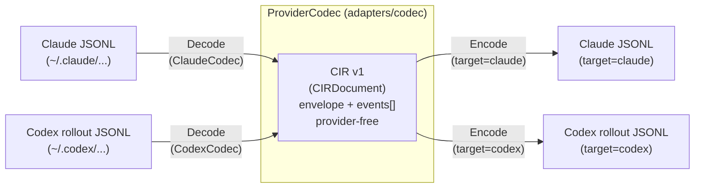

# cxthub — CROSS-COMPAT (Cross-Compatibility Design)

> This document is a **bidirectional mapping contract** for **Claude Code JSONL ↔ CIR v1 ↔ Codex rollout JSONL**.
> The upper contract is [`_SPINE.md`](./_SPINE.md) (§4 Entities, §5 CIR, §6 Ports), with empirical evidence from [`_RESEARCH-FINDINGS.md`](./_RESEARCH-FINDINGS.md) (research session format).
> If this document and SPINE conflict, **SPINE takes precedence**. Discrepancies are recorded in the "Open Questions" section at the end of this document.
> This facet cannot precisely capture the exact transformation meaning required by `adapters/codec`'s `ProviderCodec.Decode/Encode` (SPINE §6.1).

---

## 0. Transformation Pipeline Overview

- **Decode**: Provider raw JSONL → CIR. Each provider has 1 `ProviderCodec` implementation (`ClaudeCodec`, `CodexCodec`).
- **Encode**: CIR → `target` provider JSONL. If `target == cir.envelope.source_provider`, it is the **same provider** (full possible), otherwise it is **cross-provider** (reconstructed).
- CIR is a sortable **event stream**. Each event has `seq` (canonical ordering key), `id`, optional `ts`, and a tagged `kind` (SPINE §5.3).
- The unit of transformation is a **record** or **content block**. Claude has multiple blocks (text/thinking/tool_use) within one record, so it is **expanded (fan-out)** into CIR events.

Key asymmetries (affecting design):
- **Claude**: 1 JSONL line = 1 message record, with `message.content[]` containing multiple blocks (text/thinking/tool_use). An assistant turn is grouped into one line.
- **Codex**: 1 JSONL line = 1 `response_item` (or meta/event). Blocks are already flattened at the line level.
- Therefore, **Claude→CIR is block splitting (split), Codex→CIR is almost line=event (1:1)**. For reverse encoding targeting Claude, **consecutive same-role events should be recombined (coalesce) into one record**.

---

## 1. Record/Block Unit Bidirectional Mapping Table (Source of Truth)

### 1.1 Claude JSONL records ↔ CIR event

**Source of truth** for "Claude Code session storage format" includes Claude record metadata such as `parentUuid, isSidechain, promptId, type, uuid, timestamp, cwd, sessionId, version, gitBranch, userType, entrypoint, isMeta`. The `message` field follows the Anthropic message format.

| Claude record / block | CIR event `kind` | CIR core field mapping | preservation/loss |
|---|---|---|---|
| Record `type:"user"`, `message.content` = string | `message` | `role:"user"`, `blocks:[{type:"text",text:<string>}]` | Lossless |
| `type:"user"`, content block `{type:"text",text}` | `message` | `role:"user"`, `blocks[].{type:"text",text}` | lossless |
| `type:"user"`, content block `{type:"tool_result", tool_use_id, content}` | `tool_result` | `call_id:=tool_use_id`, `output:=content`, `is_error:=content.is_error?` | string and native content block array lossless (§1.4) |
| `type:"assistant"`, block `{type:"text",text}` | `message` | `role:"assistant"`, `blocks[].{type:"text",text}` | lossless |
| `type:"assistant"`, block `{type:"thinking", thinking, signature}` | `reasoning` | `locked:{provider:"claude",scheme:"signature",blob:=signature}`, `redacted_summary:=thinking(plain text)`, `cross_replayable:false` | text preserved. **signature is provider-locked (§3)** |
| `type:"assistant"`, block `{type:"tool_use", id, name, input}` | `tool_call` | `call_id:=id`, `provider_tool_name:=name`, `tool_name:=normalize(name)`(§2), `input:=input` | lossless |
| `type:"system"` / `type:"summary"` record | (envelope/backup) | `envelope` augmentation or §1.5 backup event. v1 can be downgraded to message/turn | partial loss (system metadata) |
| `type:"queue-operation"` | (drop) | not mapped to CIR (UI queue actions) | intentional loss (irreversible) |
| Record meta `timestamp` | event `ts` | RFC3339 as-is | Lossless |
| Record meta `uuid` | event `id` | Preserve original identifier | Lossless |
| Record meta `gitBranch` | envelope `git_branch` | Extract from first record | Lossless |
| Record meta `cwd` | envelope `cwd` | | Lossless |
| Record meta `sessionId` | envelope `session_origin_id` | | Lossless |
| `message.model`(assistant) | envelope `source_model` | e.g., `claude-opus-4-8` | Lossless |
| `message.usage`, `stop_reason`, `diagnostics`, `parentUuid`, `isSidechain`, `promptId`, `entrypoint`, `userType` | (drop / round-trip sidecar) | CIR v1 outside regular expression. §4 round-trip preservation is limited to `full` sidecar | **Loss in CIR standard expression** (§4 reference) |

> Turn boundary: Claude has no explicit turn record. The CIR `turn` event **synthesizes** at continuous role transition points (decoder responsibility). During encoding, `turn` is ignored (used only as a hint for record recombination).

### 1.2 Codex rollout record ↔ CIR event

Grounding: RESEARCH-FINDINGS "Codex CLI session storage format". All lines `{timestamp, type, payload}`. Top-level `type`: `session_meta`, `event_msg`, `response_item`, `turn_context`. `response_item.payload` is an OpenAI Responses API item.

| Codex line / payload | CIR event `kind` | CIR core field mapping | Preservation/Loss |
|---|---|---|---|
| `session_meta.payload` `{id,cwd,cli_version,model_provider,base_instructions,...}` | (envelope) | `session_origin_id:=id`, `cwd:=cwd`, `source_model:=model(turn_context/meta)`, `git_branch:=gitctx lookup`(§1.3) | Metadata preservation. `base_instructions` is §1.5 |
| `response_item` `message` `{role, content:[{type:"input_text"|"output_text",text}]}` | `message` | `role:=role`(user/developer/assistant), `blocks:=[{type:"text",text}]` (input_text/output_text both normalized to text) | Lossless (text). Input/output distinction absorbed by role |
| `response_item` `function_call` `{name, arguments(JSON string), call_id}` | `tool_call` | `call_id:=call_id`, `provider_tool_name:=name`, `tool_name:=normalize(name)`(§2), `input:=parse(arguments)` | Lossless. `arguments` is JSON string → object parsing |
| `response_item` `function_call_output` `{call_id, output}` | `tool_result` | `call_id:=call_id`, `output:=output`, `is_error:=output.error?` | Lossless (§1.4 normalization) |
| `response_item` `custom_tool_call` `{status, call_id, name, input}` | `tool_call` | `call_id`, `provider_tool_name:=name`(e.g. `apply_patch`), `tool_name:=normalize`, `input:=input`, `status:=status` | Lossless |
| `response_item` `custom_tool_call_output` `{call_id, output}` | `tool_result` | `call_id`, `output` | Lossless |
| `response_item` `web_search_call` `{status, action:{type,query,queries}}` | `tool_call` | `provider_tool_name:"web_search"`, `tool_name:"web_search"`, `input:={query,queries,action_type}`, `status` | Lossless (queries). Results lost if no separate output line |
| `response_item` `reasoning` `{summary:[], encrypted_content}` | `reasoning` | `locked:{provider:"codex",scheme:"encrypted_content",blob:=encrypted_content}`, `redacted_summary:=join(summary)`, `cross_replayable:false` | Summary preservation. **encrypted_content is provider-locked(§3)** |
| `event_msg.*` | (drop / turn hint) | UI event. Not directly mapped to CIR | Intentional loss (replay assistance info) |
| `turn_context.payload` | `turn` (optional) | `role` estimation + envelope `source_model` augmentation | Partial preservation (turn metadata) |
| Line `timestamp` | event `ts` | RFC3339 | Lossless |
| Filename `<uuid>` / `session_meta.id` | envelope `session_origin_id` | | Lossless |

> Turn boundary: Codex provides `turn_context`/`event_msg` for turn metadata. CIR `turn` event is synthesized from `turn_context`. Encode(codex target) from `turn` → minimal `turn_context` restored (or omitted).

### 1.3 git_branch Asymmetric (Important)

| Provider | Branch source | CIR processing |
|---|---|---|
| Claude | Record-embedded `gitBranch` (empirically verified) | Direct extraction during Decode → `envelope.git_branch` |
| Codex | **Not in record**(empirically: gitBranch field not confirmed) | During Decode, `GitContext.CurrentBranch(cwd)` (SPINE §6.1) augmentation |

→ Codex Decode cannot determine branch with just `cwd`, **requires gitctx adapter dependency**. Capture and Decode branch points may differ (loss risk) → Recommend freezing branch in snapshot metadata at capture hook (`Snapshot.Branch`, SPINE §4.2).

### 1.4 tool_result output normalization

- CIR `tool_result.output` is `string | object | array`(SPINE §5.3). The provider content block array preserves the circular preservation for the same provider round trip.
- Claude `tool_result.content` is a string or an array of `text|image|document|search_result|tool_reference` blocks. The allowed array from Claude source is re-injected as is in the full encoding (`tool_reference` is a Claude Code empirical extension).
- Codex `function_call_output.output` of `input_text|input_image|input_file` arrays also preserves the circular preservation in CIR. In Claude cross-encoding, it is not allowed, so it is forced to a string by joining text/JSON.
- When cross-encoding Claude arrays to Codex, the same rules are symmetrically applied. Codex disallowed `text|image|document|search_result|tool_reference` arrays are forced to strings, and past cxt contamination sources are blocked from the target provider allowlist regardless of source.
- Objects and other scalars are forced to JSON strings when not directly allowed by the target provider.
- `is_error` is best-effort extracted from provider-specific markers (Claude `content.is_error`, Codex error convention in output).

### 1.5 system / base_instructions / summary processing

- Claude `system` record, Codex `session_meta.base_instructions.text`: System prompts are not CIR v1 regular events. **`message{role:"system"}` or `developer` is forced and preserved** (replayable as system context), but the cross-provider system injection mechanism difference may result in loss during cross-replay.
- Claude `summary` record is used as a hint for `MemoryDigest`(SPINE §4.2) distillation input (not a CIR regular expression).

---

## 2. Tool Name Mapping Table (Source of Truth)

Groundwork: RESEARCH-FINDINGS §Cross-Compatibility 4 ("Claude `Bash`,`Edit`,`Read`,`Write` ↔ Codex `shell`/`exec`,`apply_patch`,`update_plan`,`web_search`"). `tool_call.tool_name` = **Canonical Name**, `provider_tool_name` = **Original Name**(SPINE §5.3). Canonical names are provider-independent vocabulary.

### 2.1 Canonical Name ↔ Provider Original Name

> **This table is the canonical tool_name source of truth.** (RECONCILIATION §F)
> `schemas/cir.schema.json`'s `tool_name` description example, `tool_mapping.go`'s mapping logic, and this table must all exactly match the following vocabulary.
> Canonical vocabulary(canonical tool_name): `shell`, `apply_patch`, `read_file`, `list_dir`, `grep`, `web_search`, `update_plan`, `mcp:<server>:<tool>`, `unknown:<original name>`.
> `edit_file` / `write_file` are not canonical vocabulary — Claude's `Edit`/`MultiEdit`/`Write` are normalized to `apply_patch`.

| CIR `tool_name`(canonical) | Claude original(`tool_use.name`) | Codex original(`function_call`/`custom_tool_call`/`web_search_call` name) | Meaning | Cross-mapping notes |
|---|---|---|---|---|
| `shell` | `Bash` | `shell` / `exec` | Shell command execution | Bidirectional. Claude `Bash.command` ↔ Codex `shell` argument schema normalization required (§2.2) |
| `apply_patch` | `Edit`, `MultiEdit`, `Write` | `apply_patch`(custom_tool_call) | File editing/creation | **N:1 asymmetric**. Claude 3 types → Codex single `apply_patch`. Reverse direction is §2.3 heuristic |
| `read_file` | `Read` | (shell `cat`/`sed` or built-in read) | File read | If Codex has no dedicated read tool, `shell` can be promoted (loss: meaning tag) |
| `web_search` | `WebSearch`, `WebFetch` | `web_search`(web_search_call) | Web search/query | Claude `WebFetch`(URL directly) ↔ Codex `web_search`(query) meaning difference → partial loss |
| `update_plan` | `TodoWrite` | `update_plan` | Task plan/todo update | Meaning correspondence. Schema(steps vs todos) normalization |
| `list_dir` | `Glob`, `LS` | (shell `ls`/`find`) | Directory/file listing | If Codex has no dedicated tool, `shell` can be promoted |
| `grep` | `Grep` | (shell `grep`/`rg`) | Code search | If Codex has no dedicated tool, `shell` can be promoted |
| `mcp:<server>:<tool>` | `mcp__<server>__<tool>` | MCP same/`mcp_...` | MCP server tool | Name preservation(original name round-trip). Normalization is prefix only |
| `unknown:<original name>` | (any arbitrary tool) | (any arbitrary tool) | Unknown/provider-specific | **Canonical name unspecified → `provider_tool_name` original name preserved**, cross-mapping inactive/commented |

### 2.2 Argument schema normalization

- `tool_call.input` follows the canonical vocabulary, but v1 preserves the **original input object** as much as possible (prohibited aggressive transformation).
- Same provider Encode(`full`): `provider_tool_name` + original `input` reproduced exactly (no loss).
- Cross-provider Encode(`reconstructed`): `tool_name`(canonical) → target original name reverse mapping + input key best-fit transformation. Untransformable keys preserved but target may ignore them (partial loss).

### 2.3 N:1 / 1:N asymmetric loss points (explicit)

- **`Edit`/`MultiEdit`/`Write` → `apply_patch` (N:1)**: When crossing from Claude to Codex, all three tools converge on the single canonical name `apply_patch`. In the reverse Codex-to-Claude direction, it is **impossible to recover** which original Claude tool produced `apply_patch`, so encoding falls back to `Edit` by default (or heuristically to `Write` for creation). **This is a lossy round-trip boundary.**
- **`read_file`/`list_dir`/`grep` → `shell` downgrade**: When Codex has no dedicated semantic tools, expressing these operations as `shell` commands loses their structured semantic tags. CIR can decode `read_file`, but Codex encoding cannot preserve that distinction.
- **`WebFetch`(URL) vs `web_search`(query)**: The meanings are not exactly the same, so cross-use can result in the loss of one side's meaning.
Mapping unknown tool: Always preserve `unknown:<original_name>` normalized name + `provider_tool_name`. Cross-encode by **falling back** to non-executable comments (not replayed — safe).

---

## 3. Provider-Locked Processing Policy (Source of Truth)

RESEARCH-FINDINGS §Cross-Compatibility 3, SPINE §5.4. Target: Claude `thinking.signature`, Codex `reasoning.encrypted_content`.

### 3.1 LockedBlob Mapping

| Provider | Original Field | CIR `LockedBlob.scheme` | `LockedBlob.blob` | Plain Text |
|---|---|---|---|---|
| Claude | `thinking.signature` | `"signature"` | signature original (opaque) | `redacted_summary` ← `thinking` plain text |
| Codex | `reasoning.encrypted_content` | `"encrypted_content"` | encrypted content original (opaque) | `redacted_summary` ← `reasoning.summary[]` join |

`reasoning.cross_replayable` is always `false` for locked reasoning (SPINE §5.4).

### 3.2 Load (Encode) Operation Metrics

| Scenario | locked.blob | redacted_summary | Result fidelity |
|---|---|---|---|
| Same provider, full | **Reinject as-is (restore signature/ciphertext)** → Verifiable reasoning replay | (Unused) | `full` |
| Cross-provider, reconstructed | **Metadata only preserved, inactive (target injection forbidden — signatures from other providers are invalid/rejected)** | Plain text summary fallback (or omission) | `reconstructed` |
| Memory tier | (Unused) | Plain text summary only | `memory` |

### 3.3 Core Policy Rules (Immutable)

1. **Opaque Preservation, Uninterpreted**: `blob` is never parsed or modified. It is included verbatim in storage, transmission, and hashing (content address integrity).
2. **Cross-Injection Prohibited**: Do not re-inject a locked blob from one provider to another. Invalid signature/decryption is not allowed and will cause rejection/error. During cross-injection, the `locked` metadata is retained in the reasoning event but marked as **inert** in the transcript.
3. **Summary Downgrade**: The reasoning value from cross/memory replay is transmitted only as a `redacted_summary` (plain text). Claude `thinking` body and Codex `summary[]` are the plain text sources.
4. **force fallback**: Documents with locked reasoning encoded as cross-providers cannot have `fidelity` as `full` → maximum `reconstructed`.
5. **Deduplication Safety**: Since locked.blob is included in the regular bytes that go into `Snapshot.ID` (ContentHash, SPINE §4.2 invariant), if the blob is the same, the hash will be the same. Blob must not be recreated or re-signed arbitrarily (hash corruption).

---

## 4. Fidelity Tier Preservation/Loss (Source of Truth)

SPINE §5.5 Step 3: `full` / `reconstructed` / `memory`. Explicitly state what each tier preserves/loses **item by item**.

### 4.1 Tier Definition (Summary)

| tier | Definition | Condition of Occurrence |
|---|---|---|
| `full` | Recovery from the original provider without loss (including re-injection of locked reasoning text) | Encode `target == source_provider` |
| `reconstructed` | Recovery from cross-provider. Reconstruction of text+toolcall transcript, deactivation/summary of reasoning | Encode `target != source_provider` |
| `memory` | Injection of distillation summary (MemoryDigest) only. No restoration of transcript | `memory_save`/`memory_load` paths |

### 4.2 Preservation/Loss Metrics by Item

| CIR Element / Metadata | `full` | `reconstructed` | `memory` |
|---|---|---|---|
| user/assistant text (`message.blocks`) | Preserved | Preserved | Absorbed into summary (original text loss) |
| tool_call name+args | Preserved (original name+input) | Preserved (normalized name remapping, §2.3 Asymmetric Loss Possible) | Loss (mentioned only in summary) |
| tool_result(output) | Native block array included preservation | Text preservation, target incompatible block structure is normalized loss (§1.4) | Loss |
| reasoning plain text (`redacted_summary`) | Preserved (+original text re-injection) | Preserved (summary only, inactive original text metadata) | Preserved (reflected in summary) |
| reasoning locked blob (signature/ciphertext) | **Re-injected (active)** | **Preserved but inactive** | Loss (unused) |
| timestamp (`ts`)·seq | Preserved | Preserved | Loss (no temporal context in summary) |
| cwd / git_branch / model(envelope) | Preserved | Preserved | Partial preservation (metadata only) |
| system prompt (`system`/base_instructions, §1.5) | Partial preservation | **Loss possible** (provider injection difference) | Loss |
| provider-specific metadata (usage/stop_reason/diagnostics/parentUuid etc., §1.1 below) | Round-trip sidecar only (below §5.2) | Loss | Loss |
| turn boundary (`turn`) | Preserved/Composed | Preserved/Composed | Loss |
| MCP tool (`mcp:*`) | Preserved (original name) | Preserved (name), execution meaning depends on target MCP registration | Loss |

### 4.3 Relationship Between tier and envelope.fidelity

- `CIRDocument.envelope.fidelity` and `Snapshot.Fidelity` (SPINE §4.2) record the **fidelity tier of the load result**.
- The CIR produced by decoding starts at the highest fidelity the source permits (normally a candidate for `full`), but **the target and mode at Encode/load time determine the actual tier**. `LoadOutput.Fidelity` records the final result (SPINE §6.2).
- Rule: locked reasoning exists + cross target ⇒ `full` not possible (§3.3-4).

---

## 5. Round-trip Lossless Guarantee Scope + Loss Points

### 5.1 Lossless Guarantee Scope (round-trip = decode → CIR → encode same provider)

**Claim: Lossless (semantically lossless) in the same provider round-trip (`source == target`, `full`).**

- User/assistant text block specification.
- tool_call: `provider_tool_name` + `input` (original object) as is.
- tool_result: output string/object/array. Arrays of native content blocks from the same provider are preserved in their original form (§1.4).
- reasoning: locked blob original re-injection + plaintext.
- Timestamp, cwd, git_branch, model, session_origin_id.

> "Lossless" definition: The regenerated session is the same in terms of **dialogue meaning, tool operation, and reasoning validation possibility** as the original. **Byte-identical (byte-identical) is not guaranteed** (§5.3).

### 5.2 round-trip sidecar (full preservation enhancement, optional)

CIR v1 metadata (usage, stop_reason, diagnostics, parentUuid, isSidechain, promptId, entrypoint, userType, event_msg, etc.) outside the regular CIR expression is **lost**. To enhance the fidelity of the same provider full round-trip:

- The decoder will store this as an **opaque provider sidecar** (e.g., the irregular `_raw`/separate sidecar blob) and only the same provider encoder will be used for restoration.
- However, the sidecar may **not be included in the CIR regular bytes (i.e., the ContentHash calculation target)** → Policy needed to avoid conflict with SPINE §4.2 dedup invariant (Refer to Open Questions).
- In the v1 scaffold phase, the sidecar will be kept as an **optional extension**, and the standard guarantee will be limited to §5.1 scope.

### 5.3 Explicit Loss Points

| # | Loss Point | Path | Tier Impact |
|---|---|---|---|
| L1 | Provider-specific metadata (usage/stop_reason/diagnostics/parentUuid/promptId/entrypoint/userType) | All paths (sidecar unused) | Loss in full representation |
| L2 | `queue-operation`(Claude), `event_msg`(Codex) UI events | Drop during Decode | Intentional (regeneration irrelevant) |
| L3 | Byte-level serialization difference (key order/whitespace/JSON string argument re-serialization) | Encode regeneration | Meaning loss or byte non-equivalence |
| L4 | `Edit`/`MultiEdit`/`Write` ↔ `apply_patch` N:1 (§2.3) | Cross-Encode | Reconstructed loss |
| L5 | `read_file`/`grep`/`list_dir` → `shell` downgrade (§2.3) | Cross-Encode (Codex-specific tool absent) | reconstructed meaning tag loss |
| L6 | locked reasoning(signature/encrypted_content) inactive | cross Encode (§3.3) | full→reconstructed downgrade |
| L7 | System prompt/base instructions injection difference (§1.5) | Cross-Encode | reconstructed loss possible |
| L8 | Codex git_branch capture-decode mismatch (§1.3) | Codex Decode(gitctx dependency) | Metadata inaccuracy risk |
| L9 | tool_result target provider incompatible content block → string join (§1.4) | Cross Encode or corrupted array recovery | Structure loss (text preservation) |
| L10 | Reasoning summary absent (no summary) during cross-play results in complete loss of reasoning | Cross-play/Memory | Reconstructed/Memory |
| L11 | Loss of search result line when web_search fails (§1.1/§1.2) | Decode | Partial Loss |

### 5.4 Summary of Guarantees (in one sentence)

> **Same provider + full**: Meaning lossless (§5.1), byte non-equal (L3), irregular metadata excluded (L1, sidecar not used). **Cross-provider + reconstructed**: Text, toolcall, toolresult script preservation, reasoning inactivity, mapping loss in §2.3/L4~L7. **memory**: Script unrecovorable, distillation summary only.

---

## 6. Codec Implementation Checklist (Scaffold → Implementation Guide)

`adapters/codec`'s `ClaudeCodec` / `CodexCodec` (SPINE §6.1 `ProviderCodec`) must satisfy the following transformation contract:

- [ ] `Decode`: Line-by-line JSONL parsing → Claude is block expansion(§1.1), Codex is line=event(§1.2). `seq` assignment for regular alignment.
- [ ] `Decode`: Envelope metadata extraction(§1.1/§1.2). Codex enhances branch with `GitContext`(§1.3).
- [ ] Tool name normalization table application(§2.1), unknown tool `unknown:<original name>`(§2.3).
- [ ] reasoning → `LockedBlob` + `redacted_summary`(§3.1), `cross_replayable:false`.
- [ ] `Encode(target==source)`: Full path — original name·input·locked blob re-injection(§3.2). For Claude target, same role event re-grouping(coalesce, §1.1).
- [ ] `Encode(target!=source)`: Reconstructed path — normalized name remapping, locked disabled, fidelity≤reconstructed(§3.3-4).
- [ ] tool_result output normalization(§1.4).
- [ ] (Optional) round-trip sidecar preservation(§5.2) — v1 scaffold is stub(`errNotImplemented`).

---

## 7. Open Questions (SPINE Discrepancy/Unresolved)

1. **sidecar vs ContentHash Invariant Conflict (§5.2)**: To preserve provider-specific metadata in a full round-trip, a sidecar is needed. However, the SPINE §4.2 "Snapshot.ID == ContentHash(canonical CIR)" and dedup invariant require deciding whether to include the sidecar in the hash. Including it can break deduplication for the same conversation due to metadata differences, while excluding it can break metadata round-trip guarantees for the same provider. **The current document limits standard guarantees to §5.1 and defers the SPINE-side decision to a non-standard extension**.
2. **system/developer message roles**: SPINE §5.3 permits `system` and `developer` in `message.role` (they are present in the `turn.role` enum), but cross-provider replay of system prompts (Claude system versus Codex `base_instructions`/`AGENTS.md`) is undefined. Apply the §1.5 downgrade policy and record the loss as L7.
3. **web_search result representation**: The result line corresponding to the Codex `web_search_call` is not confirmed in real-time (§1.2). Additional event for result preservation is needed (currently assumed to be absorbed by `tool_result`). SPINE confirmation required.
4. **Codex `exec` vs `shell`**: Both original names map to the `shell` canonical name (§2.1). Additional confirmation recommended to determine which is standard (or if both exist).
5. **turn event synthesis rules**: SPINE §5.3 defines `turn` as "UI/turn meta," but Claude relies on decoder synthesis (§1.1) since there is no explicit turn record. Synthesis rules need formalization.
