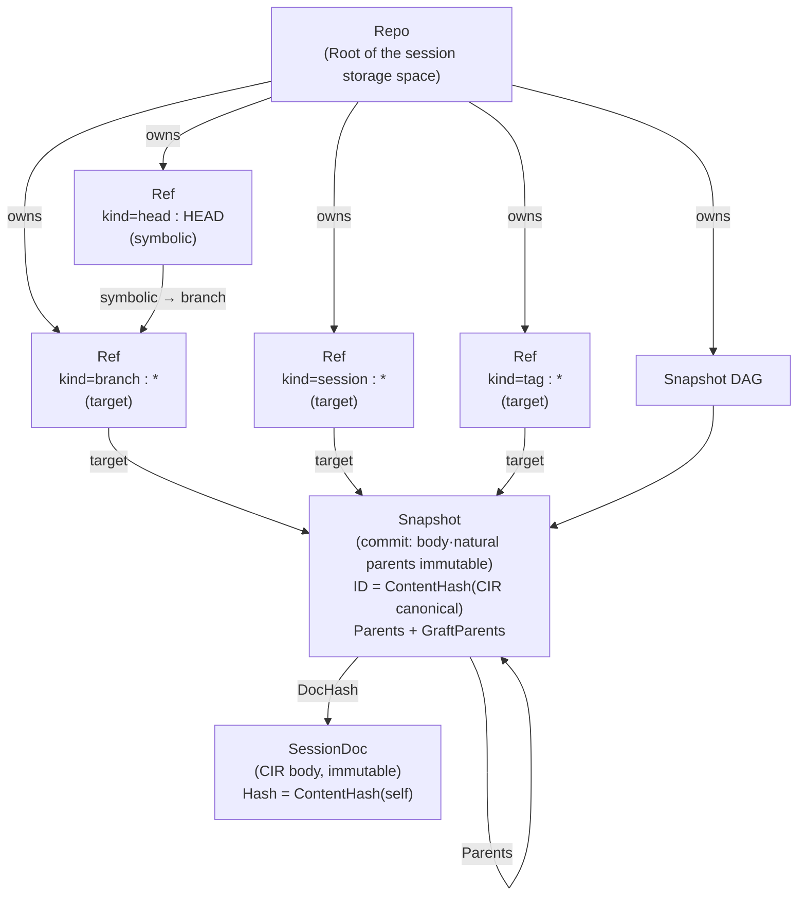
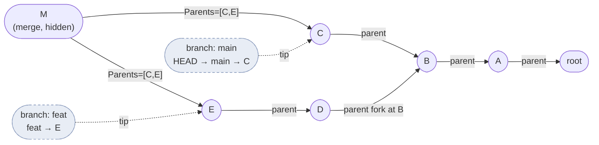
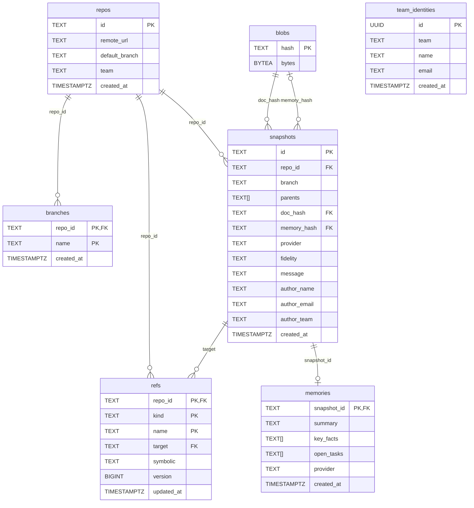

# cxthub — Data Model (Git-Inspired Semantics)

> This document is the **source of truth design specification** for the cxt domain data model. Scope: repo / branch / snapshot(commit) / ref(HEAD) / tag / fork. Exact meanings, invariants, content hash IDs, parent links in snapshot DAG, "fork = branch clone + ancestor tracking", manifest structure, self-store storage layout, and concurrency/optimistic locking.
>
> The upper contract is [`_SPINE.md`](./_SPINE.md) (§1 Concept Mapping, §4 Entities, §5 CIR) and empirical evidence is in [`_RESEARCH-FINDINGS.md`](./_RESEARCH-FINDINGS.md). **In case of conflict with SPINE, SPINE takes precedence**. Discrepancies found are recorded in the "Open Questions" section at the end of this document.
>
> This document began as a design-and-scaffolding contract. Algorithm descriptions define **what is guaranteed**, while current implementation details are called out explicitly in later sections.

---

## 0. Design Principles: Git's Mental Model, a Content-Addressed Store

cxt does not use Git's object database (packfiles or loose objects). It uses its own content-addressed store while borrowing Git's semantics. Four ideas are central:

1. **Separation of immutable content objects and mutable pointers.** The snapshot/document body and natural parent are immutable, while ref (HEAD/branch/session/tag) and hash outside derivations are mutable. This is analogous to git's object vs ref separation.
2. **ID = content hash.** The same content always has the same ID → automatic deduplication and integrity verification. This is analogous to git's SHA-1/SHA-256 object ID (we use `sha256:<hex>`).
3. **DAG formed by parent links.** Snapshots point to parent snapshots to form history. Branches/merges create diverging and merging paths.
4. **Push/pull negotiation is set difference.** Exchange manifest (snapshot index) to transmit only missing parts. This is a simplified form of git's have/want negotiation.

Differences from git:
- Instead of git's two-step tree/blob, cxt uses **snapshot → SessionDoc(CIR) one-step**. Chat logs do not have directory structure, so trees are unnecessary.
- Git's commit separates author and committer, but cxt uses a single `TeamIdentity` (`Author`) (§4 Contract). Committer separation is an open question.
- Merge is defined as a model in §2.4 (allows multiple parents) and is not exposed in this use case (SPINE §6 inbound port has no Merge).

---

## 1. Entity Overview Map



Entity mutability and addressing summary:

| Entity | Mutability | Addressing Key | Role |
|---|---|---|---|
| `Repo` | Mutable metadata | `ID` (derived key, §3.1) | Root of the session storage space. |
| `Snapshot` | Body and natural `Parents` immutable; projections and overlays outside the hash are mutable | `ID = ContentHash(canonical CIR)` | Commit-like session state plus replicated metadata. |
| `SessionDoc` | **Immutable** | `Hash = ContentHash(self)` | Body of the snapshot (CIR container). |
| `Ref` | **Mutable** | `(RepoID, Kind, Name)` | Mutable pointer to HEAD/branch/session/tag. |
| `Manifest` | Mutable (monotonic version) | `RepoID` | Repository metadata index (refs + snapshot list). |
| `MemoryDigest` | Immutable (derived) | `SnapshotID` | Distilled memory (memory-form load). |
| `TeamIdentity` | Value object | — | Snapshot author. |

---

## 2. Accurate Meaning and Invariants of Git Concepts

Each item is described by **meaning → invariants → ID/link → rules to be placed in domain doc comments**. Field contracts are sourced from SPINE §4, and here we only add additional rules.

### 2.1 Repo — Root of Session Storage

**Meaning.** One `Repo` per detected code repository. The root of the namespace for all branch/snapshot/ref names. (Fields: `ID`, `RemoteURL`, `LocalPath`, `DefaultBranch` — SPINE §4.2.)

**ID Derivation (Immutable R-ID).** `Repo.ID` is normalized and hashed using the following priority inputs (refer to §3.1 Normalization Rules):
1. If a git remote URL exists → the normalized remote URL.
2. If not → the absolute path of the current working directory (fallback key).

`Repo.ID = ContentHash(normalize(identity_input))` in form, and the same code repo should always converge to the same `Repo.ID` (key for machine/user-agnostic collaboration).

**Invariants.**
- **R1** — `Repo.ID` is stable throughout the life of the repo. If a remote URL is added later (e.g., from local-only → push), changing the ID would break collaboration. Therefore, **once an ID is determined, it can only be changed via migration** (Open Questions: ID rekeying upon remote promotion).
- **R2** — `DefaultBranch` must be the `Name` of an actual branch ref in that repo (created and specified at the first save point if it does not exist).

### 2.2 Snapshot — Commit (Immutable Core + Versioned Overlay)

**Meaning.** A single session state at a specific point in time. Corresponds to a git commit. (Fields: `ID`, `RepoID`, `Branch`, `Parents`, `DocHash`, `Provider`, `Fidelity`, `Message`, `Author`, `CreatedAt` — SPINE §4.2.)

**ID Invariant (S-ID, SPINE §4 Core Invariants).**
```
Snapshot.ID == ContentHash(canonical_bytes(SessionDoc.CIR))
```
The **snapshot ID** is the hash of the canonical CIR body referenced by the snapshot. Therefore:
- The same conversation body → the same `Snapshot.ID` → **automatic deduplication** (storing the same object twice will result in one object).
- Stored snapshots must be **verifiable for integrity** using `ID == ContentHash(GetDoc(DocHash).CIR)`.

> **Meaning of S-ID (important).** ID is the hash of the *CIR body*, so `Message`·`Author`·`CreatedAt`·`Parents` and other **commit metadata** do not enter the ID calculation. Result: If the conversation body is the same, the ID remains the same even if the parent or message changes. This is different from git (where parent, message, and author are included in the commit hash), and it is a deliberate choice to strongly guarantee deduplication based on the body as specified in SPINE §4.1 and §4 invariants.
> - Therefore, `(Snapshot.ID)` is not stored alone; **`SnapshotMeta` (parent, message, author, created_at, branch) is stored separately from the ID** (§6 Storage Layout). Different "commit events" with the same `ID` share the same ID but are distinguished by metadata.
> - This ambiguity (whether a resaved body creates a new history node?) is addressed in §5.3 and Open Questions (OQ-1).

**Invariant.**
- **S1 (immutable core)** — `ID`/`DocHash` and natural ancestry `Parents` do not change after storage. If a change is needed, a new snapshot is created. `Branches`, `MemoryHash`, setting pointers, `GraftParents/GraftSeq`, session/model/compression projections are metadata outside the ID calculation and are updated only by their respective merge/CAS rules.
- **S2 (doc existence)** — `DocHash` must point to a `SessionDoc` that exists in the store (write doc before snapshot; §6.3 write order).
- **S3 (parent existence)** — All hashes in `Parents` must exist in the same `RepoID` as snapshots or be empty (root snapshot). Invalid if pointing to non-existent parents.
- **S4 (acyclic)** — `Parents` links form a DAG. Cycles are forbidden (§2.5). While content hash properties prevent time-travel cycles structurally, explicit validation confirms them.
- **S5 (branch label)** — `Snapshot.Branch` is a snapshot taken at *creation time* of the branch name (snapshots can reach multiple branch refs but record the birth branch). This is a label, not ownership (ref holds ownership).

**graft overlay.** Reachability is calculated using `Parents ∪ GraftParents`. `Parents` are not overwritten, so local/server copies with the same ID naturally agree on the graft. `(GraftParents, GraftSeq)` is an LWW register. Higher `GraftSeq` replaces the entire set, and legacy `seq=0` sets are unioned. Discrepancies with the same positive seq are resolved by adjusting the server projection to the source of truth. This replacement possibility is necessary to avoid cycles when reordering sessions of the same git branch and superseding previous auto-grafts.

### 2.3 Ref — HEAD / Branch / Session / Tag (Mutable Pointer)

**Meaning.** A **mutable** name pointing to a snapshot. The single `Ref` type in SPINE §4.2 uses `Kind` to represent head, branch, session, or tag refs (fields: `Kind`, `Name`, `RepoID`, `Target`, `Symbolic`). A `session` ref is an internal reachability root that preserves natural descendants after a partial join within the same Git branch.

Four kinds:

| `Kind` | `Name` | `Target` | `Symbolic` | Meaning |
|---|---|---|---|---|
| `head` | `"HEAD"`(fixed) | Directly pointed snapshot; usually empty | Current checkout branch name (e.g., `main`) | Symbolic ref representing "which branch am I on?". |
| `branch` | Branch name (`main`, `feat/x`) | Latest snapshot of that branch | — | Tip of the session line. git `refs/heads/<name>`. |
| `session` | `fork/v1/<branch-byte-length>/<branch>/<short-tip>` | Tip of the session branch to be preserved | — | Reachability path of the remaining descendant branches after a partial join. Not an actual git branch, and the length component prevents scope conflicts in `feature`/`feature/foo`. |
| `tag` | Tag name (`before-refactor`) | One fixed snapshot | — | Immutable, human-readable label. |

**HEAD's behavior (git equivalent).** `HEAD` is usually **symbolic**: `Symbolic="main"` means "HEAD follows the main branch". In this case, the effective tip is `GetRef(branch, "main").Target`. A detached HEAD (directly pointing to a specific snapshot) is represented as `Symbolic=""` + `Target=<snap>`.

**Relationship between Branch.Head and Ref(branch) (resolution of duplication).** The `Branch` entity in SPINE §4.2 has a `Head ContentHash` field and simultaneously, `Ref{Kind:branch}` also points to the tip via `Target`. **The source of truth is `Ref(branch).Target`** (since the save/synchronization unit is a ref). The `Branch` entity is a **read-only view** of the ref domain, and `Branch.Head` must always match `Ref(branch, Name).Target` (invariant B1). This duplication is recorded in OQ-2.

**Invariant.**
- **REF1 (target exists)** — The `Target` of every branch, session, and tag ref, and the `Target` of a detached HEAD, must identify an existing `Snapshot.ID` (SPINE §4 invariant). For a symbolic HEAD, the branch ref named by `Symbolic` must exist.
- **REF2 (tag immutable)** — Once a tag ref is created, it does not change the `Target` (force re-tagging is only allowed by deleting and recreating; this enforces git's immutable-by-convention). This ensures that tags are "permanent pointers."
- **REF3 (head unique)** — repo has exactly 1 `Kind=head` ref with `Name="HEAD"`.
- **REF4 (branch forward-only)** — A new target must be a **descendant** of the existing target for a fast-forward (normal). Any other case (behind/diverged) is rejected by the server with a 409 status (git policy) — the only exception is an explicit `force` (git push --force, result=`forced`). Automatic fork/preserve branches do not exist (policy change 2026-07, SYNC-PROTOCOL §5).

### 2.4 Fork — "Branch Copy + Ancestor Tracking"

**Meaning (SPINE §1.2).** "Start a new workline from this session point". The `ForkSession` use-case (SPINE §6.2: `ForkInput{RepoID, FromSnapshot, NewBranch, Author}` → `ForkOutput{Branch, Head}`).

**Fork = Branch Copy + Accurate Meaning of Ancestor Tracking.**
- **Branch Copy** — A new branch ref (`NewBranch`) is created with `FromSnapshot` as its tip. The existing snapshot/content is **not copied** (since it is content-addressed, it is shared). "Copy" refers to *copying the pointer (ref)*, not the data — cost O(1), deduplication maintained.
- **Ancestor Tracking** — Since the first snapshot created after the new branch includes `FromSnapshot` in its `Parents`, the **common ancestor history** before the fork point is reachable. Thus, the fork line and the original line share the `FromSnapshot` as their LCA (lowest common ancestor).

> **Decompose into two steps.** ① At the fork point: `Ref{Kind:branch, Name:NewBranch, Target:FromSnapshot}` created (do not create an empty new snapshot — similar to `git branch <name> <commit>`). ② Afterward, `SaveSession` on `NewBranch`: new snapshot's `Parents=[current NewBranch tip]` = `[FromSnapshot]` → history finally diverges.

**Invariant.**
- **F1 (original immutability)** — Fork does not modify the `FromSnapshot` or the original branch ref. Only a new ref is added.
- **F2 (unique new name)** — `NewBranch` must not already exist in the same repository. A collision is an error; there is no forced-fork operation.
- **F3 (ancestor reachability)** — After the fork, from any snapshot on the `NewBranch` line, you can traverse the `Parents` to reach `FromSnapshot` and its ancestors (common ancestor preserved).

**Merge (model only; no public use case).** A snapshot with two or more `Parents` can represent a merge (`Snapshot.Parents []ContentHash` already permits this). No inbound merge operation is currently exposed (OQ-3).

### 2.5 Snapshot DAG — Parent Link Structure



- Arrows indicate **child → parent** (`Snapshot.Parents`) direction. They always point to the past.
- **Root Snapshot**: `Parents == []` (empty slice). The initial save of the repo.
- **DAG Invariant (S4 Re-verification)**: Acyclic. Content hashes do not directly include parent IDs (§2.2 S-ID Implication), so cycles are only possible at the meta-link level and are blocked during write-time parent existence (S3) and non-cyclicity (S4) validation.
- **Least Common Ancestor (LCA)**: `DiffSnapshots` and ref classification use graph traversal over snapshot reachability links. The backend `GitEngine` owns this calculation.

### 2.6 Joining Sessions Within the Same Git Branch

`join` changes the placement and branch head of a session side chain within one Git branch; it is not a Git branch merge. The target is fixed to `Snapshot.Branch`, and context associated with another Git branch cannot be joined. The server derives the segment from X to the leaf of its unique first-parent child path, so the client does not provide a tip.

- **Join all**: Advance the branch head to the segment tip.
- **Join only X**: Advance the branch head to X and preserve the remaining tip with a branch-scoped `session` ref. Natural parents remain unchanged, so X's child T still satisfies `T.Parents[0] == X` and the side chain continues from T.
- **Lossless update**: Preserve the previous branch head in X's graft overlay and supersede the previous incoming auto-graft edge with a higher `GraftSeq`.
- **Atomic Boundary**: Validates the target branch/scoped-session attachment, first-parent continuity, single leaf, reachability of other branch refs and session refs in different scopes, and all graft seqs and ref CASs before the repository is applied. For FS, it uses a prepared/committed journal, and for PostgreSQL, it uses a transaction/advisory lock.

**Legacy unscoped session ref** only preserves reachability of the existing history. It is not used as evidence to prove the same-branch membership in a new join or to bypass cross-branch restrictions.
Internal session ref creation and movement are performed within the atomic storage boundary of `join`. General ref push is allowed only for an idempotent echo of the same target that already exists on the server.

---

## 3. ID / Content Hash — Normalization and Determinism

### 3.1 ContentHash Format and Normalization

- **Format**: `sha256:<hex>` (lowercase hex 64 characters). Value object `domain.ContentHash` (SPINE §4.1). Manifest schema `pattern: ^sha256:[0-9a-f]{64}$`.
- **Deterministic Requirement**: Same logical content → always the same hex. This requires **canonical serialization (canonicalization)** before hashing.

**Canonical_bytes(CIR) Contract Rules**. The input CIR canonical bytes for `Snapshot.ID` must satisfy the following (implementation is in codec/storage adapter; this document specifies only the contract):
1. **JSON Key Sorting** — All object keys are sorted in UTF-8 byte ascending order (RFC 8785 JCS compatible).
2. **Whitespace Removal** — No unnecessary whitespace or line breaks between tokens (compact).
3. **Event Order Fix** — `events` are sorted in ascending order by `seq` (CIR §5.3 canonical sorting order). Same `seq` forbidden (or stable sorting auxiliary key definition — OQ-4).
4. **Unicode Normalization** — Strings are NFC (recommended). Escape notation uniformity (`\uXXXX` minimized).
5. **Number/Boolean Normalization** — Leading zeros, scientific notation uniformity, `true/false` lowercase.
6. **Excluded Fields** — Fields like `captured_at` in the envelope **can break dedup if included in the ID**. The CIR envelope is part of the body integrity, so in v1, the entire envelope is included, but the dedup impact of `captured_at` is recorded in OQ-5 (capturing the same conversation at different times can result in a different ID).

**Repo.ID Normalization.** `normalize(remote_url)`:
- Unify scheme (`git@github.com:org/repo.git` ↔ `https://github.com/org/repo.git` → to the same normalized form),
- Remove trailing `.git`, trailing `/`, and lowercase the host.
- If no remote, `normalize(abs_cwd)` = resolve symbolic link to absolute path. Then, `Repo.ID = ContentHash(normalized)`.

**SessionDoc.Hash.** `SessionDoc.Hash = ContentHash(canonical_bytes(SessionDoc.CIR))`. Therefore, in a normal state, `Snapshot.ID == Snapshot.DocHash` (both are hashes of the same CIR). The reason for keeping them as separate fields is to provide flexibility for evolving the definition of snapshot ID in the future to include metadata beyond the CIR (currently they are equivalent and verifiable). Invariant **H1**: `Snapshot.ID == Snapshot.DocHash == GetDoc(DocHash).Hash`.

### 3.2 Integrity Verification

The store should be able to validate the following when read (stub: interface only, validation is unimplemented):
- `GetDoc(h)` returns a doc with a recalculation hash equal to `h` (content tampering detection).
- `GetSnapshot(id)` has `id == DocHash`(H1).

---

## 4. Manifest Structure

`Manifest` (SPINE §4.2) is a **repository unit metadata index**. It is not a snapshot/ref body but a *list catalog* that serves two purposes: (a) push/pull negotiation (calculating the difference set of missing snapshots), and (b) storing optimistic lock versions.

| Field | Type(domain) | JSON Key | Meaning |
|---|---|---|---|
| `RepoID` | `string` | `repo_id` | Repository ID. |
| `Refs` | `[]Ref` | `refs` | All mutable pointers (HEAD/branch/session/tag). Unique by `(kind,name)`. |
| `SnapshotIndex` | `[]ContentHash` | `snapshot_index` | List of snapshot IDs held. |
| `Version` | `int` | `version` | Optimistic lock/schema version (monotonically increasing). |
| `UpdatedAt` | `time.Time` | `updated_at` | Last update timestamp. |

JSON Schema source of truth: [`../schemas/manifest.schema.json`](../schemas/manifest.schema.json) (draft 2020-12, `additionalProperties:false`, conditional validation for `Ref` where `kind=head ⇒ name="HEAD"`).

**Why is the snapshot body not the index?** During a push, the client compares its `snapshot_index` with the remote `RemoteManifest` (SPINE §6.1 `RemoteSync.RemoteManifest`) and **transmits only the difference (what is not in the remote)**. Since it is a content hash, there is no name collision, and the negotiation is complete using set operations (simplified from git have/want).

**Manifest consistency invariant.**
- **M1** — All `target` in `refs` must be snapshots included in `snapshot_index` (dangling ref prohibition). Temporary violation after pull is resolved at transaction end.
- **M2** — `version` must monotonically increase with each manifest update (§5.1 CAS).

---

## 5. Concurrency / Optimistic Locking

### 5.1 Local Store Concurrency — manifest as CAS boundary

The self-hosted store distinguishes between two categories.

1. **Immutable Objects (snapshot / doc blob)**: Since content address is specified, **write conflicts are semantically harmless**. If the same ID equals the same content, two processes writing the same blob concurrently will yield the same result (idempotent put). Writes are prevented from partial updates using the *write-temp-then-atomic-rename* pattern (§6.3).
2. **Mutable State (ref / manifest)**: Real conflicts are possible. **Optimistic locking (optimistic concurrency)** is applied here.

**Optimistic Lock Protocol (manifest version CAS).**
- Reads `Manifest.Version = v` along with the read.
- Write a new manifest with `version = v+1` containing the ref update (`PutRef`) and snapshot additions, but commit it **only if the on-disk version is still v** (compare-and-swap). If the disk already contains `v' > v`, report a **conflict** and either retry by reading and applying again or return the conflict to the caller.
- A filesystem store combines an OS advisory lock with the manifest version field. The semantic CAS unit is the `version` field.

**Concurrency of Ref Forwarding (REF4 Combination).** When two processes advance the same branch tip concurrently, the slower committing side is blocked by a manifest version conflict and re-evaluates whether their change is a fast-forward. If not a fast-forward, it is either a fork (§2.4) or conflict preservation (§5.2).

**Invariant C1** — A manifest write must not succeed unless its version CAS succeeds; this prevents lost updates.

### 5.2 Remote Synchronization Concurrency — Fast-forward First, Conflict Preservation on Conflict

`RemoteSync` (SPINE §6.1) / `SyncRepo` (§6.2) push/pull meaning:

- **push**: Transmit the objects in the local `snapshot_index` − remote `snapshot_index`, then request ref advancement. Accept only when the remote ref is an **ancestor** of the local target; otherwise reject the update as a **non-fast-forward** and require a pull first. This is equivalent to Git push.
- **pull**: Download missing remote objects, then reconcile refs.
  - Local tip is an **ancestor** of the remote tip → **fast-forward** the local branch ref.
  - Remote tip is already an ancestor of the local tip → keep the local ref; it is already ahead.
  - Diverged → stop like `git pull --ff-only`: keep the local ref, report the conflict, and let the user explicitly adopt the remote with `cxt pull --force` or preserve work through a manual branch. Fetched objects remain available, so the transfer itself is lossless.

**Invariant SY1 (Lossless)** — Synchronization must not delete reachable snapshots. A divergent update leaves the existing ref unchanged unless the user explicitly requests a forced move; immutable objects remain stored either way.

**Invariant SY2 (Idempotent Push)** — Repeatedly pushing the same content, even after partial failure, avoids generating duplicate blobs due to content addressability.

### 5.3 Ambiguity in Concurrency/Identity of Duplicate Body Storage

§2.2 Due to the S-ID definition, saving the same conversation body twice results in the same `Snapshot.ID`. At this point:
- doc/snapshot blob is deduplicated to 1.
- However, "two save events" can have different `Parents`/`Message`/`CreatedAt` → **SnapshotMeta record** (§6.2) distinguishes events. ID collision is not immediately a history node collision; branch tip advancement is tracked with meta record + ref. This model's ambiguity (can the same body be two nodes in the DAG?) is OQ-1.

---

## 6. Storage Layout (Self-Store: Content-Addressed Blob + Refs)

### DB Schema (PostgreSQL — `schemas/db/migrations/0001_init.sql` Reference)



Adopt the `.git/` layout of git but simplify it. The root is a subdirectory of the user home directory (e.g., `~/.cxt/`; the exact path is determined by the storage adapter, not fixed this time — OQ-6).

```
~/.cxt/
└── repos/
    └── <repo-id-hex>/                  # Hex part of Repo.ID = isolated namespace per repo
        ├── objects/                    # Content-addressed immutable blob (sha256:<hex>)
        │   ├── docs/                   #   SessionDoc(CIR) blob. Filename = <hex>[.json/.zst]
        │   │   └── ab/cdef…            #   git-style 2-hex fanout directory (for large object distribution)
        │   └── snapshots/              #   SnapshotMeta blob (parent/message/author/created_at/branch/provider/fidelity/doc_hash)
        │       └── ab/cdef…            #   Filename = Snapshot.ID hex
        ├── refs/                       # Mutable pointers
        │   ├── heads/<branch>          #   Branch ref. Content = target ContentHash (+ optional)
        │   ├── sessions/<name>         #   Partial join residual session tip (not a real git branch)
        │   ├── tags/<tag>              #   Tag ref (immutable; REF2)
        │   └── HEAD                    #   Symbolic/direct HEAD. Example: "ref: refs/heads/main"
        ├── manifest.json               # Manifest (§4). Version-CAS boundary (§5.1). Adheres to schemas/manifest.schema.json
        └── memory/                     # MemoryDigest blob (derivative). Filename = SnapshotID hex
            └── ab/cdef…
```

### 6.1 objects/ — Immutable Content Storage

- **Addressing**: File path is the ID. `objects/docs/<hex[0:2]>/<hex[2:]>` 2-level fanout (git-like, inode distribution).
- **Deduplication**: If the same ID exists, it is already recorded → re-recording is omitted (idempotent).
- **Compression/Format**: CIR is JSON. Optional lossless compression (e.g., zstd) is possible, but **hash canonical bytes before compression** to ensure the ID is stable (§3.1). Whether to adopt compression is OQ-6.

### 6.2 SnapshotMeta Separation (S-ID Handling)

The `Snapshot` ID is the hash of the CIR body, so the commit metadata (`Parents`, `Message`, `Author`, `CreatedAt`, `Branch`, `Provider`, `Fidelity`, `DocHash`) that does not enter the ID calculation is stored in a **separate SnapshotMeta record** at `objects/snapshots/<id-hex>`. That is, the domain `Snapshot` entity = `ID` (CIR hash) + SnapshotMeta (metadata). The body (`SessionDoc`) is stored in `objects/docs/` and linked by `DocHash`. This separation allows for the coexistence of H1 (`ID==DocHash`) and the mutable history representation of the metadata.

### 6.3 Write Order / Atomicity (Ensuring Invariants)

Write transactions commit in an **inner (immutable) to outer (mutable)** order to prevent dangling references.
1. Write doc blob (`objects/docs/`) — write-temp + fsync + atomic rename.
2. Write snapshot meta (`objects/snapshots/`) — at this time, S2 (doc existence) · S3 (parent existence) validation passed.
3. Advance ref/manifest — manifest version-CAS (§5.1). Here, only mutable state is exposed externally.

Reversing the order can result in an intermediate crash that creates a dangling reference (REF1 violation) or a missing parent (S3 violation), so this order is a contract (invariant **W1**).

### 6.4 Remote Server Layout (Overview)

The central server maintains the same logical model in a multi-tenant store with repository isolation. Push and pull follow the negotiation in §5.2. The production adapter uses PostgreSQL while the development adapter uses the filesystem; clients see both through the `RemoteSync` port.

---

## 7. Invariant Summary (Domain Doc Comment Checklist)

Specify the following in the scaffold's `internal/domain` package doc comment/verification stub.

| ID | Invariant |
|---|---|
| R1 | `Repo.ID` remains stable throughout its life (remote promotion is a migration). |
| R2 | `DefaultBranch` is the actual branch ref name. |
| S-ID/H1 | `Snapshot.ID == Snapshot.DocHash == ContentHash(canonical(CIR))`, verifiable. |
| S1 | snapshot immutable. |
| S2 | The `DocHash` document exists in the store. |
| S3 | All hashes of `Parents` exist in the same repo (or the root is an empty array). |
| S4 | DAG acyclic. |
| S5 | `Snapshot.Branch` is a birth label (not ownership). |
| REF1 | ref `Target`(directly targeted) is an existing snapshot; symbolic HEAD is an existing branch. |
| REF2 | The tag is immutable (force re-tagging is delete+create). |
| REF3 | repo has 1 HEAD, named "HEAD". |
| REF4 | branch tip advancement is limited to fast-forward or explicit (fork/conflict handling) only. |
| B1 | `Branch.Head == Ref(branch, Name).Target`(ref is source of truth). |
| F1 | fork is a snapshot/ref of the original, immutable. |
| F2 | Fork `NewBranch` with a unique name. |
| F3 | fork preserves reachability to common ancestor. |
| M1 | manifest holds all ref targets as snapshots. |
| M2 | manifest `version` strictly increases. |
| C1 | manifest writes require version-CAS (lost-update prevention). |
| SY1 | sync is possible with a lossless snapshot (conflicts are absorbed as new refs). |
| SY2 | push idempotent. |
| W1 | Write order: doc → snapshot meta → ref/manifest (inside→outside). |

---

## 8. SPINE Mapping Traceability (Contract Compliance Table)

| Section of This Document | SPINE Basis | Remarks |
|---|---|---|
| §2.1 Repo | §1.2, §4.2 Repo | Specificization of ID derivation rule. |
| §2.2 Snapshot, §3.1 | §1.2, §4.2 Snapshot, §4 Core Invariants | Derivation of S-ID (meta separation). |
| §2.3 Ref/HEAD/tag | §1.2, §4.2 Ref | head=name"HEAD", enforce tag immutability. |
| §2.4 Fork | §1.2 fork, §6.2 ForkSession | "Clone=ref clone, ancestor=Parents". |
| §4 Manifest | §4.2 Manifest, §6.1 SessionStore/RemoteSync | For difference negotiation. |
| §5 Concurrency | §6.1 RemoteSync, §6.2 SyncRepo, §1.2 push/pull | FF priority, conflict=branch preservation. |
| §6 Storage Layout | §1.2 tree/blob mapping, USER DECISION 2 | Self-storing content-addressed. |
| manifest.schema.json | §4.2 Manifest, schemas/cir.schema.json convention | draft 2020-12, additionalProperties:false. |

---

## 9. Open Questions (SPINE Mismatch and Undecided Items)

> This section records differences from the historical SPINE contract and decisions that remain open.

- **OQ-1 (Same body = same ID ambiguity).** S-ID (ID=CIR body hash) excludes commit metadata, so saving the same conversation with different parents, messages, or timestamps produces the same ID. Whether one body can represent multiple DAG events remains unresolved: possibilities include multiple `SnapshotMeta` records (§5.3 and §6.2) or evolving the ID to include lineage metadata. SPINE §4 specifies a body hash, so the current design follows that contract.
- **OQ-2 (`Branch.Head` vs `Ref(branch).Target` duplication).** SPINE §4.2 defines both. This document treats ref as the source of truth (B1), but purity of `Branch` entity as a read-only view requires standardization in SPINE revision.
- **OQ-3 (merge meaning).** `Snapshot.Parents` allows multiple parents to represent a merge as data, but there is no Merge use-case in SPINE §6 inbound ports. Pull propagation is handled by branch preservation only (automatic merge is not performed). Before introducing a merge use-case, update SPINE §6.
- **OQ-4 (Equal sequence values).** CIR §5.3 uses `seq` as the canonical ordering key. It remains undecided whether equal values should be forbidden or resolved with a secondary key such as `id` or original line order.
- **OQ-5 (`captured_at` dedup impact).** Including nondeterministic envelope metadata (`captured_at`, `session_origin_id`) in canonical bytes can give the same conversation different IDs and weaken deduplication. The current implementation follows SPINE §4 and hashes the entire CIR; a future policy may define a narrower identity projection.
- **OQ-6 (Storage physical details).** Data root path (`~/.cxt/` assumed), object compression (zstd), remote server storage engine (file/object store/DB), and lock mechanism (flock vs DB row lock) are determined during the implementation of the storage adapter. This document only fixes logical layout and invariants.
- **OQ-7 (author/committer separation).** Git distinguishes between author and committer, but cxt `Snapshot.Author` is a single `TeamIdentity`. Additional committer review in SPINE §4 is needed when "original author vs puller" distinction is required.

---

## 9.5 Permanent Record Invariants (P1 — USER DECISION 2026-07)

**The context cannot be deleted or modified under any circumstances. It is always recorded.**

| Event | Impact on Context |
|---|---|
| PR Merge / `git merge` | None — snapshot and branch context remain unchanged. |
| `git branch -D` (including cleanup after merge) | None — cxt branch ref and snapshot preserved, hook instructions output. Can be restored with `cxt checkout <branch>`. |
| `push --force` / `pull --force` | **Only the ref pointer** moves. Previous history snapshots/docs remain in the storage (no GC) and continue to appear in branch label-based lists. |
| rebase / amend | Snapshot immutability maintained — `[git <sha>]` links are interpreted as rewrite side maps (original unmodified). |
| stash drop/pop | Only stack items removed — snapshot objects are permanently stored in content-addressed storage. |

Enforcement: no snapshot, document, or ref **delete API exists**; HTTP DELETE routes are limited to login-session revocation.
Objects are content-addressed immutable and have no garbage collection. Future PR/merge functionality must also be designed with this immutability in mind.

## 10. Implementation Delta (2026-07 — Current Code)

Domain concepts added after scaffolding (the code is the source of truth):

| Concept | Definition | Location |
|---|---|---|
| `User.Username` | Global unique handle (slug). Automatically generated from the local part of the email at first login (with `-2`… in case of collision). URL segment. | backend `domain.User`, 0004 |
| `Workspace.Slug` / `OwnerUsername` | owner's unique URL segment + normalized handle → `/<username>/<slug>`. Legacy rows are backfilled on query. | backend `domain.Workspace`, 0004 |
| `Repo.WorkspaceID` | Visibility boundary binding. Automatically connects by interpreting the remote URL path (`/<owner_username>/<slug>/<repo>`) during a push. | backend `domain.Repo`, 0002 |
| `Session` | DB login session (30 days, `sess_` token) — web is passed via HttpOnly cookies. | backend, 0003 |
| `StashEntry` / `StashBranchLabel="(stash)"` | git stash equivalent stack item. Stash snapshot is excluded from branch history and push (local only). | cli `domain`, `.cxt/stash.json` |
| Rewrite side map | Maps old→new Git commits after rebase or amend. Because snapshots are immutable, `[git <sha>]` links are resolved through the side map instead of rewriting stored snapshot messages. | CLI `.cxt/rewrites.json` |
| `ErrNotGitRepo` / `ErrBranchExists` | Enforces `.git` as the repository source of truth and rejects a fork whose branch name already exists (F2). | CLI `domain/errors.go` |
| Repository origin | `cxt remote add origin <url>` defines `RepoID = sha256(normalize(url))` and server base `scheme://host/api/v1`; clients configured with the same URL converge on the same repository identity. | CLI `remotecfg` |
| `User.Nickname` | Display alias (free change, URL irrelevant). Username is heavy change (URL·CLI remote impact, owner workspace `owner_username` sync update). | backend `domain.User`, 0009 |
| `MemberRole` 5-tier | `viewer<puller<member<maintainer<owner` — RoleRank/AtLeast, Unknown values rejected. Creator is always owner·role fixed. | backend `domain/identity.go` |
| `Workspace.Visibility` | `private`(default)/`public`. Public opens viewer read to anonymous. | backend, 0009 |
| `Workspace.SecretsPolicy/SettingsPolicy` | Team asset write (maintainer+) policy to narrow `owner`. Specified user list replaced/removed (0011→0013). | backend, 0010 |
| `Workspace.GHVisibilitySync/GHSyncedAt` | One-way GitHub→cxthub visibility synchronization. While enabled, manual visibility changes return 409; the workspace is public only when every linked GitHub repository is public. | backend `app/gh_visibility.go`, 0012 |
| Ownership transfer | `POST /workspaces/{id}/transfer` transfers ownership only to an existing member, resolves slug collisions with suffixes such as `-2`, and keeps the previous creator as an owner. | backend `identity_service.go` |
| CLI token | `sess_cli_*` long-lived session (one year, shown once). `cxt login/logout` stores host-scoped credentials in `~/.cxt/auth.json` with mode 0600; listings expose only token suffixes. | backend/CLI, `authcfg` |
| Secret envelope (E2E) | Browser and CLI encrypt `.cxtsecrets` with PBKDF2-SHA256 (600k iterations) and AES-256-GCM (AAD=`cxtsecrets:v1:<repoID>`). The server stores only the opaque envelope (`secrets.enc.json`/`repo_secrets`). `cxt secrets push|pull [--remember]` may store the passphrase locally in `~/.cxt/credentials.json`. | CLI `secretscrypto`, web `secretscrypto.ts`, 0008 |
| Commit Attachment Settings Object | Attach `.claude`/`.agents` snapshots(content-addressed `SettingsBundle`), replace+backup stack(`cxt settings list/restore`) on checkout/ref-sync. | cli `settings_sync.go`, 0007 |
| Automatic `.gitignore` registration | `cxt init` idempotently appends `.cxt/` and `.cxtsecrets` to `.gitignore`, with an additional local entry in `.git/info/exclude`. It does not create `.cxtsecrets` when `.env` is absent. | CLI `githooks.EnsureGitignore` |
| OpenAPI drift guard | mux registration route ↔ `schemas/openapi.yaml` bidirectional comparison test — force spec update on route change. | backend `openapi_drift_test.go` |
