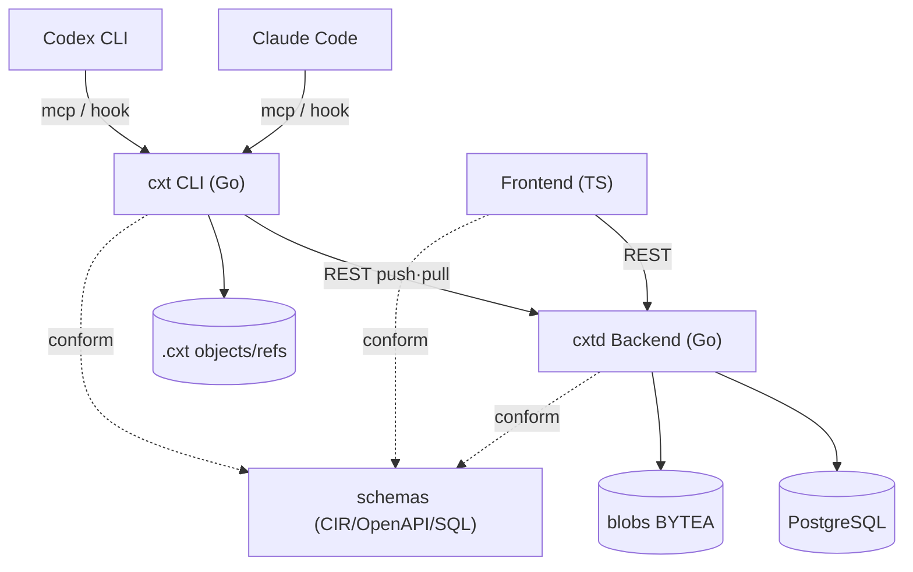

# Delivery Model — Storage and Context Restoration

> Decision: **Files and terminal workflows are canonical; MCP and IDE integrations are convenience layers.** Memory and full-context restoration must remain available through the CLI without requiring an editor integration.

## System Topology

## Native Memory/Session Location (Empirically Confirmed)
- **Claude**: Project local `.claude/` folder + `CLAUDE.md`; Auto Memory = `~/.claude/projects/<proj>/memory/MEMORY.md`(repo scope); Session = `~/.claude/projects/<cwd-encoded>/<sessionId>.jsonl`. Resume = `claude --resume <id>`.
- **Codex**: Project root **`AGENTS.md`** (no local `.codex/` folder); Project settings are in the global `~/.codex/config.toml` under `[projects."<path>"]`; Session = `~/.codex/sessions/YYYY/MM/DD/rollout-*.jsonl`; Memory DB = `~/.codex/memories_1.sqlite`(default OFF). Resume = `codex resume <id>`.
- ⚠ `.agent` is not a Codex standard. Codex's correct answer is `AGENTS.md`.

## Our Store (git's .git equivalent)
- Project local **`.cxt/`** = content address blob storage + refs(branches/HEAD) + manifest. Our own thing.
- **Do not hijack `.claude/`·`AGENTS.md`.** These are *write-only* sinks at load time.
- Global cache/remote mirror is `~/.cxt/` (optional).

## Delivery Matrix (Priority by Capability)
| Capability | Default Path | Notes |
|---|---|---|
| memory-form load | **File**: MEMORY.md/CLAUDE.md(claude), AGENTS.md(codex) write → auto load at start | Persistent, restart-agnostic |
| full-context load | **File+Terminal**: Native session file synthesis + `claude --resume`/`codex resume` | True previous turn restoration (high fidelity) |
| in-session save/fork/log/diff | **MCP/Slashes** | Stay within the session |
| immediate memory injection without restart | **MCP** `memory_load` | Digest injection into running context |

## Fallback Policy
- **CIR is the source of truth.** Native session-file synthesis from full context is sensitive to CLI format changes, so failed resume validation automatically falls back to a memory-form file or an MCP dump.
- Inject our origin/branch/snapshot metadata into the synthesized session file to maintain traceability.

## MemoryDistiller Source Strategy (Confirmed)
- **Native-first ingestion + fallback self-distillation**: Absorb from Codex `rollout_summary`/`raw_memory`·Claude `MEMORY.md`/compact-summary if available, otherwise distill directly from CIR. (Option: merge both)
