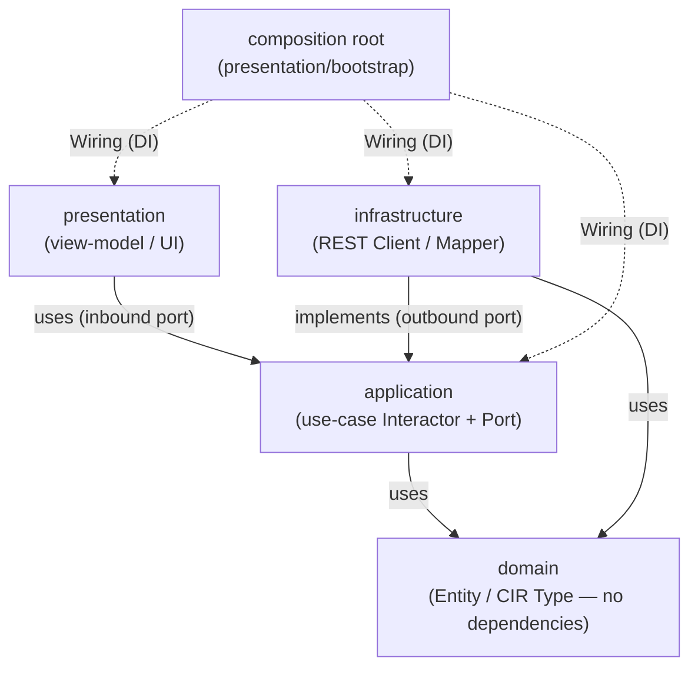

# cxthub Frontend Architecture — TypeScript Clean Layered (Design + Scaffold)

> **Implementation Status (2026-07)**: The actual deployment target web UI is implemented separately in `frontend/web/` (React + Vite) — see §8.
> This document's §1–§7 (Clean Layered Core `frontend/src/`) are maintained as framework-independent contract stubs.

> This document is the **clean layered architecture design** and **scaffold contract** for `frontend/` (package `@wnsdy95/cxthub/cli-web`, Node 22 / TS strict).
> The upper contract is [`docs/_SPINE.md`](./_SPINE.md), and this document mirrors its §2 directory tree, §4 domain entities, §5 CIR, §6 port signatures, and §7 MCP/CLI names without violation.
> The empirical format basis is [`docs/_RESEARCH-FINDINGS.md`](./_RESEARCH-FINDINGS.md).
> Sections 1–7 preserve the original **design + scaffold** contract. Unimplemented functions use `throw new Error('not implemented')` as required by the historical SPINE §8 TypeScript rule. The production React application is documented in §8.

---

## 0. One-Line Summary

The frontend is a **read-centric team session browser** (similar to GitHub UI) that consumes HTTP REST APIs exposed by the backend `cxtd`.
The frontend applies a clean layering (domain → application → infrastructure / presentation) similar to the backend hexagonal architecture, but the presentation layer is limited to framework-independent view-model stubs to pass type checks without external npm dependencies.

---

## 1. Layer Overview and Dependency Rules

### 1.1 Layer Responsibilities

| Layer | Directory (`frontend/src/`) | Responsibility | External Dependencies |
|---|---|---|---|
| **domain** | `domain/` | Pure entities/value objects/types. SPINE §4 Entities + §5 CIR **TypeScript mirror**. No logic (type guards/factories). | None (no dependencies) |
| **application** | `application/` | Use-case interactors (SPINE §6.2 inbound and 1:1) + **outbound port interfaces** (backend call abstractions). Pure logic. | domain only |
| **infrastructure** | `infrastructure/` | Outbound port **implementations**: `fetch`-based REST client (backend `cxtd` calls), DTO ↔ domain mapper. | domain, application (port interfaces), standard `fetch` |
| **presentation** | `presentation/` | Framework-independent **view-model** stubs. Define screen-specific state/action shapes. Actual renderers (React/Vue/…) are out of scope. | application (use-case interfaces), domain |

### 1.2 Dependency Rules (inward-only — enforced)



Rules (Immutable, SPINE §8 TS Layer Dependency Direction Compliance):

1. **`domain` does not import other layers.** Dependency sink. No importing of external npm packages.
2. `application` imports only `domain`. It **must not import `infrastructure`**; it defines port interfaces and receives implementations through dependency injection.
3. `infrastructure` imports `domain` and the outbound port interfaces from `application`, then **implements** those ports. It has no knowledge of `presentation`.
4. `presentation` imports only the use-case interfaces (inbound ports) from `application` and display types from `domain`. It must not import `infrastructure` directly.
5. **Composition root** (`presentation/bootstrap/container.ts`) can import all layers. DI (composition) here only.
Dependency arrows always point **outside (presentation/infrastructure) → inside (domain)**. The inside never knows about the outside.

> Hexagonal Architecture Response: The application's use-case interface is the **inbound port** (called by the presentation layer), and the application's outbound port interface is the **outbound port** (implemented by the infrastructure). This directly projects the direction rules from backend SPINE §3.2 onto the front end.

### 1.3 Import Boundary Enforcement Method (Scaffold Memo)

- Use `tsconfig.json` `compilerOptions.paths` to define layer aliases (`@domain/*`, `@application/*`, `@infrastructure/*`, `@presentation/*`) and enforce no reverse imports through code review/lint rules.
- This framework-independent package remains a contract scaffold, so import boundaries are enforced by TypeScript configuration and review rather than an additional lint plugin.

---

## 2. Domain Layer — CIR / Snapshot Mirror Type

> SPINE §4 (Entities/Value Objects) + §5 (CIR) + `schemas/cir.schema.json` TypeScript mirror. Field names/enum values are contractually bound 1:1.
> File names in kebab-case, types in PascalCase (prefix `I` forbidden). Enum mirrors using string-literal union (SPINE values directly).

### 2.1 File Batch (`frontend/src/domain/`)

| File | Content |
|---|---|
| `value-objects.ts` | `ContentHash`, `ProviderKind`, `FidelityTier`, `RefKind` (value objects/enum mirror) |
| `entities.ts` | `Repo`, `Branch`, `Snapshot`, `Ref`, `SessionDoc`, `MemoryDigest`, `Manifest`, `TeamIdentity` |
| `cir.ts` | `CIRDocument`, `Envelope`, `Event`(tag union), `ContentBlock`, `LockedBlob` etc. §5 mirror |
| `index.ts` | barrel re-export (domain public interface) |

### 2.2 Value Objects (`value-objects.ts`) — SPINE §4.1 Mirror

```ts
// Package domain/value-objects: SPINE §4.1 Value Objects TS mirror. Immutable meaning.

/** content-addressing basic unit. Format "sha256:<hex>". (SPINE §4.1) */
export type ContentHash = string;

/** Capture/target provider kind. Matches cir.schema.json providerKind. */
export type ProviderKind = 'claude' | 'codex' | 'unknown';

/** Recovery fidelity tier. (SPINE §5.5) */
export type FidelityTier = 'full' | 'reconstructed' | 'memory';

/** Ref kind. (SPINE §4.1) */
export type RefKind = 'head' | 'branch' | 'session' | 'tag';
```

### 2.3 Entities (`entities.ts`) — SPINE §4.2 Mirror (field names/types 1:1)

```ts
// Package domain/entities: SPINE §4.2 Entities TS mirror. Pure data shapes (no logic).

import type { ContentHash, ProviderKind, FidelityTier, RefKind } from './value-objects';
import type { CIRDocument } from './cir';

/** Root of session storage. (SPINE Repo) */
export interface Repo {
  id: string;            // Normalized remote URL or cwd fallback hash
  remoteUrl: string;
  localPath: string;
  defaultBranch: string;
}

/** Session line (code git branch name repurposed). (SPINE Branch) */
export interface Branch {
  name: string;
  repoId: string;
  head: ContentHash;     // Latest snapshot
}

/** Commit: immutable body·natural parents, hash outside projection/overlay mutable. */
export interface Snapshot {
  id: ContentHash;       // = canonical CIR byte hash
  repoId: string;
  branch: string;
  branches: string[];      // Projection from reflog git branch membership
  parents: ContentHash[]; // DAG; fork/merge parents
  graftParents: ContentHash[]; // Reachability overlay
  graftSeq: number;       // Overlay LWW version
  docHash: ContentHash;   // Hash of SessionDoc body
  provider: ProviderKind;
  fidelity: FidelityTier;
  message: string;
  author: TeamIdentity;
  createdAt: string;      // RFC3339 (Go time.Time serialization)
}

/** Mutable pointer (HEAD/branch/session/tag integration). (SPINE Ref) */
export interface Ref {
  kind: RefKind;
  name: string;           // e.g., main, before-refactor; HEAD is "HEAD"
  repoId: string;
  target: ContentHash;    // Snapshot it points to
  symbolic: string;       // Branch name HEAD points to (empty if direct reference)
}

/** CIR container (regular conversation body). (SPINE SessionDoc) */
export interface SessionDoc {
  hash: ContentHash;      // Content hash of self
  cir: CIRDocument;
}

/** Distilled memory (memory-form load). (SPINE MemoryDigest) */
export interface MemoryDigest {
  snapshotId: ContentHash;
  summary: string;        // Summary for human consumption from CLAUDE.md/AGENTS.md
  keyFacts: string[];
  openTasks: string[];
  provider: ProviderKind; // Format hint for injection target
}

/** Repo unit metadata index (push/pull negotiation). (SPINE Manifest) */
export interface Manifest {
  repoId: string;
  refs: Ref[];
  snapshotIndex: ContentHash[];
  version: number;
  updatedAt: string;      // RFC3339
}

/** Author identifier. (SPINE TeamIdentity) */
export interface TeamIdentity {
  name: string;
  email: string;
  team: string;
}
```

> Domain invariants (explicitly stated in comments, SPINE §4 end): `Snapshot.id == ContentHash(canonical(SessionDoc.cir))`; `Ref.target` must point to an existing `Snapshot.id`; identical `ContentHash` = identical content (dedup key). The frontend can **trust** (backend guarantees) this invariant, but can provide a validation helper stub for display/integrity badges (`verifyContentAddress(...)` → `throw new Error('not implemented')`).

### 2.4 CIR (`cir.ts`) — SPINE §5 + cir.schema.json Mirror (Tag Union)

```ts
// Package domain/cir: CIR v1 TypeScript mirror. 1:1 with cir.schema.json source of truth.
// Reflects JSON (snake_case fields) sent by the backend without mapping (zero mapping cost).

import type { ProviderKind, FidelityTier } from './value-objects';

export type Role = 'user' | 'assistant' | 'system' | 'developer';

/** Session global metadata. (SPINE §5.2 / schema envelope) */
export interface Envelope {
  cir_version: '1';
  source_provider: ProviderKind;
  source_model: string;
  captured_at: string;        // RFC3339
  cwd: string;
  git_branch: string;
  session_origin_id: string;
  fidelity: FidelityTier;
}

/** Message content block. v1 is standard text only. (schema contentBlock) */
export interface ContentBlock {
  type: 'text';
  text: string;
}

/** Provider locked blob. Immutable, no cross-replay. (SPINE §5.4 / schema lockedBlob) */
export interface LockedBlob {
  provider: ProviderKind;
  scheme: 'signature' | 'encrypted_content'; // claude=signature, codex=encrypted_content
  blob: string;                               // opaque
}

/** Common fields for all events. (schema eventBase) */
interface EventBase {
  id?: string;
  ts?: string;        // RFC3339
  seq: number;        // Normalized sort order
}

export interface TurnEvent extends EventBase {
  kind: 'turn';
  role: Role;
}
export interface MessageEvent extends EventBase {
  kind: 'message';
  role: Role;
  blocks: ContentBlock[];
}
export interface ToolCallEvent extends EventBase {
  kind: 'tool_call';
  call_id: string;
  tool_name: string;            // Provider-independent normalized name
  provider_tool_name?: string;  // Original tool name
  input: Record<string, unknown>;
  status?: string;
}
export interface ToolResultEvent extends EventBase {
  kind: 'tool_result';
  call_id: string;
  output: string | Record<string, unknown> | unknown[];
  is_error?: boolean;
}
export interface ReasoningEvent extends EventBase {
  kind: 'reasoning';
  locked?: LockedBlob;
  redacted_summary?: string;
  cross_replayable: false;      // Locked reasoning is always false
}

/** kind tag union. (schema event oneOf) */
export type Event =
  | TurnEvent
  | MessageEvent
  | ToolCallEvent
  | ToolResultEvent
  | ReasoningEvent;

/** CIR root. (SPINE §5.1 / schema root) */
export interface CIRDocument {
  envelope: Envelope;
  events: Event[];
}
```

> Design decision: CIR/Envelope/Event mirrors the **snake_case field names** of the backend JSON (1:1 with schema source of truth → zero mapping code, minimal drift risk). Entities (`Snapshot` etc.) may be in camelCase for REST DTOs during JSON serialization, so infrastructure mappers absorb them (§4.3). Once the backend JSON key notation is finalized, unification will be enforced on one side (§7 Open Questions).

---

## 3. Application Layer — Use-Case Interactors + Outbound Ports

application consists of two types:
- **Inbound Port = Use-Case Interface** (called by presentation). 1:1 with SPINE §6.2 inbound port + front-end-specific query use-case enhancements.
- **Outbound Port Interface** (implemented by infrastructure). Abstract gateway for backend calls.

### 3.1 File Batch (`frontend/src/application/`)

```
application/
├── ports/
│   └── session-gateway.ts        # Outbound port: backend REST abstract interface
├── dto.ts                        # Use-case input/output DTO (SPINE §6.2 Mirror)
├── use-cases/
│   ├── list-repos.ts             # ListReposUseCase (frontend enhancement; repo list screen)
│   ├── list-branches.ts          # ListBranchesUseCase (frontend enhancement; branch list screen)
│   ├── list-sessions.ts          # ListSessionsUseCase  ↔ SPINE ListSessions / session_list
│   ├── diff-snapshots.ts         # DiffSnapshotsUseCase ↔ SPINE DiffSnapshots / session_diff
│   ├── fork-session.ts           # ForkSessionUseCase   ↔ SPINE ForkSession  / session_fork
│   ├── load-session.ts           # LoadSessionUseCase   ↔ SPINE LoadSession  / session_load
│   ├── preview-memory.ts         # PreviewMemoryUseCase ↔ SPINE memory (MemoryDigest preview)
│   └── sync-repo.ts              # SyncRepoUseCase      ↔ SPINE SyncRepo / sync_push·sync_pull
└── index.ts
```

> Naming Alignment: Follows the names of backend inbound ports (SaveSession/ForkSession/LoadSession/ListSessions/DiffSnapshots/SyncRepo) and MCP tools (SPINE §7). `SaveSession`(session_save)·`memory_save`·`memory_load` are CLI/hook/agent-side actions, so in the web UI, only **read/fork/load/preview** are exposed (Refer to §5 Screen List). `ListRepos`/`ListBranches` for repo/branch list screens require corresponding query endpoints on the backend, which are undefined in SPINE, so they are recorded in §7 Open Questions.

### 3.2 Outbound Port (`application/ports/session-gateway.ts`)

```ts
// Package application/ports: Outbound port. application's requirements for external (backend) capabilities.
// infrastructure implements fetch-based logic, and the composition root injects it.
// Signature is normalized to match the front-end query interface, aligning with SPINE §6.2 inbound use-case and §6.1 outbound (read) operations.

import type {
  Repo, Branch, Snapshot, Ref, SessionDoc, MemoryDigest, Manifest,
} from '../../domain';
import type {
  ListInput, ListOutput, DiffInput, DiffOutput,
  ForkInput, ForkOutput, LoadInput, LoadOutput,
  SyncInput, SyncOutput,
} from '../dto';

/** Abstract single gateway port for backend cxtd REST API. */
export interface SessionGateway {
  // ── Retrieval (Read) ──
  listRepos(): Promise<Repo[]>;
  listBranches(repoId: string): Promise<Branch[]>;
  listSessions(input: ListInput): Promise<ListOutput>;       // snapshots + refs
  getSnapshot(repoId: string, id: string): Promise<Snapshot>;
  getDoc(repoId: string, docHash: string): Promise<SessionDoc>; // CIR body (timeline/diff rendering)
  getManifest(repoId: string): Promise<Manifest>;
  getMemory(repoId: string, snapshotId: string): Promise<MemoryDigest>;

  // ── Change/Action ──
  diff(input: DiffInput): Promise<DiffOutput>;
  fork(input: ForkInput): Promise<ForkOutput>;
  load(input: LoadInput): Promise<LoadOutput>;
  syncPush(input: SyncInput): Promise<SyncOutput>;
  syncPull(input: SyncInput): Promise<SyncOutput>;
}
```

### 3.3 Use-case Input/Output DTO (`application/dto.ts`) — SPINE §6.2 Mirror

```ts
// Package application/dto: use-case input/output DTO. SPINE §6.2 inbound DTO TS mirror (camelCase).

import type { ContentHash, ProviderKind, FidelityTier, Snapshot, Ref, TeamIdentity } from '../domain';

export interface ListInput  { repoId: string; branch: string; }
export interface ListOutput { snapshots: Snapshot[]; refs: Ref[]; }

export interface DiffInput  { repoId: string; left: ContentHash; right: ContentHash; }
export interface DiffEntry  { op: string; seq: number; summary: string; } // SPINE DiffEntry
export interface DiffOutput { changes: DiffEntry[]; }

export interface ForkInput  { repoId: string; fromSnapshot: ContentHash; newBranch: string; author: TeamIdentity; }
export interface ForkOutput { branch: string; head: ContentHash; }

export interface LoadInput  { repoId: string; ref: string; targetProvider: ProviderKind; mode: FidelityTier; cwd: string; }
export interface LoadOutput { writtenPath: string; fidelity: FidelityTier; }

export interface SyncInput  { repoId: string; }
export interface SyncOutput { pushed: number; pulled: number; newRefs: Ref[]; }
```

### 3.4 Use-Case Interactor (Inbound Port) — Stub Example

Each use-case is composed of **Interface (Inbound Port)** + **Interactor Class (SessionGateway Injection)**. The presentation layer depends only on the interface.

```ts
// Package application/use-cases/list-sessions: Snapshot/ref list retrieval use-case.
// SPINE inbound ListSessions / MCP session_list response.

import type { SessionGateway } from '../ports/session-gateway';
import type { ListInput, ListOutput } from '../dto';

/** Inbound Port: Presentation calls this. */
export interface ListSessionsUseCase {
  execute(input: ListInput): Promise<ListOutput>;
}

/** Interactor: Fetches backend data through outbound port (gateway). */
export class ListSessionsInteractor implements ListSessionsUseCase {
  constructor(private readonly gateway: SessionGateway) {}

  execute(_input: ListInput): Promise<ListOutput> {
    // Contract scaffold: sorting and grouping remain pure logic for a later implementation.
    throw new Error('not implemented');
  }
}
```

> The same pattern is repeated in `fork-session` (ForkSessionUseCase/Interactor), `load-session`, `diff-snapshots`, `sync-repo` (push/pull), `preview-memory`, `list-repos`, and `list-branches`. The interactor calls the gateway and performs only pure processing (sorting/DAG construction/memory formatting).

---

## 4. Infrastructure Layer — Fetch-Based REST Client (Port Implementation)

The infrastructure implements the `SessionGateway` outbound port using HTTP REST to the backend `cxtd`. It uses only standard `fetch` (Node 22 / built-in in browser) without any external npm packages → zero type checking/runtime dependencies.

### 4.0 Deployment Topology Prerequisites (Static Hosting + CORS)

The frontend is designed under the premise that it is deployed on a **separate origin** from `cxtd`.

| Item | Description |
|---|---|
| **Static Hosting** | Frontend bundles (HTML/JS/CSS) are served from a CDN or Vercel, etc., static hosting. `cxtd` and the origin can be different. |
| **API base URL (Build-time env)** | `HttpClient.baseUrl` is injected via a build-time environment variable (`VITE_API_BASE_URL` or equivalent mechanism). Hardcoding is forbidden. `AppConfig.baseUrl` receives this value and passes it to `createContainer`. |
| **CORS** | If the frontend origin is different from the `cxtd` origin, `cxtd` must include the frontend origin in the `Access-Control-Allow-Origin` allow list. CORS is not required for same-origin deployments (reverse-proxy through). |

> Local development: Default `VITE_API_BASE_URL=http://127.0.0.1:8787`. Staging/production overrides in the deployment environment.

### 4.1 File Batch (`frontend/src/infrastructure/`)

```
infrastructure/
├── http/
│   ├── http-client.ts            # fetch wrapper (base URL, JSON, error normalization)
│   └── api-routes.ts             # endpoint path constants (server routing contract)
├── rest-session-gateway.ts       # SessionGateway implementation (port → REST mapping)
├── mappers.ts                    # backend JSON DTO ↔ domain mapper (naming and type conversion)
└── index.ts
```

### 4.2 REST Client + Gateway Implementation — Stub

```ts
// Package infrastructure/http/http-client: low-level HTTP wrapper based on fetch.
// Use standard fetch only (Node 22 / browser) without external npm dependencies.

export interface HttpClientConfig {
  baseUrl: string;                 // Injected at build time via env VITE_API_BASE_URL. Example: http://127.0.0.1:8787
  fetchImpl?: typeof fetch;        // Test injection (default is global fetch)
}

export class HttpClient {
  constructor(private readonly config: HttpClientConfig) {}

  get<T>(_path: string): Promise<T> { throw new Error('not implemented'); }
  post<T>(_path: string, _body: unknown): Promise<T> { throw new Error('not implemented'); }
}
```

```ts
// Package infrastructure/rest-session-gateway: REST implementation of the SessionGateway outbound port.
// application/ports implements interfaces only, returning domain types (no reverse dependencies).

import type { SessionGateway } from '../application/ports/session-gateway';
import type { /* Repo, Branch, ... */ } from '../domain';
import type { /* ListInput, ListOutput, ... */ } from '../application/dto';
import { HttpClient } from './http/http-client';

export class RestSessionGateway implements SessionGateway {
  constructor(private readonly http: HttpClient) {}

  listRepos() { throw new Error('not implemented'); }
  listBranches(_repoId: string) { throw new Error('not implemented'); }
  listSessions(_input) { throw new Error('not implemented'); }
  getSnapshot(_repoId: string, _id: string) { throw new Error('not implemented'); }
  getDoc(_repoId: string, _docHash: string) { throw new Error('not implemented'); }
  getManifest(_repoId: string) { throw new Error('not implemented'); }
  getMemory(_repoId: string, _snapshotId: string) { throw new Error('not implemented'); }
  diff(_input) { throw new Error('not implemented'); }
  fork(_input) { throw new Error('not implemented'); }
  load(_input) { throw new Error('not implemented'); }
  syncPush(_input) { throw new Error('not implemented'); }
  syncPull(_input) { throw new Error('not implemented'); }
}
```

### 4.3 REST Endpoints (`api-routes.ts` constants — RECONCILIATION §G confirmed)

> This table is the **confirmed route contract** (RECONCILIATION §G). All routes use the `/api/v1/...` base,
> The `memories` resource follows a plural path (`/memories/{snapshotId}`).
diff / fork / load action endpoints (SYNC-PROTOCOL §2.8) are included.
`frontend/src/infrastructure/http/api-routes.ts` path constants, `SYNC-PROTOCOL.md §2.8`, and `backend/internal/adapters/delivery/http/server.go` routing must match this table 1:1.

| Method | Path | Gateway Method | SPINE/RECONCILIATION Response |
|---|---|---|---|
| GET | `/api/v1/repos` | `listRepos` | (Frontend Enhancement) |
| GET | `/api/v1/repos/{repoId}/branches` | `listBranches` | (Frontend Enhancement) |
| GET | `/api/v1/repos/{repoId}/snapshots?branch=` | `listSessions` | `session_list` |
| GET | `/api/v1/repos/{repoId}/snapshots/{id}` | `getSnapshot` | (Retrieve Enhancement) |
| GET | `/api/v1/repos/{repoId}/docs/{docHash}` | `getDoc` | (CIR body) |
| GET | `/api/v1/repos/{repoId}/manifest` | `getManifest` | outbound Manifest |
| GET | `/api/v1/repos/{repoId}/memories/{snapshotId}` | `getMemory` | `memory_load`(preview read-only) |
| POST | `/api/v1/repos/{repoId}/diff` | `diff` | `session_diff` (RECONCILIATION §G) |
| POST | `/api/v1/repos/{repoId}/fork` | `fork` | `session_fork` (RECONCILIATION §G) |
| POST | `/api/v1/repos/{repoId}/load` | `load` | `session_load` (RECONCILIATION §G) |
| POST | `/api/v1/repos/{repoId}/push` | `syncPush` | `sync_push` |
| POST | `/api/v1/repos/{repoId}/pull` | `syncPull` | `sync_pull` |

`mappers.ts` absorbs the field notation (camelCase/snake_case) and date strings from backend JSON into the domain shape. CIR (`cir.ts`) is in 1:1 correspondence with the schema (snake_case), so it passes through. Entities with notation differences are normalized here.

---

## 5. Presentation Layer — Framework-Independent View-Model Stubs

Presentation is **framework-independent** (React/Vue/Svelte). Each screen is defined as a **view-model** in the form of (state, actions), and actual rendering is attached in subsequent turns/framework decisions. No external npm usage → strict type check passed.

### 5.1 Screen List (GitHub-like Navigation)

Required flow: **repo list → branch list → snapshot timeline → diff → fork button → memory preview**.

| # | Screen | View-Model | Consumed Use-Case | GitHub Equivalent |
|---|---|---|---|---|
| 1 | Repo List | `RepoListViewModel` | `ListReposUseCase` | Repository List |
| 2 | Branch List | `BranchListViewModel` | `ListBranchesUseCase` | Branch List |
| 3 | Snapshot Timeline | `SnapshotTimelineViewModel` | `ListSessionsUseCase` | Commit History/DAG |
| 4 | Diff View | `DiffViewModel` | `DiffSnapshotsUseCase` (+ `getDoc`) | Commit Diff |
| 5 | Fork Action | `ForkActionViewModel` | `ForkSessionUseCase` | "Fork" Button |
| 6 | Memory Preview | `MemoryPreviewViewModel` | `PreviewMemoryUseCase` | (cxt unique: distillation summary) |
| (Auxiliary) | Load Action | `LoadActionViewModel` | `LoadSessionUseCase` | Checkout |
| (Auxiliary) | Sync Status | `SyncStatusViewModel` | `SyncRepoUseCase` | Push/Pull Badge |

### 5.2 File Batch (`frontend/src/presentation/`)

```
presentation/
├── view-models/
│   ├── repo-list.ts
│   ├── branch-list.ts
│   ├── snapshot-timeline.ts
│   ├── diff-view.ts
│   ├── fork-action.ts
│   ├── load-action.ts
│   ├── memory-preview.ts
│   └── sync-status.ts
├── bootstrap/
│   └── container.ts              # composition root (DI assembly)
└── index.ts
```

### 5.3 view-model Shape — Stub Example

```ts
// Package presentation/view-models/snapshot-timeline: snapshot timeline screen view-model.
// Framework-independent. Defines only the (state, actions) shape.

import type { ListSessionsUseCase } from '../../application';
import type { Snapshot, Ref } from '../../domain';

export interface SnapshotTimelineState {
  loading: boolean;
  error: string | null;
  snapshots: Snapshot[];   // For timeline loading, sorted by createdAt and DAG display
  refs: Ref[];             // Badges, achievements for head/branch/session/tag
  selectedId: string | null;
}

export interface SnapshotTimelineViewModel {
  state: SnapshotTimelineState;
  /** Load timeline by repoId/branch. */
  load(repoId: string, branch: string): Promise<void>;
  select(snapshotId: string): void;
}

export function createSnapshotTimelineViewModel(
  _listSessions: ListSessionsUseCase,
): SnapshotTimelineViewModel {
  // Contract scaffold: state machines and subscriptions are framework-specific.
  throw new Error('not implemented');
}
```

> Other view-models (`repo-list`/`branch-list`/`diff-view`/`fork-action`/`load-action`/`memory-preview`/`sync-status`) follow the same pattern: `XxxState` + `XxxViewModel` + `createXxxViewModel(useCase): XxxViewModel`(→ `throw new Error('not implemented')`). This way, React adapters can wrap view-models with `useSyncExternalStore`, and Vue with `reactive`, isolating framework replacement costs.

---

## 6. DI / Composition Root

DI occurs **only** in `presentation/bootstrap/container.ts` (§1.2 Rule 5). Injects implementation from outside to inside: `HttpClient` → `RestSessionGateway` (outbound port implementation) → each interactor (use-case) → each view-model.

```ts
// Package presentation/bootstrap/container: composition root.
// The single point where all layers are imported to wire up dependencies.

import { HttpClient } from '../../infrastructure/http/http-client';
import { RestSessionGateway } from '../../infrastructure/rest-session-gateway';
import { ListSessionsInteractor /*, ForkSessionInteractor, ... */ } from '../../application';
import type { SessionGateway } from '../../application';

export interface AppConfig { baseUrl: string; }

export interface AppContainer {
  gateway: SessionGateway;
  listSessions: ListSessionsInteractor;
  // fork / load / diff / sync / previewMemory / listRepos / listBranches ...
}

/** Assembles the entire dependency graph from the configuration. */
export function createContainer(config: AppConfig): AppContainer {
  const http = new HttpClient({ baseUrl: config.baseUrl });
  const gateway = new RestSessionGateway(http);
  return {
    gateway,
    listSessions: new ListSessionsInteractor(gateway),
    // ... inject the same gateway as the rest of the interactors
  };
}
```

Assembly order (inside→outside injection):
1. `HttpClient`(infrastructure) ← `AppConfig.baseUrl`.
2. `RestSessionGateway`(infrastructure, outbound port implementation) ← `HttpClient`.
3. Each `XxxInteractor`(application inbound port) ← `SessionGateway`.
4. Each view-model(presentation) ← corresponding use-case interface.
5. The framework entry point (subsequent turn) binds the view-models to the renderer using the result of `createContainer`.

// Inject an in-memory fake `SessionGateway` in place of `RestSessionGateway` for testing (thanks to the port for lossless substitution). Possible to perform type checking and unit tests for presentation/application layers independently of the backend.

---

## 7. Open Questions (SPINE Mismatch/Undefined Tracking)

> Prioritize SPINE, but to fulfill the current screen requirements, the following is needed. Since SPINE is undefined, it is recorded here (SPINE §2 Tree/§4/§5/§6/§7 do not violate this).

1. ~~**HTTP REST route undefined**~~ → **Resolved(§4.3 / SYNC-PROTOCOL §2 openapi reference)**:
   The `cxtd` REST route was finalized in SYNC-PROTOCOL §2(REST Surface Truth) and RECONCILIATION §G.
   §4.3 is the definitive contract, and the `frontend/src/infrastructure/http/api-routes.ts` constant path matches this exactly.
   The diff/fork/load action endpoints are specified in SYNC-PROTOCOL §2.8. The contract that the backend `adapters/delivery/http/server.go` must share the same route is also noted in the api-routes.ts doc comments.
2. **Missing repo/branch list retrieval port**: Screen 1·2(repo→branch) does not correspond to an SPINE inbound port(§6.2). An outbound `SessionStore.Manifest`/`ListRefs` can be derived, but a dedicated retrieval use-case(`ListRepos`/`ListBranches`) and corresponding server endpoint are needed. A decision is required on whether to add an inbound port to the backend.
3. **CIR body (SessionDoc) retrieval route**: The timeline/diff render requires `getDoc(docHash)`, but there is no single document retrieval in the SPINE inbound port (only an outbound `SessionStore.GetDoc` exists). The serve should expose this as a read endpoint.
4. **JSON case notation (JSON case) not finalized**: Entities are in camelCase, while CIR is mirrored in snake_case according to the schema. Once the backend JSON serialization notation is finalized, unify it on one side and adjust the `mappers.ts` role.
5. **Web UI write scope**: `session_save`/`memory_save`/`memory_load` injection is for CLI/hooks/agents, so the web should only expose read+fork+load+memory-preview. Whether to allow save/injection triggers in the web is a product decision.


---

## 8. Real-time Web UI — `frontend/web/` (React + Vite, Implementation Complete)

§1–§7 apart, the cxthub website is self-containedly implemented in `frontend/web/`.
(Separation to avoid conflicts between NodeNext `.js` import and Vite bundler interpretation).

### 8.1 Configuration

| File | Role |
|---|---|
| `src/route.ts` | **History API Path Routing** — `/<username>/<workspace-slug>[/members\|/connections]`, `/invite/<token>`, `/login/device?code=…`(CLI Pairing Approval), Legacy `/w/<id>`·Hash Link Auto Promotion. `navigate`(pushState)/`replacePath` synthesizes popstate to unify listener. |
| `src/api.ts` | REST client. All requests `credentials:'include'` — authentication via **HttpOnly `cxt_session` cookie** only (JS does not store token → XSS mitigation). Login exchange (`POST /auth/session`) only passes IDP token once in header. |
| `src/auth.ts` | IDP token generator — Firebase Email/Password·Google popup (configured) / dev token (unconfigured). |
| `src/hooks.ts` | React Query v5 — Authentication status is determined by the `me` query (200=logged in). Queries include workspaces/members/repos (workspace filter)/refs/snapshots/doc (infinite cache — content-addressed) + login/logout/workspace/invite/profile (`PATCH /me` — username·nickname·load_mode)/member role mutations. |
| `src/store.ts` | Zustand — UI selection state only (selected workspace). Server state is all React Query (role separation). |
| `src/types.ts` | 1:1 mapping with backend wire(snake_case) types — no additional mapping required. |
| `src/roles.ts` | **5-rank role ladder** UI response (`ROLE_RANK`: viewer<puller<member<maintainer<owner) — server `guard` mirror. UI gating is for usability, but enforcement is always server-side. |
| `src/graph.ts` | Commit graph **pure function** (git log --graph mental model — lane-specific expected hashes, branch join/merge lanes). |
| `src/secretscrypto.ts` | `.cxtsecrets` end-to-end encryption (PBKDF2-SHA256 600k + AES-256-GCM) — CLI Go implementation and **byte compatibility**. Passphrases/plaintexts stay in the browser. |
| `src/zip.ts` | Minimal ZIP generator (STORE uncompressed) — Download team settings bundle folder structure as-is. |
| `components/Dashboard.tsx` | Shell: Sidebar (Workspace) + Tabs (Context|Members|Connections, URL segment sync) + Invite link issue/copy. |
| `components/ContextView.tsx` | **Context Browser** (GitHub repo view response): Auto-select base branch → head context display, branch dropdown, commit log (click for context at that point), branch head·tag **ref badge**, CIR event viewer (user/assistant chat + tool block summary line). Hide write UI·asset section if role=null (public read). |
| `components/CommitGraph.tsx` | GitHub network style SVG graph. Pushed/Unpushed/Uncommitted states are distinguished by opacity, nodes, and dividers. Members can drag the pushed session side chain to join the same git branch. The Context tab explicitly shows the selected branch and infers On Hold only when it is the unique branch membership. In the modal, selecting X or the entire natural descendant tree is possible, and the server validates the final scope and segment. |
| `components/AIBar.tsx` | **Participate in AI Attribution** — GitHub "Languages" widget AI label: Snapshot `models` list as stack bar+legend (Claude/Codex entities fixed colors). |
| `components/About.tsx` | GitHub About page right rail (edit description/website/topics, maintainer or higher) + team basic settings and secrets section. |
| `components/Settings.tsx` | Account settings (nickname/username/**load_mode** → `PATCH /me`)·Workspace settings (publicity, etc. — owner only) modal. |
| `components/PublicBrowse.tsx` | Non-logged in **public read-only** (GitHub public repo response) — read-only public workspace. |
| `components/DeviceApprove.tsx` | CLI pairing approval page (`/login/device?code=…`) — `cxt login` runs in this browser to verify and approve the code, bypassing the page. |
| `components/Login.tsx` | Login (mode chip DEV/FIREBASE, email+password or Google). |

### 8.2 Operational Characteristics

- **dev**: Vite proxy (`/api` → cxtd :8907) — first-party (SameSite=Lax) cookies, no CORS.
- **prod**: SPA rewrite (all paths → index.html, exclude `/api/*`). Frontend API must be same-site deployed (cross-domain requires `CXT_COOKIE_SAMESITE=none` + CSRF token follow-up).
- Design: Minimal (monochrome ink+hairline, semantic colors only), monospace labels/hashes. Accessibility: focus-visible, role=alert/status, keyboard navigation.
- Validation: `npx tsc --noEmit` + `vite build` (Makefile `typecheck`/`web` targets).
