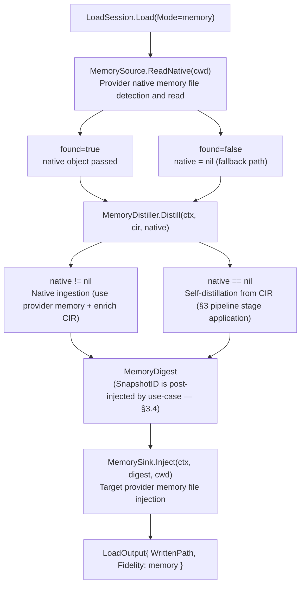
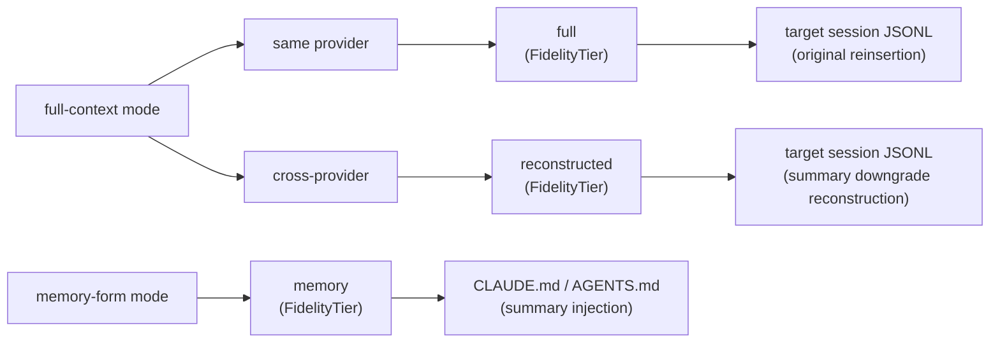
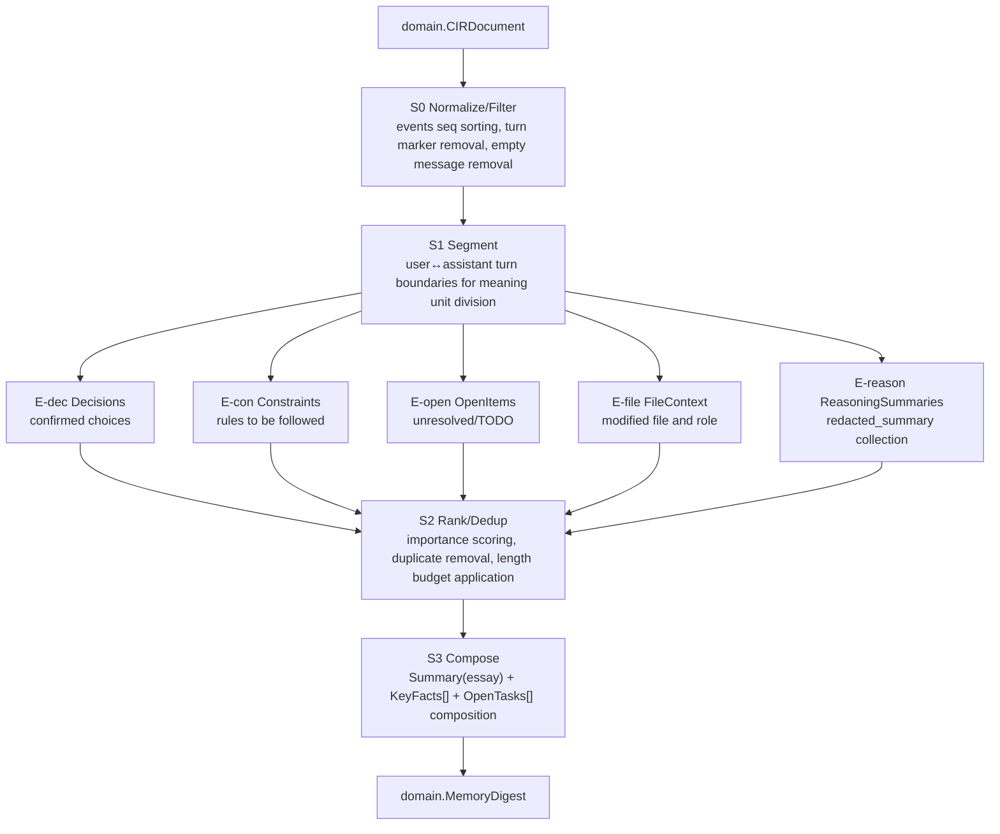
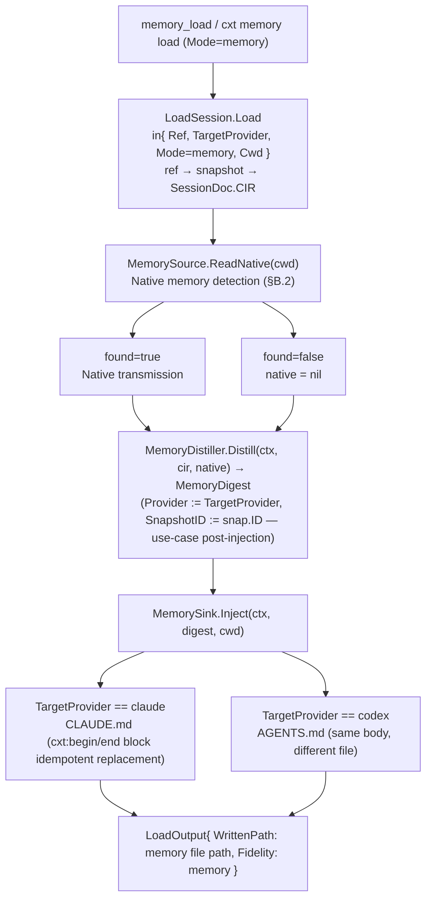

# MEMORY — Memory/Load Mode Design (facet: memory)

> This document designs the **memory distillation pipeline** and the two load modes (full-context vs memory-form).
> The historical contract is defined by [`_RECONCILIATION.md`](./_RECONCILIATION.md) (§B–§E) and [`_SPINE.md`](./_SPINE.md). Empirical provider-format evidence is recorded in [`_RESEARCH-FINDINGS.md`](./_RESEARCH-FINDINGS.md).
> This document defines the canonical contract for the three ports (`MemorySource`, `MemoryDistiller`, `MemorySink`) confirmed in RECONCILIATION §B and the **native-first ingestion + fallback self-distillation** model.
> In case of conflict with the single `MemoryDistiller` (legacy) of SPINE, RECONCILIATION §B takes precedence.
> Prose, identifiers, code, and schema keys are maintained in English.

---

## 0. Scope of This Document (Revised)

- **Implementation Status (2026-07)**: Memory source/sink/distiller (rule-based) are implemented. LLM distillation is still a future option.
- This document covers (a) the **three RECONCILIATION §B ports** (`MemorySource`, `MemoryDistiller`, and `MemorySink`) and the native-first ingestion model, (b) differences and use cases for the load modes, (c) the `MemoryDistiller` pipeline (CIR → extraction → `MemoryDigest`), (d) provider-specific injection paths, (e) cross-provider compatibility of distilled results, and (f) the heuristic for choosing full context or memory.
- What is **not defined here**: Store disk layout, codec decode/encode details, synchronization protocol (each managed by different facet documents). This document consumes the contract but does not redefine it.

---

## B. Memory Ports — Native-First Ingestion + Fallback Self-Distillation (RECONCILIATION §B Confirmed)

> This section provides the **single source of truth** for the port signatures. The legacy single `MemoryDistiller` interface of SPINE is replaced and extended by the following three ports.

### B.1 Port Definition (`internal/ports/outbound`)

```go
// MemorySource: read native memory from the provider when available.
// Example: Claude ~/.claude/projects/.../MEMORY.md, Codex rollout_summary section.
type MemorySource interface {
    Provider() domain.ProviderKind
    ReadNative(ctx context.Context, cwd string) (native domain.NativeMemory, found bool, err error)
}

// MemoryDistiller: ingest native memory when available; otherwise self-distill from CIR. (Native-first + fallback)
// SPINE's single Distill(cir) signature extended form. native == nil is the fallback path.
type MemoryDistiller interface {
    Distill(ctx context.Context, cir domain.CIRDocument, native *domain.NativeMemory) (domain.MemoryDigest, error)
}

// MemorySink: Inject MemoryDigest into the native memory file of the target provider.
// e.g., claude → CLAUDE.md (or .claude/ memory file), codex → AGENTS.md.
type MemorySink interface {
    Provider() domain.ProviderKind
    Inject(ctx context.Context, digest domain.MemoryDigest, cwd string) (writtenPath string, err error)
}
```

domain value object addition:
```go
// NativeMemory: native memory generated by a provider CLI (ingestion source).
type NativeMemory struct {
    Provider   ProviderKind
    Source     string            // e.g., "claude:MEMORY.md", "codex:rollout_summary"
    Text       string
    Structured map[string]string // optional
}
```

Implementations live in `cli/internal/adapters/memory/`: Claude and Codex sources/sinks plus the deterministic `RuleDistiller` fallback.

### B.2 Native-First Ingestion Flow (`LoadSession` memory mode)



> **Core invariant**: If native memory exists, ingest it first because the provider's own summary is more accurate. Otherwise, fall back to CIR-based self-distillation. Both paths pass through the single `MemoryDistiller.Distill` port without branching in the use case.

---

## 1. Core Concepts — "Load" has three fidelity tiers

cxt's `LoadSession` use-case (SPINE §6.2) checks out the snapshot to the target provider session. At this time, `LoadInput.Mode domain.FidelityTier` determines which fidelity to restore. SPINE §4.1 / §5.5 / `cir.schema.json`'s `fidelityTier` enum has exactly three values:

| `FidelityTier` | One-line Meaning | Transcript Restoration? | Locked Reasoning |
|---|---|---|---|
| `full` | Full restoration to original provider | Full restoration | Original (`locked.blob`) re-injection |
| `reconstructed` | Cross-provider reconstruction | Text+toolcall restoration | Inactive, `redacted_summary` fallback |
| `memory` | Only memory summary injection | **No restoration** | Use only `redacted_summary` |

This three-tier system maps to the two user-facing **load modes** as follows:

**full-context mode** = `full` or `reconstructed` to load. → "Restores the session transcript itself as the target CLI session file." For a provider, use `full`; for a cross-provider, use `reconstructed`.
**memory-form mode** = `memory` to load. → "Restores the transcript without injection, injecting the distilled summary into the provider memory file (`CLAUDE.md` / `AGENTS.md`)."

**Mode** represents the user's intent (full restoration or summary injection), while **tier** represents the fidelity achieved in realizing that intent. The tier for the full-context mode automatically branches to `full`/`reconstructed` based on the provider match, while the tier for the memory-form mode is always `memory`.



---

## 2. full-context vs memory-form — Differences and Use Cases

### 2.1 full-context (Transcript Restoration)

- **What**: Encodes CIR's `events` (turn/message/tool_call/tool_result/reasoning) in time order (`seq`) into the target provider's session JSONL, allowing the target CLI to "continue the conversation as is." The output is the session file path pointed to by `CaptureSource.SessionFilePath(...)`, which is `LoadOutput.WrittenPath`.
- **Fidelity**:
  - Same provider (claude→claude / codex→codex) → `full`. Injects locked reasoning (`locked.blob` = claude `thinking.signature` / codex `reasoning.encrypted_content`) **verbatim** (RESEARCH §72, SPINE §5.4).
  - Cross-provider (claude↔codex) → `reconstructed`. Preserves text+toolcall transcripts but disables cross-replay for locked reasoning, which is **downgraded** to plain text (`redacted_summary`) (SPINE §5.4 rules).
- **When**: Use when you need to **continue exactly from that point**. For debugging, when a reviewer needs to see the steps in detail, or when losing long tool interactions (multiple Edit/Bash cycles) is unacceptable.
- **Cost**: High token/context cost. Long sessions lock down the target CLI's context window significantly and carry noise (intermediate attempts, failed tool calls) verbatim.

### 2.2 Memory-form (Distillation Summary Injection)

- **What**: `MemoryDistiller` injects the `MemoryDigest` (SPINE §4.2) created from the CIR into a **memory file that the target provider automatically reads at session start**. Transcripts are not restored. Outputs are located at `CLAUDE.md` (or memory directory) / `AGENTS.md` path.
- **Fidelity**: Always `memory`. Reasoning is reflected only in `redacted_summary` (original text not restored).
- **When**: Start a new task/session with **only the conclusion of the previous context**. When team members only need to know "what decisions were made and what remains", when the entire transcript is too large for the context budget, or when cross-provider collaboration does not require precise replay.
- **Cost**: Low (summary bundle). However, detailed/precise tool inputs at each step are lost. Some nuance of "why it was done that way" may be lost.

### 2.3 One-Click Comparison

| Axis | Full-Context | Memory-Form |
|---|---|---|
| Use-Case Entry | `LoadSession.Load` (`Mode=full`\|`reconstructed`) | `LoadSession.Load` (`Mode=memory`) |
| MCP Tool (SPINE §7.1) | `session_load` | `memory_load` |
| CLI (SPINE §7.2) | `cxt load` | `cxt memory load` |
| Output Target | Session JSONL (target provider) | Memory file (`CLAUDE.md`/`AGENTS.md`) |
| Transcript | Restored | Not restored (summary only) |
| Tool Call Details | Preserved | Lost (core only in summary) |
| Context Cost | High | Low |
| Cross-Provider Compatibility | Moderate (reasoning downgraded) | High (provider-agnostic summary) |
| Result `FidelityTier` | `full` or `reconstructed` | `memory` |

---

## 3. MemoryDistiller Pipeline (CIR → MemoryDigest)

`MemoryDistiller` port follows the **updated signature in RECONCILIATION §B** (`§B.1` reference):

```go
// MemoryDistiller: ingest native memory when present; otherwise distill from CIR.
// (Native-first + fallback — RECONCILIATION §B)
type MemoryDistiller interface {
    Distill(ctx context.Context, cir domain.CIRDocument, native *domain.NativeMemory) (domain.MemoryDigest, error)
}
```

This document designs a single method **internal stage pipeline**. The stages are implementation details and do not change the surface — externally, it appears as a single `Distill` call (`native == nil` fallback included).

### 3.1 Output: `MemoryDigest` Field Mapping (SPINE §4.2)

The final output form of the distillation pipeline is **fixed** by SPINE. The pipeline design determines what extraction result fills each field:

| `MemoryDigest` Field | Type | What to Fill |
|---|---|---|
| `SnapshotID` | `ContentHash` | ID of the distillation target snapshot (use-case injected; not present in CIR itself → see §3.4) |
| `Summary` | `string` | Narrative summary for human reading (injected body). Synthesizes decisions, constraints, unresolved issues, and file context in prose |
| `KeyFacts` | `[]string` | Flattened list of extracted **decisions + constraints** |
| `OpenTasks` | `[]string` | Flattened list of extracted **unresolved open questions/TODOs** |
| `Provider` | `ProviderKind` | Injection target format hint (set in `TargetProvider` of memory_load) |

> `MemoryDigest` has no dedicated file-context field. File information is represented through `KeyFacts` and `Summary`; possible schema extensions are recorded in §9.

### 3.2 Pipeline Steps (Logical Flow)



#### S0 — Normalize/Filter
- Input `cir.events` to be sorted in ascending order by `seq` (SPINE §5.3 ensures normalized sorting).
- Exclude `kind == "turn"` (UI/turn meta) from distillation. Remove empty or whitespace-only blocks from `message`.
- Tag `tool_result` entries where `is_error == true` as "attempt failed" (unresolved/warning signal candidate).

#### S1 — Segment
`turn` boundary (or role transition) splits the conversation into meaning units (segments). Each segment is a "user request → assistant response + tool cycle" bundle.
extractor runs at the segment level to preserve local context (local context).

#### E-dec — Extract Decisions
- Signal: Assistant `message` with definitive vocabulary ("decide/adopt/select/~go", "we'll use", "decided"), user approval (`message` role=user consent), `tool_call` (e.g., `write_file`/`edit_file`) **empirically verified** changes.
- Output: Decision sentence list → `KeyFacts` join. Example: `"decision: self-store + git meaning adoption"`.

#### E-con — Constraint Extraction
- Signal: Imperative/Prohibitive ("must/never/prohibited/must", "do not", "compile must pass"), environment constraints (Go 1.26, Node 22, TS strict), architecture constraints (Hexagonal Architecture dependency direction).
- Output: Constraint sentence list → `KeyFacts` join. Example: `"constraint: domain package internal package import prohibition"`.

#### E-open — Extract Unresolved OpenItems
- Signal: Unclosed question, "TODO/defer/later/follow-up/unresolved", ends with `tool_result.is_error == true` and no subsequent resolution, mentions "next turn".
- Output: Unresolved sentence list → `OpenTasks`. Example: `"open: MemoryDigest needs file-context field addition decision"`.

#### E-file — Extract FileContext (file context)
- Signal: Identify original action from `provider_tool_name` in `input` of `tool_call` with file-related regular tool names (`read_file`/`edit_file`/`write_file` and codex `apply_patch`).
- Output: `"touches: <path> (<Action Summary>)"` string → `KeyFacts` join (no new field creation, §3.1).
- Normalize absolute paths to relative paths based on `envelope.cwd` for readability and portability.

#### E-reason — ReasoningSummaries (Reasoning Summaries) Collection
- Collect only the `redacted_summary` (plain text) of reasoning events. **Do not include `locked.blob` (signature/ciphertext) in the distillation input** (cross-replay impossible, meaningless — RESEARCH §72).
- Output: Used only to strengthen the "rationale" of decisions/restrictions. Matches the memory tier's reasoning processing rules (SPINE §5.4).

#### S2 — Rank/Dedup
- Score extracted items by importance (recency, user emphasis, and evidence in the resulting code).
- Remove semantic duplicates (merge rephrasing of the same decision).
- Length budget applied — Memory files should be short for high utility (§6 Heuristic).

#### S3 — Compose
- `Summary`: Synthesize **provider-agnostic prose** of decisions/restrictions/unresolved issues/file context (including section headers, §4 Template).
- `KeyFacts`: Flattened list of decisions + constraints + file context.
- `OpenTasks`: List of open items.
- `Provider`: Injection target specified by the caller (configuration only, content is provider-agnostic).

### 3.3 Determinism Requirement

- `Distill` must be **deterministic** (same CIR → same Digest). Reason: to consistently apply content-addressing and deduplication mental models in memory, and to ensure reproducibility across teams.
- The implemented extractor therefore uses **deterministic rules and heuristics**. LLM-based distillation remains a possible separate adapter because it introduces nondeterminism and an external dependency (§9).

### 3.4 Source of `SnapshotID` — Boundary Awareness

The input to `MemoryDistiller.Distill` is only `CIRDocument`, and there is no `SnapshotID` in the CIR envelope (since the snapshot ID is a hash of the CIR bytes, it is cyclical). Therefore:

- The `MemoryDigest.SnapshotID` returned by `Distill` is set to **zero**,
- and the `LoadSession` (memory mode) or `memory_save` handler in the **use-case layer (app)** knows the snapshot ID, so it fills `digest.SnapshotID = snap.ID` there.
- This aligns with the dependency rules in SPINE §3.2 (adapters implement ports; orchestration is in the app). This document explicitly states this responsibility distribution but does not add new ports.

---

## 4. MemoryDigest → Provider-Agnostic Memory File Synthesis (Provider-Independent Body)

Core Principle: **`MemoryDigest` is provider-agnostic**. The same Digest is injected regardless of whether it is from Claude or Codex. The difference between providers is **"which file and marker to use"**; the body itself is the same (§5 Cross-Compatibility).

`Summary` recommended template (language agnostic, section header English key):

```markdown
# cxt memory — <branch> @ <snapshot-short-id>
<!-- cxt:begin generated; do not edit by hand -->

## Context
<1–3 sentences session one-liner background + captured_at + source_provider/source_model>

## Decisions
- <Decision 1>
- <Decision 2>

## Constraints
- <Constraint 1>

## Open
- <Unresolved/Next Task 1>

## Files touched
- <relpath> — <Summary of action>

<!-- cxt:end generated -->
```

- `KeyFacts` → Bullets for Decisions/Constraints/Files section. `OpenTasks` → Bullets for Open section.
- `cxt:begin/end` markers to **encapsulate the generated block** alongside the user's handwritten memory (idempotent update: on re-entry, only the content between markers is replaced).

---

## 5. Provider-specific injection paths + cross-compatibility of distillation results

### 5.1 Injection target files (RESEARCH §63–66, SPINE §7.1 `memory_load`)

| Provider | Memory Injection Path | Notes |
|---|---|---|
| **Claude** | Project root `CLAUDE.md`, or memory directory (`.claude/` series) | Project memory automatically loaded at session start. The generated block is isolated by `cxt:begin/end` markers. |
| **Codex** | Project root `AGENTS.md` | Codex reads the agent instructions file at session start. Same marker convention. |

- Both paths are specified **relative to the cwd (project root)**. `LoadInput.Cwd` is the base point.
- The actual "where to write" decision and file I/O are the responsibility of `adapters/delivery` (or codec/memory writer adapters). This facet is only responsible for **path conventions and body synthesis rules**.
- Injection is **non-destructive**: existing user-written memories are preserved, and only the `cxt:begin/end` blocks are replaced idempotently.

### 5.2 Injection Path Branching (memory-form load flow)



### 5.3 Cross-Compatibility — Provider-Independent MemoryDigest at Core

The greatest benefit of distillation is that **cross-compatibility is essentially free**. The reasons are:

1. **Provider-lock (provider-lock) disappears**. The deactivation of `thinking.signature`/`encrypted_content` in full-context cross-load was a major obstacle (SPINE §5.4). memory-form only writes the reasoning's `redacted_summary` (plain text), so **it does not touch the original text at all** → claude→codex, codex→claude both maintain the same quality.
2. **`MemoryDigest` itself is provider-independent**. The `Provider` field is merely a hint about "where to write" and has no impact on the body. Thus, a single distilled Digest can be symmetrically injected into both providers.
3. Therefore, the cross-compatibility matrix is simple:

| source_provider → TargetProvider | full-context result | memory-form result |
|---|---|---|
| claude → claude | `full`(reinjection of original text) | `memory` |
| codex → codex | `full`(reinjection of original text) | `memory` |
| claude → codex | `reconstructed`(reasoning downgrade) | `memory` (same text) |
| codex → claude | `reconstructed`(reasoning downgrade) | `memory` (same text) |

→ **Memory form becomes more advantageous as a team switches providers more frequently** (reflected in the §6 heuristic).

---

## 6. When to use full-context, when to use memory-form? (Recommended Heuristic)

Recommended logic (also to be documented in the scaffold's docstring):

```
Recommended mode selection
│
├─ Do you need to continue the same task accurately (restarting from a breakpoint, preserving tool cycles)?
│     Yes ─▶ full-context
│
├─ Is the target provider the same as the original provider and is fidelity to reasoning important?
│     Yes ─▶ full-context (full tier, reinjection of original text)
│
├─ Is a step-by-step transcript absolutely necessary across providers?
│     Yes ─▶ full-context (reconstructed tier, acceptance of reasoning downgrade)
│
├─ Is starting a new task with only "conclusion/restrictions/unresolved issues" sufficient?
│     Yes ─▶ memory-form
│
├─ Is the session very long, pressuring the context budget?
│     Yes ─▶ memory-form (compression through summarization)
│
└─ Are frequent provider switches and lower reasoning precision acceptable?
      Yes ─▶ memory-form (escape from locking, symmetric injection)
```

Summary table:

| Situation | Recommendation |
|---|---|
| Resuming from a debugging breakpoint with exact context | full-context |
| Reviewer confirming step-by-step tool calls | full-context |
| Retaining the same provider + reasoning | full-context (`full`) |
| Starting a new branch/new task with only the conclusion | memory-form |
| Context budget pressure (very long session) | memory-form |
| Frequent cross-provider movements + unnecessary precise replay | memory-form |
| Team onboarding ("What's the situation with this branch?") | memory-form |
| Delivering only the "pure" results in noisy trial sessions | memory-form |

Default recommendation: **Automatic hook capture is full-context (preserving snapshot source)**, **Cross-provider load/start point for team sharing is memory-form**. However, the final choice is prioritized by the user/caller argument (`LoadInput.Mode`).

---

## 7. Implementation Map

- `internal/ports/outbound` defines the three ports: `MemorySource`, `MemoryDistiller`, and `MemorySink`.
- `internal/domain` defines `NativeMemory`, `MemoryDigest`, and `ProviderUnknown`.
- `internal/adapters/memory` implements Claude/Codex sources and sinks plus `RuleDistiller`.
- `internal/app` orchestrates memory-mode load as `ReadNative` → `Distill` → `Inject`, then fills `SnapshotID`, `Provider`, and `LoadOutput.Fidelity`.
- `MemoryDigest` intentionally keeps file context in `Summary`/`KeyFacts` rather than adding provider-specific fields.

---

## 8. RECONCILIATION/SPINE Contract Compliance Check

- Entity/Field: `MemoryDigest{ SnapshotID, Summary, KeyFacts, OpenTasks, Provider }` only. `NativeMemory` redefined (RECONCILIATION §B.1). ✔
- Ports: Adhere to the 3 port signatures of RECONCILIATION §B (`MemorySource`, `MemoryDistiller`, `MemorySink`). ✔
- Fidelity: Use only `FidelityTier{full,reconstructed,memory}` (schema enum match). ✔
- Native-first ingestion: `MemorySource.ReadNative` → `Distill(cir, native)` → `MemorySink.Inject` (§B.2). ✔
- CIR: Extraction references only `events` of `message/tool_call/tool_result/reasoning` and `envelope.cwd/git_branch/source_*`. ✔
- Lock Handling: `locked.blob` excluded from distillation input, `redacted_summary` only used (SPINE §5.4). ✔
- Naming: Load mode ↔ `session_load`/`memory_load`, `cxt load`/`cxt memory load` (SPINE §7) exact mapping. ✔
- Implementations are wired through outbound ports and covered by unit and restore tests. ✔

---

## 9. Open Questions (SPINE Discrepancies/Unresolved — SPINE Precedence Principle)

1. **Missing file-context-specific fields.** The `MemoryDigest` lacks file-context-specific fields, so this facet merges into `KeyFacts`/`Summary`. For future precision in re-load/UI display, add `FilesTouched []string` (or `[]FileTouch{Path,Action}`) to SPINE §4.2. (Currently, no addition — SPINE priority.)
2. **Responsibility for `SnapshotID` filling.** The app layer injects the snapshot ID after the `Distill` input (§3.4). This interpretation without changing the port signature. If Digest is to be content-addressed, additional hash rules must be defined (SPINE undetermined).
3. **Distillation engine selection (rules vs LLM).** For determinism and reproducibility, initially recommend rule-based (§3.3). Whether to treat LLM-based distillation as first-class and how to reconcile its non-determinism with the content-addressed model is undetermined in SPINE.
4. **Claude memory path polymorphism.** RESEARCH mentions `CLAUDE.md`/memory directory, but the exact directory specification (project vs user scope) is outside the empirical scope. Priority of the injection target path must be determined in the delivery adapter facet.
5. **Relationship with memory_save.** SPINE §7.1 `memory_save("distill the current session to MemoryDigest")` is the **persistence** point for Digest. The storage location (separate namespace within the store vs. snapshot attachment) is managed by the storage facet — this document is responsible for the creation pipeline only and does not define the persistence layout.

---

_This document is the design and implementation contract for the memory facet._
