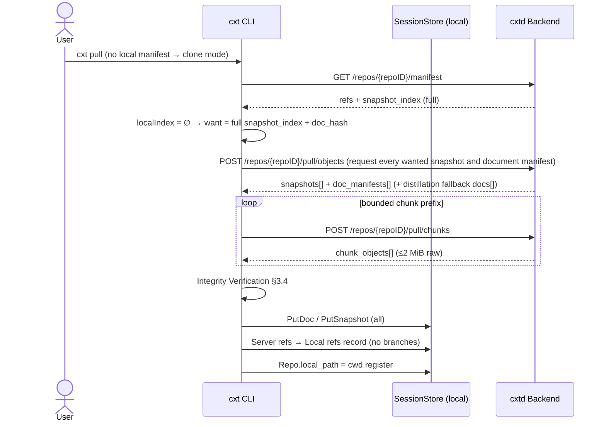
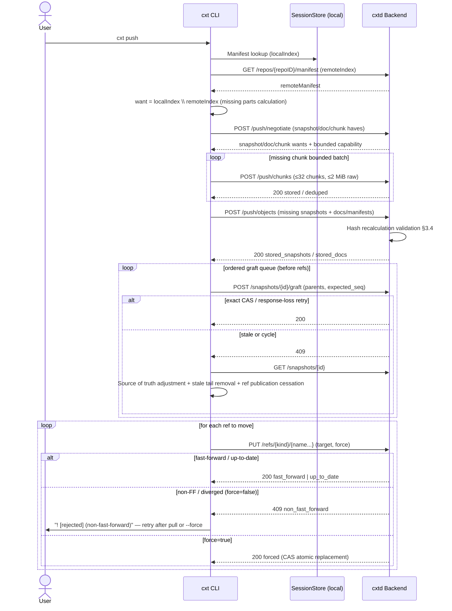
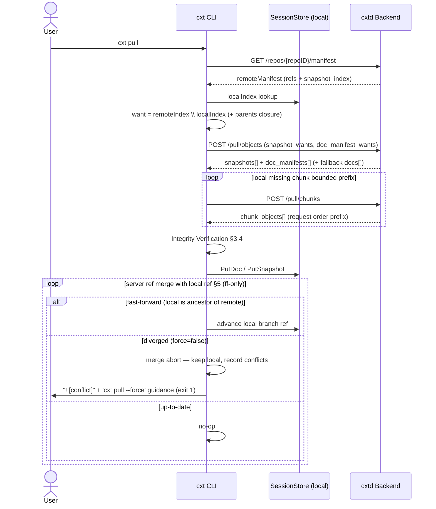

# cxthub — SYNC PROTOCOL (Central Server ↔ Local Synchronization)

> This document is the **synchronization contract** for cxt. It defines the REST API surface, content-addressed blob negotiation (have/want), authentication, conflict/merge model, permissions, clone/push/pull flow, between the central server (central remote) and the local store (local store).
>
> Supercontract: [`docs/_SPINE.md`](./_SPINE.md) — The directory tree/entity/port signature/CIR/name is the SPINE, the source of truth.
> Ground truth: [`docs/_RESEARCH-FINDINGS.md`](./_RESEARCH-FINDINGS.md) — Empirically verified session format.
>
> This document projects the SPINE's `RemoteSync` (outbound) / `SyncRepo` (inbound) ports and `Manifest`/`Snapshot`/`Ref`/`SessionDoc`/`TeamIdentity` entities **directly into the wire format**. No new domain concepts are introduced. Discrepancies between SPINE and the document are recorded in the **Open Questions** at the end of the document.

---

## 0. Design Principles (Summary)

cxt synchronization implements **git's transfer semantics** but uses its own store (USER DECISION 2). Core 4 principles:

1. **Content Addressed First (content-addressed first)** — All transfer units are identified by `ContentHash` (`sha256:<hex>`). If the server and client have the same hash, that object is **never sent again**. This forms the foundation for mimicking git's `have`/`want` negotiation.
2. **ref/overlay is mutable, body and natural parent are immutable (immutable objects, mutable refs/overlay)** — `SessionDoc` and `Snapshot.Parents` do not change. Only `Ref` (head/branch/session/tag) and `graft_parents/graft_seq` outside the hash move.
3. **Fast-forward First, branches are preserved as forks (ff-first, diverge-as-fork)** — If the ref move is ancestor→descendant, a fast-forward is performed. If it diverges, it is rejected and **forked into a new branch**, preserving both histories (USER DECISION: Mimicking git meaning, no data loss).
4. **Server is verifier, client is negotiator (server verifies, client negotiates)** — The server recalculates the hash of all received objects to verify that they match the ID (integrity). The missing parts calculation (diff) is done by comparing both `Manifest`s.

---

## 1. Resource Model (REST Surface Overview)

The server exposes the SPINE §4 entity as a resource. All paths are nested under `repos/{repoID}` (multi-tenancy boundary = repo + team).

| Resource | Domain Mapping (SPINE §4) | Identifier |
|---|---|---|
| `repos` | `Repo` | `repoID` (normalized remote URL or hash of cwd fallback) |
| `branches` | `Branch` | `name` (code git branch name adopted) |
| `snapshots` | `Snapshot` (immutable) | `ContentHash` |
| `docs` (blobs) | `SessionDoc` (immutable body) | `ContentHash` |
| `refs` | `Ref` (head/branch/session/tag) | `kind` + `name` |
| `manifest` | `Manifest` (negotiation catalog) | one per repo |
| `memories` | `MemoryDigest` | `SnapshotID` |
| `pending` | `Pending` (in-progress session pointer) | `sessionID` |
| `unsync` | `Unsync` (push pending pointer) | (user, branch) |

> Note: The body pointed to by SPINE `Snapshot.DocHash` is a `SessionDoc`. In the wire, the body blob is exposed as `docs/{hash}` (tree/blob meaning). `snapshots/{id}` only contains the meta(commit).

API Base: `POST/GET https://<central-host>/api/v1/...`. All bodies are `application/json; charset=utf-8`. Time is RFC3339. Hashes are `sha256:<hex>` strings.

---

## 2. REST API Surface (Methods·Paths·JSON Examples)

> Authentication headers are referenced in §4 (required for all calls). The examples below omit headers.
> DTO specifications project SPINE entity fields 1:1. **JSON keys are the snake_case representation of domain fields** (mapped via Go struct tags; identifiers kept in English).

### 2.1 Repo

#### `GET /api/v1/repos`
List of accessible repos within team visibility (§6).
```json
{
  "repos": [
    {
      "id": "sha256:9f1c...",
      "remote_url": "git@github.com:wnsdy95/app.git",
      "local_path": "",
      "default_branch": "main"
    }
  ]
}
```
> `local_path` is always an empty string on the server side (local-only field). Filled by the client during clone.

#### `POST /api/v1/repos`
Register a repo with the central server (automatically called on first push or explicit creation). Idempotent: returns existing record if same `id`.
```json
// Request
{ "id": "sha256:9f1c...", "remote_url": "git@github.com:wnsdy95/app.git", "default_branch": "main" }
// Response 201 Created (or 200 if existing)
{ "id": "sha256:9f1c...", "remote_url": "git@github.com:wnsdy95/app.git", "local_path": "", "default_branch": "main" }
```

#### `GET /api/v1/repos/{repoID}`
Single record retrieval. 404 if non-existent or out of visibility scope.

### 2.2 Manifest (Negotiation's Core)

#### `GET /api/v1/repos/{repoID}/manifest`
A list of refs held by the server and a snapshot index. Called by `RemoteSync.RemoteManifest`. The first step in push/pull negotiation.
```json
{
  "repo_id": "sha256:9f1c...",
  "refs": [
    { "kind": "branch", "name": "main",  "repo_id": "sha256:9f1c...", "target": "sha256:aaa...", "symbolic": "" },
    { "kind": "head",   "name": "HEAD",  "repo_id": "sha256:9f1c...", "target": "sha256:aaa...", "symbolic": "main" },
    { "kind": "tag",    "name": "v1-design", "repo_id": "sha256:9f1c...", "target": "sha256:bbb...", "symbolic": "" }
  ],
  "snapshot_index": [ "sha256:aaa...", "sha256:bbb...", "sha256:ccc..." ],
  "version": 1,
  "updated_at": "2026-06-29T09:00:00Z"
}
```

### 2.3 Branches

#### `GET /api/v1/repos/{repoID}/branches`
Convenience query (projection of refs with `kind=branch`). Includes head snapshot pointer for each branch.
```json
{ "branches": [ { "name": "main", "repo_id": "sha256:9f1c...", "head": "sha256:aaa..." } ] }
```

### 2.4 Snapshots (Immutable Core + Versioned Overlay)

#### `GET /api/v1/repos/{repoID}/snapshots/{id}`
Metadata for a single snapshot.
```json
{
  "id": "sha256:aaa...",
  "repo_id": "sha256:9f1c...",
  "branch": "main",
  "branches": [ "main" ],
  "parents": [ "sha256:zzz..." ],
  "graft_parents": [],
  "graft_seq": 0,
  "doc_hash": "sha256:doc111...",
  "provider": "claude",
  "fidelity": "full",
  "message": "before refactor",
  "author": { "name": "Alice", "email": "alice@example.com", "team": "acme" },
  "created_at": "2026-06-29T08:55:00Z"
}
```

#### `GET /api/v1/repos/{repoID}/snapshots?branch=main`
List of snapshots by branch (metadata only; blob bodies not included). Mirrored by `ListSnapshots`.

> Snapshot/doc creation (upload) is done via a single POST, not the batch push endpoints described in §3. ID/DocHash/natural `parents` do not change after creation. Hash projections outside `branches`, `graft_parents/graft_seq`, memory/settings pointers are updated via dedicated merge/CAS paths.

### 2.5 Docs (content-addressed blob body)

#### `GET /api/v1/repos/{repoID}/docs/{hash}`
`SessionDoc` body (CIR container) single. For blob download on pull. Response is the regular expression of SessionDoc.
```json
{
  "hash": "sha256:doc111...",
  "cir": { "envelope": { "cir_version": "1", "source_provider": "claude", "...": "..." }, "events": [] }
}
```
> `cir` internal is SPINE §5 CIR v1 schema (`schemas/cir.schema.json`). This document does not redefine the CIR internal.

### 2.6 Refs

#### `GET /api/v1/repos/{repoID}/refs`
Full ref list (`ListRefs` mirror). Response format is the same array as in §2.2 manifest `refs`.

#### `PUT /api/v1/repos/{repoID}/refs/{kind}/{name}`
ref movement (part of push). **compare-and-swap** meaning: client sends previous target (`expected_target`) to control optimistic concurrency. Server determines ff-ness (§5).
```json
// Request PUT /refs/branch/main
{
  "ref":            { "kind": "branch", "name": "main", "repo_id": "sha256:9f1c...", "target": "sha256:ddd...", "symbolic": "" },
  "expected_target": "sha256:aaa..."
}
// Response 200 (fast-forward accepted)
{ "result": "fast_forward", "ref": { "kind": "branch", "name": "main", "target": "sha256:ddd..." } }
```
In case of a conflict (fork), the response is §5.3 (409 + forked branch information).

### 2.7 Memories

#### `GET /api/v1/repos/{repoID}/memories/{snapshotID}`
The `MemoryDigest` for the snapshot (if available).
```json
{
  "snapshot_id": "sha256:aaa...",
  "summary": "Context before refactoring ...",
  "key_facts": [ "auth is based on TeamIdentity token" ],
  "open_tasks": [ "pull conflict merge UI" ],
  "provider": "claude"
}
```
#### `PUT /api/v1/repos/{repoID}/memories/{snapshotID}`
Upload of digest (idempotent; the body is the same as above). The memory is attached to the snapshot, so the snapshot must exist first (otherwise, 422).

### 2.8 Web UI Action Endpoints (RECONCILIATION §G)

Web UI endpoints used by the server to execute DiffSnapshots / ForkSession / LoadSession. Corresponds to the same use-case as CLI/MCP (the server returns a preview/metadata, while the actual local file restoration is the responsibility of the CLI).

| Method | Path | Request Body | Meaning |
|---|---|---|---|
| POST | `/api/v1/repos/{repoID}/diff` | `{ "left": "<ContentHash>", "right": "<ContentHash>" }` | `DiffSnapshots` — Returns the event delta between two snapshots |
| POST | `/api/v1/repos/{repoID}/fork` | `{ "from": "<ContentHash>", "newBranch": "<name>" }` | `ForkSession` — Creates a new branch, returns `ForkOutput{ branch, head }` |
| POST | `/api/v1/repos/{repoID}/load` | `{ "ref": "<ref>", "mode": "full\|memory", "provider": "claude\|codex" }` | `LoadSession` — Server-side returns metadata/preview (`writtenPath`, `fidelity`); actual file restoration is the responsibility of the local CLI |

> Consolidation target: path constants in `frontend/src/infrastructure/http/api-routes.ts`, `FRONTEND-ARCHITECTURE.md` §4.3 table, routing in `backend/internal/adapters/delivery/http/server.go` (doc comment enumeration).

### 2.9 Pending (In-Progress Session Pointer — Hook Auto-Capture)

Hook capture updates the session-specific mutable pointer (CAPTURE §2.2) without moving the branch ref (ref DAG immutable).

| Method | Path | Minimum Role | Meaning |
|---|---|---|---|
| GET | `/api/v1/repos/{repoID}/pending` | puller | List of in-progress session pointers |
| PUT | `/api/v1/repos/{repoID}/pending/{sessionID}` | member | Upsert session pending (points to the latest hook capture snapshot) |
| DELETE | `/api/v1/repos/{repoID}/pending/{sessionID}` | member | Resolves pending by deletion (idempotent) |

- upsert: Hook capture stores the snapshot/doc object as is but updates the `Pending{sessionID → target}` pointer.
- delete: Commit storage captures the entire session up to that point, so deleting the pending of the same session resolves it ("tail moves to new commit").

### 2.10 Unsync (Push Pending Pointer — Local Ahead)

Tracks the tip of a locally committed chain that has not yet been `git push`ed (before the server branch ref advances), keyed by authenticated user and branch. It is the commit-level counterpart to pending and powers the web On Hold view.

| Method | Path | Minimum Role | Meaning |
|---|---|---|---|
| GET | `/api/v1/repos/{repoID}/unsync` | puller | List of push pending pointers |
| PUT | `/api/v1/repos/{repoID}/unsync/{branch...}` | member | Upsert my (user, branch) unsync |
| DELETE | `/api/v1/repos/{repoID}/unsync/{branch...}` | member | Resolve on `git push` success (or sync/behind) |

- The key is per authenticated user, so each team member's unsync chain appears independently (can only write/delete their own).
- Objects reach the server first via a shadow push (objects-only, refs immutable), and refs wait for `git push`.

---

## 3. Push / Pull Protocol — Content-Addressed Blob Negotiation

Core: **Send only missing parts**. Mimics git's have/want with manifest comparison. Logical objects are `snapshots` (commit metadata) and `docs` (blob bodies), and large doc bodies are split into content-addressed chunks during transport. DocHash is always based on the fully reassembled canonical body, regardless of chunking.

### 3.1 Negotiation Algorithm (Object → Overlay → Ref)

```
1) MANIFEST exchange: Fetch local Manifest and RemoteManifest, compare snapshot_index sets.
2) DELTA Calculation: Objects to send/receive = (have, want).
                     - push want (what server wants) = localIndex \ remoteIndex
                     - pull want (what local wants) = remoteIndex \ localIndex
                     - Calculate the missing parts of doc blobs for each snapshot using the same rules as doc_hash.
                     - Include the transitive closure (ancestral missing parts) of want by following the parents of the snapshot DAG.
3) TRANSFER        : Stage the missing chunks into bounded batches → doc manifest and snapshot confirmation.
4) OVERLAY + REF   : Push is confirmed by an ordered graft event using expected_seq CAS, then move the ref (CAS).
                     - The order is chunk → object → overlay → ref.
```

> Invariant: **chunk → object → graft overlay → ref**. Chunk staging occurs before the ref or complete doc.
> Publicly expose an idempotent CAS write. After a partial failure, if the server already has the chunk, it is removed from want.
> Fails. Ref is only published after the overlay needed for fast-forward is confirmed.

### 3.2 Push Negotiation Endpoint

#### Step A — `POST /api/v1/repos/{repoID}/push/negotiate`
When the client presents a list of candidate hashes to send, the server returns only the **missing ones(want)**, excluding the **ones it already has(have)**.
```json
// Request: The client's local snapshot/doc hash that can be sent
{
  "snapshot_haves": [ "sha256:ddd...", "sha256:aaa...", "sha256:zzz..." ],
  "doc_haves":      [ "sha256:doc333...", "sha256:doc111..." ],
  "chunk_haves":    [ "sha256:chunk1...", "sha256:chunk2..." ]
}
// Response: Only what the server actually needs (omitted parts)
{
  "snapshot_wants":          [ "sha256:ddd..." ],
  "doc_wants":               [ "sha256:doc333..." ],
  "chunk_wants":             [ "sha256:chunk2..." ],
  "chunks_supported":        true,
  "bounded_chunks_supported": true
}
```

#### Step B0 — `POST /api/v1/repos/{repoID}/push/chunks`
If `bounded_chunks_supported=true`, `chunk_wants` body is uploaded to this path first. Each request contains
a maximum of 32 chunks, with an uncompressed total of 2 MiB (JSON base64 included, HTTP body max 4 MiB). Each chunk is
`sha256(data) == hash` is validated and stored idempotently in the repo owner's CAS. The chunks are joined across multiple batches.
is broken, the incomplete doc/ref is not yet published, and only the remaining part of the next negotiate is requested.
If a single event exceeds 2 MiB, do not create a chunk manifest.
Fallback to the existing `docs` path (do not implicitly introduce a new format to maintain compatibility with older versions).

```json
{ "chunks": [ { "hash": "sha256:chunk2...", "data": "<base64>" } ] }
// 200
{ "stored": 1, "deduped": 0 }
```

#### Step B — `POST /api/v1/repos/{repoID}/push/objects`
Identify missing objects. For small or unplanable bodies, send them using the existing `docs` path, and for chunked bodies, send them using the `chunked_docs` manifest. The bounded server does not reload `chunk_objects`. The server reassembles staging chunks to **recalculate** the DocHash and validates it along with the snapshot (§3.4).
```json
// Request
{
  "snapshots": [
    { "id": "sha256:ddd...", "repo_id": "sha256:9f1c...", "branch": "main",
      "parents": [ "sha256:aaa..." ], "doc_hash": "sha256:doc333...",
      "provider": "claude", "fidelity": "full", "message": "fix sync edge case",
      "author": { "name": "Alice", "email": "alice@example.com", "team": "acme" },
      "created_at": "2026-06-29T09:10:00Z" }
  ],
  "docs": [
    { "hash": "sha256:doc333...", "cir": { "envelope": { "cir_version": "1", "...": "..." }, "events": [] } }
  ],
  "chunked_docs": [
    { "hash": "sha256:doc444...", "envelope": { "cir_version": "1", "...": "..." },
      "chunks": [ "sha256:chunk1...", "sha256:chunk2..." ] }
  ]
}
// Response 200
{ "stored_snapshots": 1, "stored_docs": 1, "deduped_snapshots": 0, "deduped_docs": 0 }
```

Backward compatibility is handled as a capability. For servers with `chunks_supported=false`, send the entire `docs` path. For servers that know about chunks but not the bounded path, send `push/objects.chunk_objects` inline as before.

#### Step B2 — Confirm ordered graft queue
If the new branch tip in the sibling session does not have the previous head as a natural parent, the client propagates the ordered graft event recorded locally using the `expected_seq` CAS. The new snapshot object is created in B with the server-owned overlay removed, so **B2 must occur before C**.

- When a new edge is added, only allow `current_seq == expected_seq` and update the set before incrementing the seq by 1.
- If an edge already exists and `current_seq == expected_seq`, increment the seq by 1 to verify the event once.
- If an edge already exists and `current_seq == expected_seq + 1`, report it as a retry of a lost response and consider it successful.
- For any other version or cycle, return 409. The client should read the server snapshot source of truth again, adjust the local register, remove the stale queue tail for the same snapshot, and stop publishing this ref.

This restriction prevents the old push queue from reviving an auto-graft edge that has been superseded by a `GraftSeq` with a higher join.

#### Step C — Ref Movement
For each target ref, call §2.6 `PUT /refs/{kind}/{name}` using CAS. If it is an ff, accept it; if it is a branch, perform §5.3 fork.

> `RemoteSync.Push` allows object-only and ref-only calls. `SyncRepo.Push` first completes A→B and then confirms the graft queue (B2) before calling ref-only C. Combining these steps leads to a race condition where ref FF is determined before the overlay of new objects is present on the server.

### 3.3 Pull Negotiation Endpoint

#### Step A — `GET /api/v1/repos/{repoID}/manifest`
Receive server manifest (§2.2). Calculate `want = remoteIndex \ localIndex` by comparing with the local manifest, including the parents closure.

#### Step B — `POST /api/v1/repos/{repoID}/pull/objects`
Receive snapshot metadata and doc manifest. For chunked download, use `doc_manifest_wants`; for whole compatibility path, use `doc_wants`.
```json
// Request
{ "snapshot_wants": [ "sha256:eee..." ], "doc_manifest_wants": [ "sha256:doc444..." ] }
// Response 200
{ "snapshots": [ /* ... */ ], "docs": [],
  "doc_manifests": [ { "hash": "sha256:doc444...", "envelope": {},
    "chunks": [ "sha256:chunk1...", "sha256:chunk2..." ] } ],
  "bounded_chunks_supported": true }
```

#### Step B1 — `POST /api/v1/repos/{repoID}/pull/chunks`
Requests only manifest chunks that are not present locally. The request is limited to a maximum of 32 chunks, and the server returns a **prefix** of up to 2 MiB in uncompressed size, preserving the request order. The client advances by the number of returned hashes and repeats the request for the remaining hashes, verifying the order, hash, and body of each response before reconstructing the entire doc. The request JSON is limited to 64 KiB, and the response JSON is limited to 4 MiB.

```json
// Request
{ "chunk_wants": [ "sha256:chunk1...", "sha256:chunk2..." ] }
// Response (may return only one prefix due to size limits)
{ "chunk_objects": [ { "hash": "sha256:chunk1...", "data": "<base64>" } ] }
```

If the old server does not return a manifest, the client re-requests with a comprehensive `doc_wants`. If bounded capability is not supported and only inline chunks are supported, the existing `pull/objects.chunk_wants` is used.

#### Step C — Local Ref Merge
Merges server refs and local refs using the §5 model. If it is an ff (fast-forward), the local ref is advanced. If it is diverged, the merge is canceled, and the local ref is maintained with a conflict reported. No automatic fork is created. **Pull does not change the server** (read-only).

> `RemoteSync.Pull(ctx, repoID) (snapshots, docs, refs, err)` returns the results of step B (downloaded objects) plus the server refs as is. Ref merge (step C) is performed by the `app`'s `SyncRepo.Pull` use-case, reflecting in the local `SessionStore` (port separation).

### 3.4 Integrity Verification (Common to Server and Client)

- For every received `Snapshot`: Verify that `recompute(canonical_bytes(referenced SessionDoc.CIR))` matches the snapshot's `doc_hash`, and that the SPINE invariant `Snapshot.ID == ContentHash(canonical_bytes(SessionDoc.CIR))` holds. Mismatch → `422 integrity_violation`, reject the entire batch.
- For every received `SessionDoc`: Verify that `recompute(canonical_bytes(cir)) == hash`.
- For every received chunk: Verify that `recompute(data)==chunk.hash`, and that the reconstructed canonical body in manifest order matches `ChunkedDoc.hash`. Staging chunks are not accessible outside the repository owner's workspace.
- The canonical bytes rules (key sorting, whitespace removal, etc.) must be implemented using the same algorithm as the `ContentHash` function in the codec/domain (Open Question Q3).

---

## 4. Authentication (Implementation Confirmed — Session · CLI Token · 5-Stage Role Gate)

> The "Team Token" sketch in the designer has been discarded. The current model (code is the source of truth):

### 4.1 Proof of Authority — Two Entrances, Same Interpreter
- **Web**: Exchange IDP token (Firebase ID token RS256 / dev token) in `POST /auth/session`.
  - Server session (`sess_*`, 30 days) is issued and only transmitted via **HttpOnly cookie `cxt_session`** (JS not exposed).
- **CLI**: In Web Account Settings ⚙, **CLI token** (`sess_cli_*`, 1 year, value exposed only once in issuance response).
  - Register using `cxt login <token>`. After validation (GET /me 200),
  - Stored in `~/.cxt/auth.json` (0600, **host-specific** — multiple servers can be used).
  - Automatically attached to all requests as `Authorization: Bearer`. Order of interpretation: `CXT_TOKEN` (CI) > auth.json.
  `cxt logout` to delete, web list (suffix only)·deprecate.
- Server looks for tokens in cookie → Bearer order, `sess_` prefix for session lookup, otherwise IDP validation (+user upsert).

### 4.2 Permission Gate — Serial AND (role as layer boundary, policy as action-specific narrowing)
```
Request → Authentication → Workspace Membership → Role Ladder → (If team asset) Operation Policy
```
5-tier role (GitLab equivalent): `viewer < puller < member < maintainer < owner`.

| Level | Allowed Surface |
|---|---|
| viewer | GET repo/manifest/refs/snapshots/docs/memories, POST diff (public workspace — **anonymity** level) |
| puller | + GET settings/secrets/settings-objects, POST pull/objects·pull/chunks |
| member | + POST push/*(negotiate/objects/chunks), PUT refs/memories/settings-objects, POST fork (default — "git follows" target) |
| maintainer | + PUT settings/secrets, PATCH about, POST invites — but `secrets_policy`/`settings_policy` must be `owner` for owner only |
| owner | + PATCH workspace(public/policy/GitHub sync), member role/removal, transfer(creator only) |

- The constructor (OwnerID) is always considered as owner and role changes/removal are not allowed (preventing orphan ownership — only transfer is allowed).
- Unknown role/policy values are **conservatively rejected** (do not silently expand).
- Hooks are fail-open: If a 401/403 is encountered, the push is paused and **only once** is the user informed (`.cxt/auth-hint-shown`).
  Local snapshots continue to accumulate, so after login, the next push will catch up through the haves/wants negotiation.

### 4.3 Authentication Failure Codes
| Situation | HTTP | Code |
|---|---|---|
| No token / Invalid token | 401 | `unauthenticated` |
| Insufficient role/policy | 403 | `forbidden` |
| Invalid role/policy value | 422 | `validation` |

---

## 5. Conflict / Merge Model — **Same as Git policy (fast-forward only + --force)**

**Policy Change (2026-07, User Decision)**: The initial design's "diverged auto fork" has been removed.
A completely different context cannot be overlaid on a branch, and all ref movements must take the previous commit as an ancestor (fast-forward). For all other cases, **reject** and allow overwrites only with `--force`.

All synchronization conflicts reduce to **ref movement conflicts**. Objects are immutable, so object writes only deduplicate; ancestry in the DAG determines whether a ref may move.

### 5.1 Three Cases
Branches are divided based on the relationship between `old` (the server's ref target) and `new` (the client's target) in the snapshot DAG:

| relationship | determination | action |
|---|---|---|
| `new` is descendant of `old` (`old` is ancestor of `new`) | **fast-forward** | advance ref to `new`. accept. |
| `new == old` | **up-to-date** | no-op. accept. |
| `new` is ancestor of `old` | **non-fast-forward (behind)** | reject (server is ahead). client pulls and retries. |
| A common ancestor exists, but neither side descends from the other | **diverged** | **reject (`409 non_fast_forward`)**, matching Git. Only `force=true` may overwrite it (`result=forced`). |

### 5.2 Fast-Forward Classification
- The server ascends from `new` to `parents` until it encounters `old` (DAG reachability check).
- For cost control, classification uses only the manifest's `snapshot_index` and the snapshot metadata's `parents`; it does not load the full document.

### 5.3 non-FF/diverged → Reject + `--force` (Git Policy, Current)
The server (`UpdateRef`) rejects all branch movements other than ff/up-to-date with **409 `non_fast_forward`**.

```json
// PUT /refs/branch/main {"target":"sha256:ddd...","force":false} → 409
{ "error": { "code": "non_fast_forward",
             "message": "main (must include previous commit — pull and retry or --force)", "details": {} } }
```

- Client (cxt push) aggregates rejections in git style: `! [rejected] branch/main (non-fast-forward)` + pull/--force hint.
- If `force:true`, performs CAS atomic replacement and returns result=`forced`. **Only ref pointer** changes; previous lineage snapshots/docs are not deleted (permanent record invariant P1, DATA-MODEL §9.5 — no delete API, no GC).
- **Tags are immutable**: Moving an existing tag to another target also results in 409 (`--force` exception).
- **pull --ff-only**: Client determines ancestor using local DAG, diverged branches are **cancelled** (local kept, `Conflicts` reported). `cxt pull --force` only adopts remote. Objects are already fetched, so no data loss.
- If history preservation is needed, user can explicitly use `session_fork` (manual fork) — no automatic fork.

### 5.4 Explicit Merging Outside v1 Scope
Creating an N-parent merge snapshot (`Snapshot.parents` with more than 2 parents) is expressible in the domain model, but **automatic merge use-cases are excluded from v1**. Branches are preserved as forks, and integration is handled manually by the user (`load` → manual work). (Open Question Q2)

### 5.5 Joining Sessions Within the Same Git Branch

`POST /repos/{repoID}/join` is not a git branch merge as described in §5.4. It is a projection operation that repositions an existing session side chain behind the branch head of the same actual git branch. The target branch is fixed as the source snapshot's branch, and the server validates membership using `Branches`/reflog and scoped session refs. Snapshots reachable from other branch refs or session refs from different branch scopes are rejected with a 409. Session refs are not actual git branches but the scope named after them serves as the join ownership boundary.

The client sends only `{branch, snapshot, include_descendants}`. The server calculates from X to the unique first-parent child to the leaf tip. `include_descendants=true` makes the tip the head, while `false` makes X the head and the remaining tip is stored as `RefKind=session`'s `fork/v1/<branch-byte-length>/<branch>/<short-tip>`. The natural lineage of the child T continues branching from X.

Competing with service read and write is not allowed. FS/PG storage revalidates segment attachment, exact first-parent chain, single leaf, cross-branch reachability, all graft seqs, target branch head, and optional session refs within an atomic boundary. FS recovers using a prepared/committed journal, while PostgreSQL applies using a repo advisory lock + transaction. Legacy unscoped session refs are for reachability preservation only and do not serve as a basis for join permissions.

---

## 6. Permissions (Workspace Visibility + 5 Roles)

**Visibility Unit = Workspace**. A repo is bound to exactly one workspace via a remote URL path (`/<owner_username>/<slug>/<repo>`). Unaffiliated repos (legacy/dev) require only login.
- **Public Status**: Default is `private` (members only). If set to `public`, viewer level read access is **open to anonymous users** (GitHub public repo equivalent). Enabling `gh_visibility_sync` locks manual toggling (409), and the linked GitHub repo must be **entirely public** for it to be public (404/failure/no GitHub remote = private, conservative).
- **Roles/Policy**: §4.2 Serial AND Gate. User-level segmentation is done through role changes (individual user lists for actions are removed — 0013).
- **Deletion/History Change Prohibition (P1)**: Snapshots/docs are immutable, with no delete API. Only refs can be moved.

The permission matrix in §4.2 is the source of truth. Anon users have access only to the viewer surface of public workspaces.

---

## 7. Local ↔ Remote Flow (clone / push / pull)

This code runs on all three flows within the SPINE `SyncRepo` (inbound) use-case and `RemoteSync` (outbound) ports. The local store is `SessionStore`.

### 7.1 Clone (initial pull) — SPINE's `SyncRepo` initialization
Clone the entire remote repo into an empty local store. "clone = fetch all branches/snapshots initially" (SPINE §1.2).



### 7.2 Push — Local new changes to central server



### 7.3 Pull — Central Server Changes to Local



> A stash snapshot (label `"(stash)"`) is local-only — excluded from push targets.

### 7.4 Automatic Hooks vs Manual Commands (USER DECISION 3)
- **Automatic**: `cxt hook --provider <claude|codex> --event <Stop|SessionEnd|...>` can trigger a push after session storage based on policy (trigger policy is the hook adapter's responsibility; this synchronization contract defines only the wire protocol for push/pull).
- **Manual**: `cxt push` / `cxt pull` (= MCP `sync_push` / `sync_pull`). Same flow as §7.2/§7.3.
- Both paths pass through the same `RemoteSync` port → wire protocol is single.

---

## 8. Error Model (Common)

All error responses are in the same envelope:
```json
{ "error": { "code": "non_fast_forward", "message": "main (must include previous commit — retry after pull or --force)", "details": {} } }
```
| HTTP | code | meaning |
|---|---|---|
| 400 | `bad_request` | invalid body/hash format |
| 401 | `unauthenticated` | no token / invalid token |
| 403 | `forbidden` / `team_mismatch` | out of team visibility |
| 404 | `not_found` | repo/snapshot/doc/ref does not exist |
| 409 | `non_fast_forward` | ref move rejected (§5 — behind/diverged/tag reassign, only pass with --force) |
| 422 | `integrity_violation` | hash mismatch (§3.4) |
| 422 | `missing_object` | snapshot/doc not arriving that ref points to (object precedence violation) |

---

## 9. Port Mapping (This Protocol ↔ SPINE Port)

| Document Flow | SPINE Outbound (`RemoteSync`) | SPINE Inbound (`SyncRepo`) | REST |
|---|---|---|---|
| push | `Push(ctx, repoID, snapshots, docs, refs, force, appendDiverged)` + `GraftSnapshotParents` | `Push(ctx, SyncInput) (SyncOutput)` | negotiate + objects + graft CAS + refs PUT |
| pull | `Pull(ctx, repoID) (snapshots, docs, refs, err)` | `Pull(ctx, SyncInput) (SyncOutput)` | manifest GET + pull/objects |
| negotiation | `RemoteManifest(ctx, repoID) (Manifest)` | — | GET /manifest |

`SyncOutput{Pushed, Pulled, NewRefs, Conflicts}` mapping: `Pushed`/`Pulled`=snapshot count, `NewRefs`=updated refs, `Conflicts`=list of ref names canceled (locally retained) due to ff impossible in pull — if not empty, CLI reports git-style `! [conflict]` and exits with code 1.

`RefKind=session` is an internal pointer created by join storage. General `PUT /refs/{kind}/{name}` only allows idempotent echo for existing same session target. Allowing new creation, movement, and force can be used to bypass the cross-branch restriction in §5.5, so it is rejected with 403.

---

## 10. Open Questions (Unresolved/Extension Points with SPINE — Source of Truth is SPINE)

- **Q1 (Wire Key Notation)**: **Resolved** — Code is confirmed to use snake_case struct tags (cli/backend domain entities' `json:"..."` tags are the source of truth, wire/local storage common). Identifiers (RefKind, etc.) are maintained in English.
- **Q2 (Explicit Merge)**: `Snapshot.parents` allows N-parents, so merge snapshots are expressible in the domain, but automatic merge use-case is not in SPINE inbound port (`SyncRepo` only supports Push/Pull). Confirmation needed whether fork preservation is sufficient in v1.
- **Q3 (Canonical Bytes Algorithm Sharing)**: Server-side integrity verification (§3.4) must match client codec's `ContentHash` calculation and byte-wise equality. Normalization rules (key sorting, whitespace, Unicode normalization) to be standardized in `schemas/` or SPINE.
- **Q4 (Author Consistency Enforcement)**: Enforce match between `Snapshot.author.email` in push body and header `X-Cxt-Identity` (to prevent tampering) vs just logging (trust model). Trust boundary decision needed for v1.
- **Q5 (Credential Storage Location)**: **Resolved** — CLI credentials (login token) are stored in `~/.cxt/auth.json` (0600, **host unit** — for multi-server use) (`authcfg`). `CXT_TOKEN` (CI) always takes precedence. "Team token" model is deprecated (§4.1).
- **Q6 (Push Concurrency Isolation)**: Other clients can interfere between `push/objects` and `refs PUT` (objects arrived but ref CAS is stale). Policy for CAS retry (client retries after manifest re-fetch, auto retry count) needs to be defined.
- **Q7 (Repo.id Calculation)**: SPINE specifies `Repo.ID` as "normalized remote URL or cwd fallback hash". URL normalization rules (scheme, `.git` suffix, case) need to be standardized to ensure server and client produce the same repoID.
