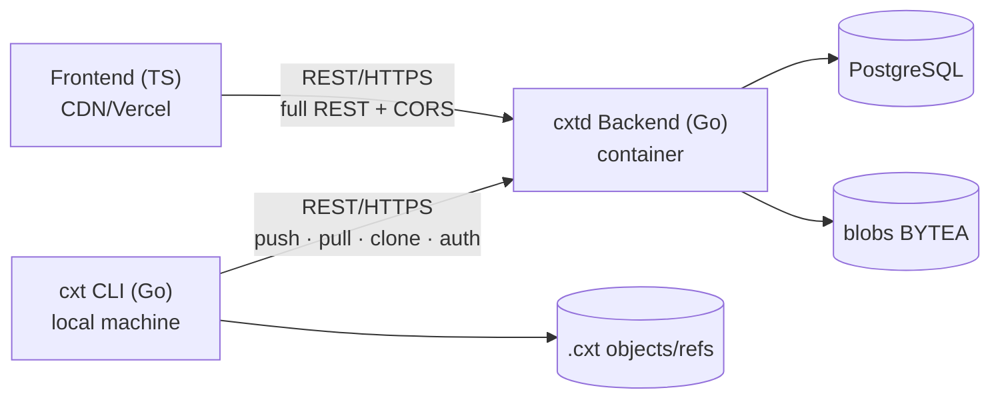

# ARCHITECTURE R2 — 3 Fully Isolated + Communication Model (Authority, Applied on R1)

> **[Frozen Document]** Preserves the authority specification at the scaffolding point for historical records. Subsequent implementation deltas (git native hooks·ref ff-only policy·authentication/workspace/slug·stash·web UI, etc.) are not reflected. The current state is found in [`ARCHITECTURE.md`](./ARCHITECTURE.md) §6.5 and each domain document (code as source of truth).

> User Confirmation (R2): (1) cli·backend·frontend **completely separated** (independent projects/repos), (2) **DB schema identical** (local cache == server DB),
> (3) Communication = **cli↔backend, frontend↔backend** (both using REST/HTTPS), direct cli↔frontend communication is not allowed, (4) frontend has its own static hosting (CDN/Vercel).
This document applies to the structure revision of R1(_RECONCILIATION.md), with precedence given to this document in case of conflicts.


- CLI↔Backend: push/pull/clone, authentication, (online) fork/diff etc. git engine calls.
- Frontend↔Backend: full REST (repos/branches/snapshots/refs/memories/diff/fork/load/push/pull...).
- CLI↔Frontend: **none**.

## 2. Responsibility Distribution (Core of Complete Separation: Backend is Provider-Format Agnostic)
| Component | Owns | Doesn't Know |
|---|---|---|
| **cli/** (Go module) | `ProviderCodec` (Claude/Codex ↔ CIR), `CaptureSource` (active-session detection and reading), `SessionMaterializer` (resume-session synthesis), `MemorySource`/`MemorySink` (native memory ingestion/injection), `GitContext`, **local cache store** (`.cxt`, shared object schema), `BackendClient` (REST) | Internal server database and authentication implementation |
| **backend/** (Go module) | REST API (delivery/http), source-of-truth database, Git semantics engine (commit/branch/fork/diff/HEAD/tag; CIR/hash based and provider agnostic), `MemoryStore` (CIR-neutral digest), authentication, teams, and visibility | **Claude/Codex raw formats** (accepts CIR only) |
| **frontend/** (TS) | Domain mirror types, application use-case, infrastructure(REST client), presentation(ViewModel) | Backend internal, local machine |
| **schemas/** | cir.schema.json, manifest.schema.json, **db/migrations/*.sql(Source DB Schema)**, openapi.yaml(REST contract) | — |

**Principles:**
1. Provider format knowledge is **only in the cli**. The backend only uploads provider-neutral CIR → codec changes have no impact on the backend, and adding new providers is done via the cli.
2. The git meaning engine is **in the backend**. The cli uses local cache + synchronization.
3. The original "identical DB schema" decision means that local and server data conform to shared contracts in `schemas/`; §5 records the later decision to use content-addressed files locally and PostgreSQL on the server.
4. REST(OpenAPI) is a common contract between cli↔backend and frontend↔backend.

## 3. Directory Structure (Monorepo, Each Independent Project = Repository Separation Possible)
```
cxthub/
├── schemas/
│   ├── cir.schema.json          # Provider-Neutral Conversation Expression (cli generates, backend stores)
│   ├── manifest.schema.json
│   ├── openapi.yaml             # REST Contract (cli·frontend consume)
│   └── db/migrations/*.sql      # Source of Truth DB Schema (cli local cache + backend DB share)
├── cli/                         # Independent go.mod (module .../cxt-cli), binary cxt
│   ├── cmd/cxt/main.go         # cli/mcp/hook entry point (no serve)
│   └── internal/{domain,ports,app,adapters/{codec,capture,session,memory,gitctx,localstore,backendclient,delivery/{cli,mcp,hook}}}
├── backend/                     # Independent go.mod (module .../cxt-backend), binary cxtd
│   ├── cmd/cxtd/main.go        # Serve entry point only
│   └── internal/{domain,ports,app,adapters/{store(sqlite/postgres),auth,delivery/http,gitengine}}
└── frontend/                    # Independent TS (CDN/Vercel)
    └── src/{domain,application,infrastructure,presentation}
```
- The cli and backend each own domain types but **must conform to the schemas/** (code sharing is not allowed = complete separation). The same schema allows wire(CIR/JSON) compatibility.
- Binaries: cli=`cxt`, backend=`cxtd`.

## 4. Migration (R1 → R2)
- Currently, the single `backend/internal/*` is divided:
  - codec/capture/gitctx/memory(source·sink)/session-materializer/delivery(cli·mcp·hook) → **cli/**
  - store/auth/delivery-http + git engine(fork/diff/branch/ref) → **backend/**
  - SessionStore port is split into `LocalStore` (cache) on the cli side and `ServerStore` on the backend side. RemoteSync → cli's `BackendClient`(REST).
- Add openapi.yaml + db/migrations to `schemas/`.
- Build consistency: `cd cli && go build ./...`, `cd backend && go build ./...`, `cd frontend && tsc --noEmit` all GREEN.
- Application order: **complete R1** before R2 structure refactoring (to prevent simultaneous backend editing conflicts).

## 5. Confirmed Storage + Modules (R2-final, user confirmation)
- **Backend DB = PostgreSQL.** Metadata tables (`repos, branches, refs, snapshots(meta), memories(meta), team_identities`). Source DDL = `schemas/db/migrations/*.sql` (Postgres dialect).
- **Blob (CIR body·memory body) = content-addressed.** `BlobStore` port behind **v1 = Postgres `BYTEA`** (`blobs(hash PK, bytes BYTEA)`, hash dedup), followed by S3/MinIO adapter for seamless replacement.
  **Scaffold Note**: The Postgres driver (pgx, etc.) is not imported yet (network-free build GREEN). The store/blobstore adapter uses a **stub with stdlib only** (errNotImplemented) + doc comment specifying "impl phase pgx/Postgres". Migration `.sql` files are written as actual Postgres DDL text (compile-agnostic).
- **CLI Local = Content-Addressed Files**: `.cxt/objects/`(CIR/memory blob, sha256), `.cxt/refs/heads/*`·`refs/tags/*`, `.cxt/HEAD`, `.cxt/config`. **Not SQLite/SQL** (similar to git's `.git`). Adapter = `filestore`.
**"DB Schema Same" Interpretation**: Assets are **not the DB schema but the CIR object format + REST(OpenAPI) contract**. Backend is Postgres only. CLI stores the same object format as files. (GitHub: Local `.git` is not a MySQL mirror.)
**Complete Separation = No Shared Go Modules**: CLI and backend each have their own domain types (allowing duplicates), contracts are in `schemas/` (cir.schema.json + openapi.yaml + db/migrations). Intentional trade-off for deployment independence.
**Module/Binary**: CLI = module `github.com/wnsdy95/cxthub/cli` (maintained), binary `cxt`. Backend = module `github.com/wnsdy95/cxthub/backend`, binary `cxtd`.

## 6. R2 Migration Plan (Mechanical, No Conflict)
1. (deterministic) `mkdir cli && mv backend/* cli/` → keep monolith structure (module path unchanged → no import breakage, immediately GREEN). backend/ remains empty for A2 to fill.
2. cli/ cleanup (A1): remove server-specific modules (delivery/http, RemoteSync implementation) → add `localstore(filestore)` + `backendclient(REST)`. cmd/cxt retains only cli/mcp/hook (serve removed).
3. backend/ new (A2): server-only module (module cxt-backend). domain/ports/app (server use-case: storage/branch/fork/diff/ref/push·pull handlers/auth) + adapters (store=postgres-stub, blobstore=BYTEA-stub, auth, gitengine, delivery/http) + cmd/cxtd. **docs(schemas/+SPINE) derive contracts** (cli code not read).
4. schemas/(B): add openapi.yaml + db/migrations/*.sql.
5. frontend(C)·docs+integrations(D): openapi sync + R1 remaining gap fix.
- build unchanged: `cd cli && go build ./...`, `cd backend && go build ./...`, `cd frontend && tsc --noEmit` all GREEN (all stdlib stubs).
