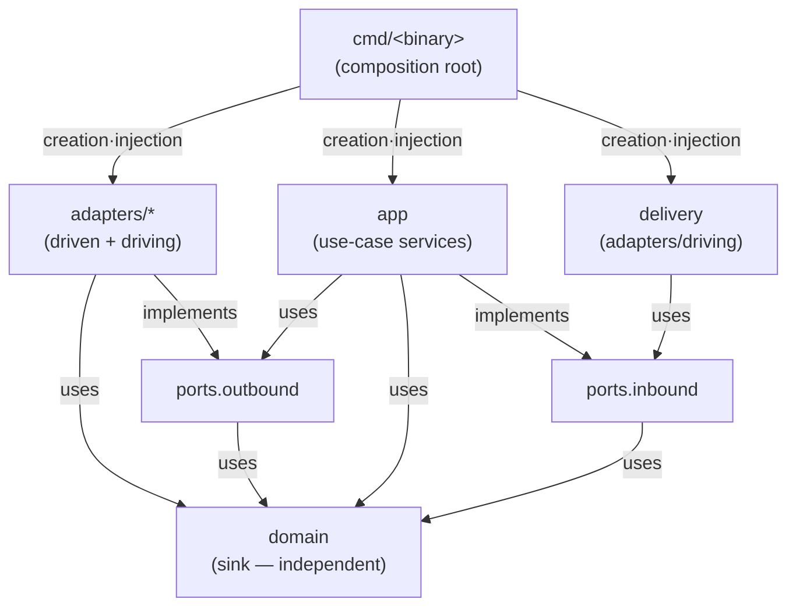
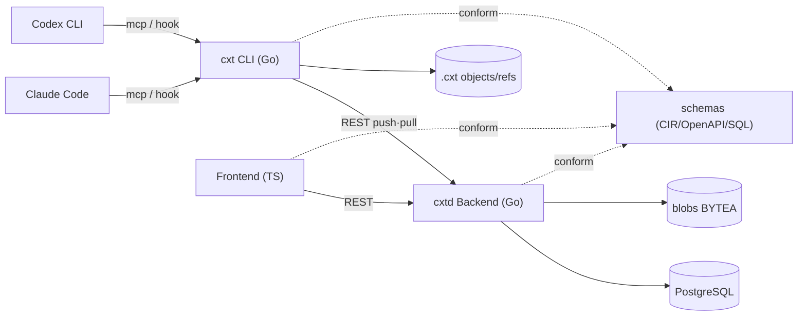
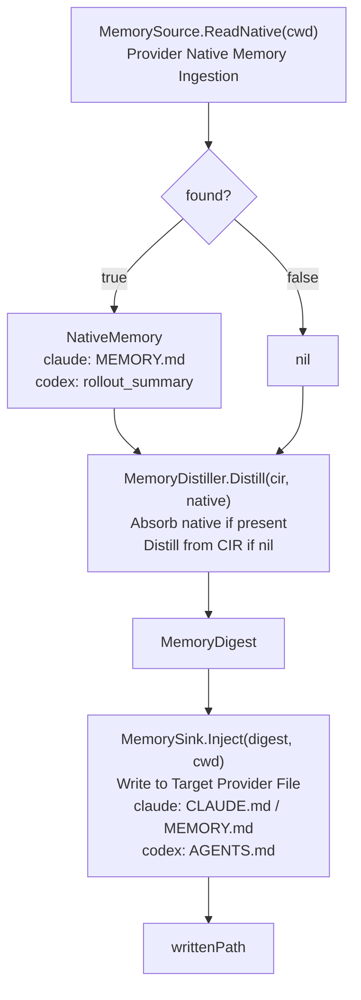

# cxthub — SPINE (Single Point of Truth)

> **[Frozen Document]** Preserves the authoritative specification at the scaffolding point for historical records. Subsequent implementation deltas (git native hooks·ref ff-only policy·authentication/workspace/slug·stash·web UI, etc.) are not reflected. The current state is found in [`ARCHITECTURE.md`](./ARCHITECTURE.md) §6.5 and each domain document (code as source of truth).

> This document is the **Single Point of Truth (SPINE)** for the cxt project. All subsequent scaffolds (directory tree, Go packages, port signatures, MCP/CLI names, CIR schema) will contract to this document. In case of conflict between this document and the code, this document takes precedence. Changes must be reflected in this document first before being applied to the code.
>
> Authority Delta: [`docs/_RECONCILIATION.md`](./_RECONCILIATION.md) — Confirmed user decisions and reconciliation checks after SPINE. In case of conflict, _RECONCILIATION.md takes precedence.
> Ground Truth: [`docs/_RESEARCH-FINDINGS.md`](./_RESEARCH-FINDINGS.md) — Empirically verified session format. No speculation allowed.

---

## 1. Product Definition + Core Concept Mapping

### 1.1 One-Line Definition
**cxt is a "Git + GitHub" duo for coding agent sessions.** It snapshots, forks, and loads Claude Code / Codex sessions based on the branch names of detected code repos, and bridges the two CLI interfaces (cross-replay) for seamless operation. The local store and central server synchronize via push/pull.

### 1.2 Mapping GitHub Meaning to cxt Meaning

This is a **self-contained store that mimics the meaning of Git**. It does not use an actual git object DB; instead, it borrows the git mental model using content-addressing.

| GitHub Concept | cxt Domain Implementation | Description |
|---|---|---|
| **repo** | `Repo` — 1 session storage space per detected code repository | Identifier key = normalized git remote URL of the code repo + local path. If no repo exists, use the absolute path of the current working directory as the fallback key. |
| **branch** | `Branch` — Directly adopts the git branch name of the code repo | Automatically extracted from the `gitBranch` field of the Claude Code record (empirically verified). Codex augments this with a git lookup based on the `cwd`. A branch is "a session history of a specific work context". |
| **commit** | `Snapshot` (= commit) — A single session state at a specific point in time | The body and natural parent are immutable. `Snapshot.ID = ContentHash(CIR canonical bytes)`. Replaces the batch with a graft/ref projection without rewriting the natural ancestry. |
| **tree/blob** | CIR container (`SessionDoc`) + content-addressed blob | The regular conversation body (CIR) that the snapshot points to. Duplicate content results in the same hash → automatic deduplication. |
| **fork** | `ForkSession` use-case → A new `Branch` branching off from an existing `Snapshot` | "Start a new work line from this session point". The original remains unchanged, and a new ref is created. |
| **HEAD** | `Ref{Kind: RefHEAD}` — A symbolic ref pointing to the latest snapshot of the current branch | Each branch points to the latest `Snapshot.ID` at `refs/heads/<branch>`. `HEAD` is a symbolic ref pointing to the "currently checked-out branch". |
| **tag** | `Ref{Kind: RefTag}` — A name that a person can read attached to a specific snapshot | An immutable label (e.g., `before-refactor`, `v1-design`). Permanently points to a single snapshot. |
| **push** | `RemoteSync.Push` — Uploads snapshots/refs from the local store to the central server | Transmits only missing parts based on content hash. Transmits both raw CIR blob and memory blob. |
| **pull** | `RemoteSync.Pull` — Downloads snapshots/refs from the central server to the local store and merges them | Prefers fast-forward, branches off into a new branch on conflict. |
| **clone** | `SyncRepo` (initial pull) — Clones the entire remote repo into an empty local store | Clone = "initially fetch all branches/snapshots of a specific repo". |
| **checkout / load** | `LoadSession` use-case — Restores a snapshot to a target provider session file | Two modes: `full-context` (script recovery) or `memory-form` (injection of distilled summary). |
| **diff** | `DiffSnapshots` use-case — Delta of CIR events between two snapshots | Comparison at turn/message/tool level. |
| **author / committer** | `TeamIdentity` — Who created the snapshot | Email/name/team. Team collaboration identification. |

Core Invariant: **Snapshot ID is a content hash.** Same normalized content → same ID → automatic deduplication + integrity verification. Refs (branch/tag/HEAD) are mutable pointers pointing to snapshots.

---

## 2. Monorepo Directory Tree (Scaffold Contract)

> **R2 3-module structure applied.** Details can be found in [`docs/_ARCHITECTURE-R2.md`](./_ARCHITECTURE-R2.md).
> cli(cxt) · backend(cxtd) · frontend fully separated. No shared Go modules. The contract is in `schemas/`.

This tree is the **contract for all subsequent scaffolds**. The location where files are added is determined here.

```
cxthub/
Makefile                        # build/test/lint/codegen entry point
README.md                       # project overview + quick start
├── .gitignore
│
cli/                            # Go independent module (module github.com/wnsdy95/cxthub/cli). binary: cxt
│   ├── go.mod                      # module github.com/wnsdy95/cxthub/cli (Go 1.22+)
│   ├── go.sum
│   ├── cmd/
│   │   └── cxt/                   # client binary entry point. cli/mcp/hook subcommands only (no serve)
│   │       └── main.go
│   └── internal/
│       ├── domain/                 # pure domain entities/value objects/domain rules (dependency-free)
│       ├── ports/                  # interface contracts. inbound(use-case)·outbound(driven) distinction
│       │   ├── inbound/            # Entry ports: SaveSession/ForkSession/LoadSession/InitRepo/CheckoutSession/Memorize/... use-case interfaces
│       │   └── outbound/           # Exit ports: SessionStore/ProviderCodec/CaptureSource/GitContext/BackendClient/MemorySource/MemoryDistiller/MemorySink/SessionMaterializer
│       ├── app/                    # Use-case service implementations (inbound port implementations, outbound port consumers)
│       └── adapters/               # Port concrete implementations (driving + driven)
│           ├── localstore/         # SessionStore implementation: content-addressed file store (.cxt/ based, filestore)
│           ├── backendclient/      # BackendClient(REST) implementation: central server REST calls (stdlib only)
│           ├── codec/              # ProviderCodec implementation: claude / codex JSONL ↔ CIR conversion + tool name mapping
│           ├── capture/            # CaptureSource implementation: active session file detection from cwd + hook event reception
│           │   ├── claude_capture.go
│           │   ├── codex_capture.go
│           │   ├── encode_cwd.go
│           │   ├── coordinator.go
│           │   └── secret_scrubber.go
│           ├── delivery/           # driving adapter: CLI(cobra) / MCP(stdio) / hook handler (no HTTP serve)
│           ├── gitctx/             # GitContext implementation: current repo/branch retrieval
│           └── memory/             # MemorySource/MemoryDistiller/MemorySink adapter stubs (claude/codex)
│
├── backend/                        # Go independent module (module github.com/wnsdy95/cxthub/backend). binary: cxtd
│   ├── go.mod                      # module github.com/wnsdy95/cxthub/backend (Go 1.22+)
│   ├── go.sum
│   ├── cmd/
│   │   └── cxtd/                  # Server binary entry point. HTTP serve exclusive
│   │       └── main.go
│   └── internal/
│       ├── domain/                 # Pure domain entities/values (independent of CLI, conforms to schemas/source of truth)
│       ├── ports/                  # Interface contracts. inbound(HTTP use-case)·outbound(store/auth/git) distinction
│       ├── app/                    # Server-side use-case orchestration (storage/branch/fork/diff/ref/push·pull/auth)
│       └── adapters/               # Concrete implementations of ports
│           ├── store/              # ServerStore implementation: PostgreSQL stub (stdlib only; impl phase uses pgx)
│           ├── blobstore/          # BlobStore implementation: Postgres BYTEA stub (content-addressed, hash PK)
│           ├── auth/               # Authentication/Team/Visibility adapters
│           ├── gitengine/          # Git semantics engine: commit/branch/fork/diff/HEAD/tag (CIR/Hash-based)
│           └── delivery/
│               └── http/           # HTTP REST adapter (delivery). Based on OpenAPI contract.
│                   └── server.go
│
├── frontend/                       # TypeScript independent project (CDN/Vercel static hosting)
│   ├── package.json                # name @wnsdy95/cxthub/cli-web (Node 22, TS strict)
│   ├── tsconfig.json               # strict
│   └── src/
│       ├── domain/                 # Framework-agnostic entities/types (CIR/Snapshot mirror types)
│       ├── application/            # use-case (session list/diff view/fork trigger etc. pure logic)
│       ├── infrastructure/         # HTTP API client (backend REST calls), adapter
│       └── presentation/           # UI components/views (layer topmost)
│
├── integrations/                   # Plugins/asset settings connecting two CLIs
│   ├── claude-code/                # Claude Code plugin package
│   │   ├── .claude-plugin/
│   │   │   └── plugin.json         # Plugin manifest
│   │   ├── .mcp.json               # cxt MCP server (stdio) registration
│   │   ├── commands/               # Slash command definitions (.md) — matches §7.3 list
│   │   └── hooks/
│   │       └── hooks.json          # SessionStart/Stop/SessionEnd → `cxt hook`
│   └── codex/                      # Codex CLI integration assets
│       ├── config.snippet.toml     # [mcp_servers.cxt] block to merge into ~/.codex/config.toml
│       ├── hooks.json              # SessionStart/Stop/UserPromptSubmit → `cxt hook --provider codex`
│       └── prompts/
│           ├── cxt-*.md           # Codex custom prompt slash commands (~/.codex/prompts/<name>.md → /prompts:<name>). Claude commands/ counterpart.
│           └── AGENTS-snippet.md   # Snippet to add to AGENTS.md (independent memory injection snippet for slash commands)
│
schemas/                        # Language-neutral contract schemas. Shared by cli, backend, frontend
│   ├── cir.schema.json             # CIR v1 JSON Schema (draft 2020-12) — §5 Regular Expression
│   ├── manifest.schema.json        # Manifest JSON Schema — Snapshot/ref catalog contract
│   ├── openapi.yaml                # REST Contract (consumed by cli BackendClient + frontend)
│   └── db/
│       └── migrations/             # Source DB schema DDL (Postgres dialect). Implemented by backend store
│           └── *.sql
│
├── .cxt/                          # (Runtime-generated, .gitignore target) Local session store — Refer to §10
│
docs/                           # Design documents
    ├── _SPINE.md                   # (This document) Single source of truth
    ├── _ARCHITECTURE-R2.md         # R2 3-module structure authority document (takes precedence on conflict)
    ├── _RECONCILIATION.md          # Authority delta: SPINE confirmed decisions + reconciliation review (takes precedence on conflict)
├── _RESEARCH-FINDINGS.md       # Measurement session format (source of truth)
    ├── ARCHITECTURE.md             # Overall architecture overview
    BACKEND-ARCHITECTURE.md     # Go hexagonal architecture backend details
    CLI-ARCHITECTURE.md         # cxt CLI hexagonal architecture details (cmd/mcp/hook, adapter map)
    CAPTURE.md                  # Capture subsystem design
    CROSS-COMPAT.md             # Cross-provider compatibility + standardized tool_name source (§2.1)
    DATA-MODEL.md               # Domain data model details
    DELIVERY-MODEL.md           # Delivery model (file backbone + MCP support)
├── FRONTEND-ARCHITECTURE.md    # TypeScript frontend details
├── GETTING-STARTED.md          # Quick Start Guide
├── MEMORY.md                   # Memory subsystem design
├── PRIMARY-USE-CASE.md         # User confirmation journey + data model invariants
└── SYNC-PROTOCOL.md            # Synchronization protocol + REST endpoints (source of truth)
```

Each directory 1-line responsibility:
- `cli/cmd/cxt` — Client binary (`cxt`). cli/mcp/hook entry points only (no serve).
- `cli/internal/domain` — Pure domain (entities/value objects/immutables). conforms to schemas/CIR source of truth. no dependencies.
- `cli/internal/ports/inbound` — Use-case entry interfaces (actions exposed by application to the outside world).
- `cli/internal/ports/outbound` — Driving interfaces (capabilities required by application to the outside world).
- `cli/internal/app` — Use-case orchestration. inbound implementation, outbound consumption.
- `cli/internal/adapters/localstore` — Content-addressed file store (.cxt-based, filestore). not SQLite.
- `cli/internal/adapters/backendclient` — Central server REST call adapter (stdlib only, OpenAPI contract).
- `cli/internal/adapters/codec` — Claude/Codex raw JSONL ↔ CIR bidirectional transformation, tool name mapping.
- `cli/internal/adapters/capture` — Session file detection based on cwd, hook event reception.
- `cli/internal/adapters/delivery` — CLI/MCP/hook driver adapter (no HTTP serve).
- `cli/internal/adapters/gitctx` — Current code repo/branch lookup.
- `cli/internal/adapters/memory` — MemorySource/MemoryDistiller/MemorySink adapter (claude/codex).
- `backend/cmd/cxtd` — Server binary (`cxtd`). HTTP serve exclusive.
- `backend/internal/domain` — Server domain types (independent of cli. conforms to schemas/CIR source of truth).
- `backend/internal/adapters/store` — PostgreSQL adapter stub (build is stdlib only).
- `backend/internal/adapters/blobstore` — Postgres BYTEA content-addressed blob stub.
- `backend/internal/adapters/gitengine` — Git semantic engine (commit/branch/fork/diff/HEAD/tag, CIR/hash-based).
- `backend/internal/adapters/delivery/http` — HTTP REST adapter. based on OpenAPI contract.
- `frontend/src/domain` — TS domain types (mirror of backend domain).
- `frontend/src/application` — Front use-case (pure logic).
- `frontend/src/infrastructure` — backend HTTP API client/adapter.
- `frontend/src/presentation` — UI views/components.
- `integrations/claude-code` — Claude Code plugin (manifest/MCP/slash command/hook).
- `integrations/codex` — Codex CLI MCP registration + hook setup. Slash command = `prompts/cxt-*.md`(`~/.codex/prompts/<name>.md` → `/prompts:<name>`, Claude `commands/` counterpart). `AGENTS-snippet.md` is a separate snippet for memory injection.
- `schemas` — language-neutral contract schemas (CIR + Manifest + OpenAPI + DB migrations).
- `docs` — design documents.

---

## 3. Go package map + dependency direction (R2 3-module)

> In R2, a single module was split into two independent Go modules: cli(cxt) and backend(cxtd).
> No shared Go modules. Contracts are in `schemas/` (cir.schema.json + openapi.yaml + db/migrations).

### 3.1 cli package map (module = `github.com/wnsdy95/cxthub/cli`)

| Package | Import Path (cli/) | Role |
|---|---|---|
| domain | `internal/domain` | Entities/value objects/domain rules. **No dependencies** (use stdlib only). Schemas conform to CIR source of truth. |
| Ports.Inbound | `internal/ports/inbound` | Use-case interfaces (SaveSession, etc.). Reference only domain types. |
| Ports.Outbound | `internal/ports/outbound` | Driven interfaces (SessionStore/BackendClient, etc.). Reference only domain types. |
| App | `internal/app` | Use-case services. Inbound implementation + outbound calls + domain usage. |
| Adapters/LocalStore | `internal/adapters/localstore` | SessionStore implementation: content-addressed file store (.cxt/ based). |
| adapters/backendclient | `internal/adapters/backendclient` | BackendClient implementation: central server REST call (stdlib only). |
| adapters/codec | `internal/adapters/codec` | ProviderCodec implementation (claude/codex). |
| adapters/capture | `internal/adapters/capture` | CaptureSource implementation. |
| adapters/delivery | `internal/adapters/delivery` | Driving adapter (CLI/MCP/hook). No HTTP serve. |
| adapters/gitctx | `internal/adapters/gitctx` | GitContext implementation. |
| adapters/memory | `internal/adapters/memory` | MemorySource/MemoryDistiller/MemorySink implementation (claude/codex). |
| cmd/cxt | `cmd/cxt` | Composition root. Adapter creation, wiring, delivery entry point startup. |

### 3.2 Backend Package Map (module = `github.com/wnsdy95/cxthub/backend`)

| Package | Import Path (backend/) | Role |
|---|---|---|
| domain | `internal/domain` | Server domain types (independent of cli, conform to schemas/Source of Truth). Provider format unknown (CIR only). |
| ports.inbound | `internal/ports/inbound` | HTTP use-case interfaces. References domain types only. |
| ports.outbound | `internal/ports/outbound` | Driven interfaces (ServerStore/BlobStore/GitEngine/Auth). References domain types only. |
| app | `internal/app` | Server-side use-case orchestration (save/branch/fork/diff/ref/push/pull/auth). |
| adapters/store | `internal/adapters/store` | ServerStore implementation: PostgreSQL stub (stdlib only; impl phase uses pgx). |
| adapters/blobstore | `internal/adapters/blobstore` | BlobStore implementation: Postgres BYTEA content-addressed blob stub. |
| adapters/auth | `internal/adapters/auth` | Authentication/team/visibility adapters. |
| adapters/gitengine | `internal/adapters/gitengine` | Git semantic engine (commit/branch/fork/diff/HEAD/tag, CIR/hash based). |
| adapters/delivery/http | `internal/adapters/delivery/http` | HTTP REST adapter. Based on OpenAPI contract. |
| cmd/cxtd | `cmd/cxtd` | Composition root. Server adapter creation/wiring, HTTP server initiation. |

### 3.3 Dependency Direction Rules (common to cli and backend, enforced)



Rules (immutable):
1. **`domain` does not import other internal packages.** Dependency endpoint.
2. `ports.inbound` / `ports.outbound` import only `domain` (mutual import forbidden).
3. `app` imports only `domain` + `ports` (inbound implementation, outbound calls). Does not import adapters.
4. `adapters/*` import only `domain` + `ports` (interface implementation/use). **Does not directly import other adapters packages** (use ports for indirect imports when necessary).
5. `cmd/<binary>` can import everything (composition root). Dependency injection (DI) only here.
6. Dependency arrows are always **out (adapters/delivery) → in (domain)** direction. Inside never knows about outside.
7. **cli and backend do not import each other.** Communication is via REST (OpenAPI contract only).

---

## 4. Domain Entities / Value Objects (Name + Type Only)

> This is not an implementation but a **field contract**. The scaffold's `internal/domain` uses this list directly for type declarations.

### 4.1 Value Objects (value objects, immutable)
- **`ContentHash`** — `string` (format: `sha256:<hex>`). The basic unit for content address resolution.
- **`ProviderKind`** — `string` enum. Allowed values: `"claude"`, `"codex"`, `"unknown"`. (`ProviderUnknown = "unknown"` constant included. schema/TS enum in sync with 3rd party.)
- **`FidelityTier`** — `string` enum. Allowed values: `"full"`, `"reconstructed"`, `"memory"`.
- **`RefKind`** — `string` enum. Allowed values: `"head"`, `"branch"`, `"session"`, `"tag"`. `session` is an internal reachability ref for partial join residual sessions and is not a real git branch.

### 4.2 Entities

**`Repo`** — The root of the session storage space.
| Field | Type |
|---|---|
| `ID` | `string` (normalized remote URL or hash of cwd fallback) |
| `RemoteURL` | `string` |
| `LocalPath` | `string` |
| `DefaultBranch` | `string` |

**`Branch`** — Session line (code git branch name adopted).
| Field | Type |
|---|---|
| `Name` | `string` |
| `RepoID` | `string` |
| `Head` | `ContentHash` (current latest snapshot) |

**`Snapshot`** — commit(immutable core + versioned reachability overlay).
| Field | Type |
|---|---|
| `ID` | `ContentHash` (**= hash of the regular CIR bytes**) |
| `RepoID` | `string` |
| `Branch` | `string` |
| `Branches` | `[]string` (git branch membership projected from the reflog) |
| `Parents` | `[]ContentHash` (DAG; fork/merge parents) |
| `GraftParents` | `[]ContentHash` (reachability overlay; natural parents are immutable) |
| `GraftSeq` | `uint64` (overlay LWW version) |
| `DocHash` | `ContentHash` (hash of the SessionDoc body it points to) |
| `MemoryHash` | `ContentHash` (optional, can be `""` — hash of the attached MemoryDigest) |
| `Provider` | `ProviderKind` (original capture provider) |
| `Fidelity` | `FidelityTier` |
| `Message` | `string` (snapshot description) |
| `Author` | `TeamIdentity` |
| `CreatedAt` | `time.Time` |

> Invariant: ID/DocHash/natural Parents are immutable. Reachability is Parents ∪ GraftParents, and the higher GraftSeq replaces the entire overlay set. A Snapshot holds both the raw CIR blob (DocHash) and the memory blob (MemoryHash, optional), and both are pushed together.

**`Ref`** — mutable pointer (unified representation of HEAD/branch/session/tag).
| Field | Type |
|---|---|
| `Kind` | `RefKind` |
| `Name` | `string` (e.g., `main`, `before-refactor`; HEAD is `"HEAD"`) |
| `RepoID` | `string` |
| `Target` | `ContentHash` (hash of the snapshot it points to) |
| `Symbolic` | `string` (branch name when HEAD points to a branch; empty if direct reference) |

**`SessionDoc`** — CIR container (regular conversation body). Snapshot body.
| Field | Type |
|---|---|
| `Hash` | `ContentHash` (hash of its own content) |
| `CIR` | `CIRDocument` (§5 definition; envelope + events) |

**`MemoryDigest`** — distilled memory (memory-form load target).
| Field | Type |
|---|---|
| `SnapshotID` | `ContentHash` |
| `Summary` | `string` (human-readable summary body; for injection into CLAUDE.md/AGENTS.md) |
| `KeyFacts` | `[]string` |
| `OpenTasks` | `[]string` |
| `Provider` | `ProviderKind` (target format hint for injection) |

**`NativeMemory`** — native memory generated by the provider CLI (ingestion source).
| Field | Type |
|---|---|
| `Provider` | `ProviderKind` |
| `Source` | `string` (e.g., `"claude:MEMORY.md"`, `"codex:rollout_summary"`) |
| `Text` | `string` |
| `Structured` | `map[string]string` (optional) |

**`Manifest`** — Repository unit metadata index (snapshot/ref list catalog; used in push/pull negotiations).
| Field | Type |
|---|---|
| `RepoID` | `string` |
| `Refs` | `[]Ref` |
| `SnapshotIndex` | `[]ContentHash` (list of held snapshots) |
| `Version` | `int` (manifest schema version) |
| `UpdatedAt` | `time.Time` |

**`TeamIdentity`** — Author identification.
| Field | Type |
|---|---|
| `Name` | `string` |
| `Email` | `string` |
| `Team` | `string` |

Domain Invariants (explicitly stated in the scaffold doc comments):
- `Snapshot.ID == ContentHash(canonical_bytes(SessionDoc.CIR))` — Must be verifiable.
- `Ref.Target` must be an existing `Snapshot.ID`.
- The same `ContentHash` guarantees the same content (dedup key).

---

## 5. CIR v1 — Canonical Intermediate Representation

CIR is a standard schema for expressing conversations **independently of the provider**. It decodes the original JSONL from Claude/Codex into CIR, and then encodes CIR into the target provider format. The JSON Schema source of truth is [`schemas/cir.schema.json`](../schemas/cir.schema.json).

### 5.1 Structure Overview

```
CIRDocument
├── envelope: Envelope            # Session global metadata
└── events: Event[]               # Time-ordered event stream
```

### 5.2 Envelope (Required Metadata)
| Field | Type | Meaning |
|---|---|---|
| `cir_version` | `string` const `"1"` | CIR schema version |
| `source_provider` | `ProviderKind` (`claude`\|`codex`) | Original capture provider |
| `source_model` | `string` | Example: `claude-opus-4-8`, `gpt-...` |
| `captured_at` | `string` (RFC3339) | Capture timestamp |
| `cwd` | `string` | Absolute working directory |
| `git_branch` | `string` | Capture point branch (claude has branch embedded in record, codex queries gitctx) |
| `session_origin_id` | `string` | Original session identifier (claude `sessionId` / codex rollout uuid) |
| `fidelity` | `FidelityTier` (`full`\|`reconstructed`\|`memory`) | Fidelity tier for this entire document |

### 5.3 Event (kind Tag Union)

All event common fields: `kind`(tag), `id`(original identifier/create id), `ts`(RFC3339, optional), `seq`(int, normal sort order).

| `kind` | Meaning | Core payload fields |
|---|---|---|
| `turn` | Turn boundary marker (UI/turn metadata) | `role` (`user`\|`assistant`\|`system`\|`developer`) |
| `message` | Natural language message block | `role`, `blocks: ContentBlock[]` |
| `tool_call` | Tool call (claude `tool_use` / codex `function_call`·`custom_tool_call`·`web_search_call`) | `call_id`, `tool_name`(canonical name), `provider_tool_name`(original name), `input`(object), `status`(optional) |
| `tool_result` | Tool result (claude `tool_result` / codex `function_call_output`·`custom_tool_call_output`) | `call_id`, `output`(string\|object\|array), `is_error`(bool, optional) |
| `reasoning` | Reasoning (claude `thinking` / codex `reasoning`) | §5.4 Refer to |

**Standard `tool_name` Vocabulary** (CROSS-COMPAT.md §2.1 This source of truth): `shell`, `apply_patch`, `read_file`, `list_dir`, `grep`, `web_search`, `update_plan`, `mcp:<server>:<tool>`, `unknown:<original_name>`. claude Edit/MultiEdit/Write → `apply_patch`. `tool_mapping.go` implements this vocabulary.

`ContentBlock` (message.blocks elements): `{ type: "text", text: string }`. (Extensions like images are outside v1 scope, `type` extensible.)

### 5.4 Reasoning Event — Provider-Locked Handling

Reasoning preserves the **Cross-Replay Unavailable** original text but deactivates it, and keeps a plain text summary separately.

| Field | Type | Meaning |
|---|---|---|
| `kind` | const `"reasoning"` | |
| `locked` | `LockedBlob` (optional) | Provider-locked original text preservation |
| `redacted_summary` | `string` (optional) | Plain text summary (for cross-provider replay/memory) |
| `cross_replayable` | `boolean` | Always `false` for locked reasoning (explicitly cross-replay unavailable) |

`LockedBlob` structure:
| Field | Type | Meaning |
|---|---|---|
| `provider` | `ProviderKind` | Provider that locked this blob |
| `scheme` | `string` enum (`signature`\|`encrypted_content`) | claude=`signature`, codex=`encrypted_content` |
| `blob` | `string` | Opaque original text (signature/encrypted content). Do not interpret, only preserve. |

Rules:
- For same-provider load: `locked.blob` is re-injected verbatim (high fidelity, `full`).
- For cross-provider load: `locked` is **meta-only preserved (inactive)**, only `redacted_summary` is plain text replay → document `fidelity` is `reconstructed`.
- For memory-form load: Reasoning uses only `redacted_summary` → `fidelity` = `memory`.

### 5.5 Fidelity Tier Meaning
- **`full`** — Full recovery from the original provider (includes original text re-injection for locked reasoning).
- **`reconstructed`** — Recovery from cross-provider. Text+toolcall transcript is preserved, but locked reasoning is inactive/summarized.
- **`memory`** — Only reconstructed summary (MemoryDigest). No transcript recovery.

---

## 6. Core Port Interfaces — Accurate Go Signatures

> cli module `github.com/wnsdy95/cxthub/cli`. Assume domain type is `domain` package (e.g., `domain.Snapshot`).
> CIR type (`CIRDocument` etc.) is also in `domain` package (entities directly reference it).
> All methods receive `context.Context` as the first argument.
> backend(module `github.com/wnsdy95/cxthub/backend`) has its own independent domain types and port signatures are the same.

### 6.1 Outbound Port (`internal/ports/outbound`)

```go
// SessionStore: content-addressed snapshots/documents/refs persistence (local store — .cxt/ based).
type SessionStore interface {
    PutDoc(ctx context.Context, doc domain.SessionDoc) (domain.ContentHash, error)
    GetDoc(ctx context.Context, hash domain.ContentHash) (domain.SessionDoc, error)
    PutSnapshot(ctx context.Context, snap domain.Snapshot) error
    GetSnapshot(ctx context.Context, id domain.ContentHash) (domain.Snapshot, error)
    ListSnapshots(ctx context.Context, repoID string, branch string) ([]domain.Snapshot, error)
    PutRef(ctx context.Context, ref domain.Ref) error
    GetRef(ctx context.Context, repoID string, kind domain.RefKind, name string) (domain.Ref, error)
    ListRefs(ctx context.Context, repoID string) ([]domain.Ref, error)
    Manifest(ctx context.Context, repoID string) (domain.Manifest, error)
    // PutMemory/GetMemory: MemoryDigest to content-addressed blob persistence.
    PutMemory(ctx context.Context, digest domain.MemoryDigest) (domain.ContentHash, error)
    GetMemory(ctx context.Context, hash domain.ContentHash) (domain.MemoryDigest, error)
}

// ProviderCodec: provider raw JSONL ↔ CIR bidirectional conversion.
type ProviderCodec interface {
    Provider() domain.ProviderKind
    Decode(ctx context.Context, raw []byte) (domain.CIRDocument, error)
    Encode(ctx context.Context, cir domain.CIRDocument, target domain.ProviderKind) ([]byte, error)
}

// CaptureSource: finds active session file based on cwd and reads raw bytes.
type CaptureSource interface {
    Provider() domain.ProviderKind
    LocateActiveSession(ctx context.Context, cwd string) (path string, err error)
    ReadSession(ctx context.Context, path string) ([]byte, error)
    SessionFilePath(ctx context.Context, cwd string, provider domain.ProviderKind) (string, error)
}

// GitContext: retrieves current code repo / branch.
type GitContext interface {
    CurrentRepo(ctx context.Context, cwd string) (domain.Repo, error)
    CurrentBranch(ctx context.Context, cwd string) (string, error)
}

// RemoteSync: syncs snapshots/refs with central server.
// Push sends both raw SessionDoc blob + MemoryDigest blob (if Snapshot.MemoryHash exists).
type RemoteSync interface {
    Push(ctx context.Context, repoID string, snapshots []domain.Snapshot, refs []domain.Ref) error
    Pull(ctx context.Context, repoID string) (snapshots []domain.Snapshot, refs []domain.Ref, err error)
    RemoteManifest(ctx context.Context, repoID string) (domain.Manifest, error)
}

// MemorySource: absorbs provider native memory (if available).
// (Claude MEMORY.md / Codex rollout_summary etc. → NativeMemory read)
type MemorySource interface {
    Provider() domain.ProviderKind
    ReadNative(ctx context.Context, cwd string) (native domain.NativeMemory, found bool, err error)
}

// MemoryDistiller: absorbs native if available, otherwise (nil) distills from CIR. (Native-first + fallback)
type MemoryDistiller interface {
    Distill(ctx context.Context, cir domain.CIRDocument, native *domain.NativeMemory) (domain.MemoryDigest, error)
}

// MemorySink: injects MemoryDigest into target provider native memory file.
// (Claude CLAUDE.md/MEMORY.md, Codex AGENTS.md)
type MemorySink interface {
    Provider() domain.ProviderKind
    Inject(ctx context.Context, digest domain.MemoryDigest, cwd string) (writtenPath string, err error)
}

// SessionMaterializer: implements CIR to target provider session file to enable native resume.
// claude: ~/.claude/projects/<cwd-encoded>/<newid>.jsonl synthesis + resumeCmd="claude --resume <id>"
// codex:  ~/.codex/sessions/.../rollout-*.jsonl synthesis + resumeCmd="codex resume <id>"
type SessionMaterializer interface {
    Provider() domain.ProviderKind
    Materialize(ctx context.Context, cir domain.CIRDocument, cwd string) (sessionPath string, resumeCmd string, err error)
}
```

### 6.2 Inbound Port (`internal/ports/inbound`) — use-case

```go
// Each use-case has an input/output DTO and a single execution method.

type SaveSession interface {
    Save(ctx context.Context, in SaveInput) (SaveOutput, error)
}
type ForkSession interface {
    Fork(ctx context.Context, in ForkInput) (ForkOutput, error)
}
type LoadSession interface {
    Load(ctx context.Context, in LoadInput) (LoadOutput, error)
}
type ListSessions interface {
    List(ctx context.Context, in ListInput) (ListOutput, error)
}
type DiffSnapshots interface {
    Diff(ctx context.Context, in DiffInput) (DiffOutput, error)
}
type SyncRepo interface {
    Push(ctx context.Context, in SyncInput) (SyncOutput, error)
    Pull(ctx context.Context, in SyncInput) (SyncOutput, error)
}

// InitRepo: registers current repo in cxt and initializes local .cxt/ store.
type InitRepo interface {
    Init(ctx context.Context, in InitInput) (InitOutput, error)
}

// CheckoutSession: checks out specified snapshot/branch. NewBranch != "" forks then load (= -b).
type CheckoutSession interface {
    Checkout(ctx context.Context, in CheckoutInput) (CheckoutOutput, error)
}

// Memorize: distills active session to MemoryDigest and attaches to current branch.
type Memorize interface {
    Memorize(ctx context.Context, in MemorizeInput) (MemorizeOutput, error)
}

// DTO fields (names/types only, §4·§5 domain types referenced):
//
// SaveInput  { Cwd string; Provider domain.ProviderKind; Message string; Author domain.TeamIdentity }
// SaveOutput { SnapshotID domain.ContentHash; Branch string }
//
// ForkInput  { RepoID string; FromSnapshot domain.ContentHash; NewBranch string; Author domain.TeamIdentity }
// ForkOutput { Branch string; Head domain.ContentHash }
//
// LoadInput  { RepoID string; Ref string; TargetProvider domain.ProviderKind; Mode domain.FidelityTier; Cwd string }
// LoadOutput { WrittenPath string; Fidelity domain.FidelityTier; ResumeCmd string }
//   Mode==full:   codec.Encode(cir, target) → SessionMaterializer.Materialize → ResumeCmd returned.
//                 Materialize failure automatically falls back to memory mode (Mode downgraded).
//   Mode==memory: MemorySource.ReadNative → MemoryDistiller.Distill(cir, native) → MemorySink.Inject.
//
// ListInput  { RepoID string; Branch string }
// ListOutput { Snapshots []domain.Snapshot; Refs []domain.Ref }
//
// DiffInput  { RepoID string; Left domain.ContentHash; Right domain.ContentHash }
// DiffOutput { Changes []DiffEntry }   // DiffEntry { Op string; Seq int; Summary string }
//
// SyncInput  { RepoID string }
// SyncOutput { Pushed int; Pulled int; NewRefs []domain.Ref }
//
// InitInput     { Cwd string; RemoteURL string }   // RemoteURL "" auto-detects git remote origin
// InitOutput    { RepoID string; LocalStorePath string }
//
// CheckoutInput { RepoID string; From string; NewBranch string; TargetProvider domain.ProviderKind; Mode domain.FidelityTier; Cwd string }
//                 // NewBranch != "" => forks then load (= -b). NewBranch=="" => simple load (checkout).
// CheckoutOutput{ Branch string; Head domain.ContentHash; WrittenPath string; ResumeCmd string; Fidelity domain.FidelityTier }
//
// MemorizeInput { Cwd string; Provider domain.ProviderKind }
// MemorizeOutput{ SnapshotID domain.ContentHash; MemoryHash domain.ContentHash; Attached bool }
```

---

## 7. MCP Tool + CLI Subcommands (Name Conflicts)

> **These names are contracts.** Commands/MCP registrations in `integrations/` and handlers in `adapters/delivery` must use the same names.

### 7.1 MCP Tool (snake_case) — Existing 9 + New 3
| Tool Name | Description |
|---|---|
| `session_save` | Saves the active session in the current cwd as a snapshot (auto-detects branch). |
| `session_list` | Retrieves the list of snapshots and refs in the repo/branch. |
| `session_fork` | Creates a new branch from a specified snapshot. |
| `session_load` | Restores the snapshot to the target provider session (full/reconstructed). |
| `session_diff` | Calculates the CIR event delta between two snapshots. |
| `memory_save` | Distills the current session into a MemoryDigest and saves it. |
| `memory_load` | Injects the MemoryDigest into the provider memory (CLAUDE.md/AGENTS.md) (memory tier). |
| `sync_push` | Pushes local snapshots/refs to the central server. |
| `sync_pull` | Pulls snapshots/refs from the central server. |
| `repo_init` | Registers the current repo and creates a local store in `.cxt/` (equivalent to `cxt init`). |
| `session_checkout` | Combines fork (+ load) — restores the context to the target provider session (equivalent to `cxt checkout`). |
| `memorize` | Alias for `memory_save`. Distills and attaches the active session (in-session friendly name). |

### 7.2 CLI Subcommands (`cxt <cmd>`)

Entrypoint Group:
- `cxt mcp` — Starts the stdio MCP server (exposes client tools).
- `cxt hook --provider <claude|codex> --event <Name>` — Hook event handler (auto-capture).
- **Server startup is handled by `cxtd` (backend binary)**. No `cxt serve`.

Git-style user commands:
| Command | Meaning | Mapping Use-Case |
|---|---|---|
| `cxt init` | Register current repo (auto-detect git remote origin, fallback to cwd). Create local `.cxt/` store | `InitRepo` |
| `cxt repo create <github-url>` | Explicitly register repo (specify RemoteURL) | `InitRepo` |
| `cxt save [-m msg]` | Commit active session as raw snapshot to current branch | `SaveSession` |
| `cxt list` / `cxt log` | List snapshots/refs | `ListSessions` |
| `cxt checkout <ref>` or `cxt checkout -b <new> [--from <ref>]` | Combined fork (with `-b`) and load. Restore context into a session for the target provider. | `CheckoutSession` |
| `cxt fork <from> --as <newBranch>` | Fork only (subcommand, persistent) | `ForkSession` |
| `cxt load <ref> [--mode full\|memory] [--provider claude\|codex]` | Restore only (subcommand, maintain) | `LoadSession` |
| `cxt memorize` | Distill active session → MemoryDigest, attach to current branch | `Memorize` |
| `session_diff` (web/MCP only, CLI not implemented) | snapshot delta | `DiffSnapshots` |
| `cxt push [--no-autosave]` | Synchronize the current working directory by committing the raw snapshot and recent memory attachment as a raw+memory upload | `SyncRepo.Push` |
| `cxt pull` | Fetch from remote | `SyncRepo.Pull` |

Common flags: `checkout`/`load` are `--mode full|memory`(default full), `--provider`(default=detected current provider, otherwise cross-converted).

### 7.3 Slash Commands (claude + codex) — Place in `integrations/*/commands/` or `integrations/*/prompts/`
MCP tool and 1:1. `cxt-sync.md` (push/pull integration) is deleted and split into `cxt-push.md`/`cxt-pull.md`.
- **Claude**: `integrations/claude-code/commands/cxt-*.md` → `/<name>` slash command.
- **Codex**: `integrations/codex/prompts/cxt-*.md` → `~/.codex/prompts/<name>.md` registration with `/prompts:<name>` slash command. Symmetric with Claude `commands/`.

| Slash Command File | Corresponding MCP Tool |
|---|---|
| `cxt-init.md` | `repo_init` |
| `cxt-save.md` | `session_save` |
| `cxt-list.md` | `session_list` |
| `cxt-fork.md` | `session_fork` |
| `cxt-checkout.md` | `session_checkout` |
| `cxt-load.md` | `session_load` |
| `cxt-diff.md` | `session_diff` |
| `cxt-memorize.md` | `memorize` / `memory_save` |
| `cxt-memory-load.md` | `memory_load` |
| `cxt-push.md` | `sync_push` |
| `cxt-pull.md` | `sync_pull` |

---

## 8. Conventions

### Go
- **Error Stub**: Unimplemented methods use `return ..., errNotImplemented` pattern. Package-specific private `var errNotImplemented = errors.New("not implemented")` declaration.
- **Interfaces**: Role names directly (e.g., `SessionStore`, `ProviderCodec`) without suffixes (`-er`/`-Interface`). Standard interface methods (io etc.) follow convention.
- **Ports vs Implementations**: Ports are interfaces in `ports/{inbound,outbound}`, implementations in `adapters/*` as `<Role>Adapter` or concrete names (e.g., `FileStore`, `ClaudeCodec`).
- **File Names**: `snake_case.go` (e.g., `session_store.go`, `claude_codec.go`). Tests are `_test.go`.
- **Error Variables**: `errXxx` (private), public sentinel errors are `ErrXxx`.
- **Context**: First argument of all port/use-case methods is `ctx context.Context`.
- **Package Doc**: Each package must have a `// Package x ...` doc comment in a single file.

### TypeScript (frontend)
- **Unimplemented Stub**: `throw new Error('not implemented')`.
- File Names: `kebab-case.ts`. Types/Interfaces: `PascalCase` (prefix `I` forbidden). Functions/Variables: `camelCase`.
- Layer Dependency Direction: `presentation → application → domain`, `infrastructure → domain` (domain is stateless). Must pass strict mode.

### Common
- Directory: kebab-case(`claude-code`). JSON Schema/Configuration: follows kebab or snake convention.
- Snapshot ID notation: `sha256:<hex>`.
- All stubs must pass **compile/typecheck** as a first pass criterion (Go: errNotImplemented, TS: throw) and include role doc comments in all packages/modules/files.

---

## 9. Historical Scaffold Scope

- This output is limited to **design + scaffold (backbone/stub)**. Complete implementation is forbidden.
- Confirmed decisions at the time: (1) central server plus local storage, (2) a custom store with Git-inspired semantics, (3) both automatic hooks and manual commands, and (4) this historical phase was limited to design and scaffolding.

---

## 10. Delivery Model

> Summary of the delivery model. Details can be found in [`docs/DELIVERY-MODEL.md`](./DELIVERY-MODEL.md).
> R2 communication topology: `cli(cxt) ──REST──▶ backend(cxtd) ◀──REST── frontend`. Details can be found in [`docs/_ARCHITECTURE-R2.md`](./_ARCHITECTURE-R2.md).

**Files/Terminals are the canonical layer, MCP is an in-session convenience layer.** Git is the core, with files+terminals and IDE integration being conveniences. Memorize and full-context load prioritize files/terminals.

### R2 Deployment Topology Summary



| Component | Binary | Storage | Communication |
|---|---|---|---|
| **cli** | `cxt` | Local `.cxt/` (content-addressed files, analogous to git's `.git`) | backend REST push/pull/clone/auth |
| **backend** | `cxtd` | PostgreSQL (metadata) + Postgres BYTEA (blob, content-addressed) | REST/HTTPS reception |
| **frontend** | — (static TS, CDN/Vercel) | — | backend REST/HTTPS |

- cli↔backend: push/pull/clone, authentication, snapshot upload/download.
- frontend↔backend: full REST (repos/branches/snapshots/refs/memories/diff/fork/load).
- cli↔frontend: **no direct communication**.
- Blob storage: v1 = Postgres `BYTEA` (`blobs(hash PK, bytes BYTEA)`, content-addressed dedup). BlobStore implementation behind the port. Build step stubs using only the standard library.
- `.cxt/` local store is analogous to git's `.git` (not SQLite). Content-addressed objects + refs + HEAD + manifest.json + config.

### 10.1 `.cxt/` Local Store Layout (analogous to git's .git)

SessionStore (FileStore) persists in the `.cxt/` directory of the repo root. Runtime-generated, `.gitignore` target.

```
.cxt/
├── objects/            # content-addressed blob: SessionDoc(CIR) + MemoryDigest
├── refs/heads/<branch> # branch → Snapshot.ID
├── refs/sessions/<name> # partial join residual sessions → Snapshot.ID (not a real git branch;
│                       # name=fork/v1/<branch-byte-length>/<branch>/<short-tip>)
├── refs/tags/<name>    # tag → Snapshot.ID
├── HEAD                # symbolic ref (current branch)
├── manifest.json       # Manifest (snapshot/ref catalog)
└── config              # remote URL, TeamIdentity
```

**Does not hijack native `.claude/`·`AGENTS.md`.** These are targets for MemorySink/SessionMaterializer to write to upon load.

### 10.2 Full-Context Recovery Flow (Mode=full)

1. `codec.Encode(cir, targetProvider)` — CIR → Target Provider Raw JSONL Conversion.
2. `SessionMaterializer.Materialize(cir, cwd)` — Native Session File Synthesis + `resumeCmd` Return.
   - claude: `~/.claude/projects/<cwd-encoded>/<newid>.jsonl` Synthesis → `resumeCmd="claude --resume <id>"`.
   - codex: `~/.codex/sessions/YYYY/MM/DD/rollout-*.jsonl` Synthesis → `resumeCmd="codex resume <id>"`.
3. On Materialize Failure, Automatically Fall Back to Memory Mode (Fidelity Downgrade → `reconstructed` or `memory`).
4. Return `LoadOutput.ResumeCmd` → User Can Resume Session Using This Command.

### 10.3 Memory Ingestion, Distillation, and Injection Flow (`mode=memory` / `cxt memorize`)



Automatically Load This File When Starting a New Provider → Context Recovery (memory-tier).
