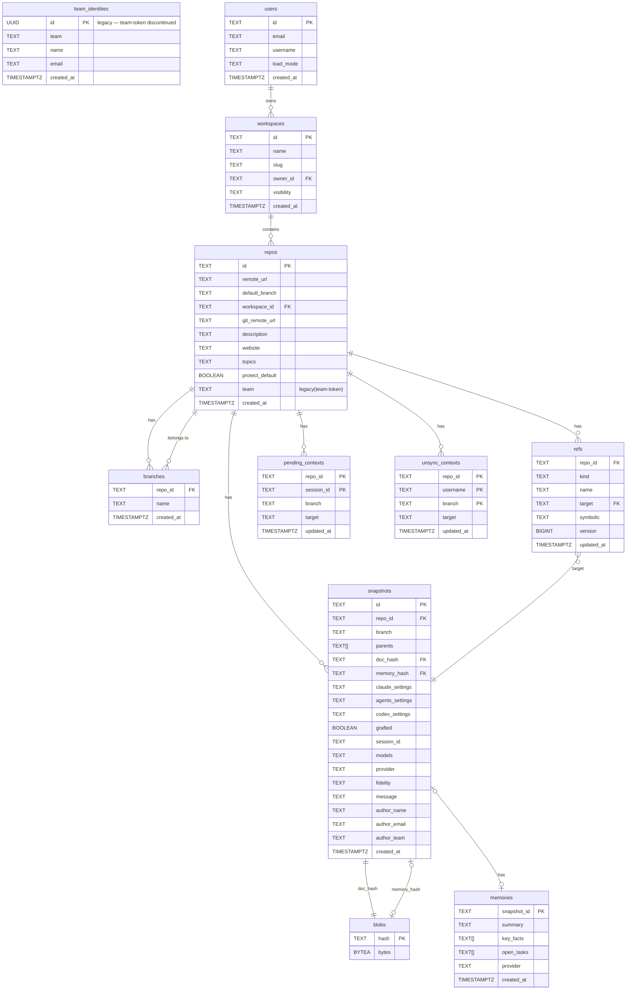

# schemas/ — Shared CLI, Backend, and Frontend Contracts

cxt keeps `cli/` and `backend/` in separate Go modules with independent domain types. The files in `schemas/` are the shared wire and persistence contracts used across the CLI, backend, and frontend.

## What This Directory Defines

| File | Role |
|---|---|
| `cir.schema.json` | CIR v1, the provider-independent canonical intermediate representation decoded from raw Claude and Codex JSONL. Changes require compatibility review. |
| `manifest.schema.json` | Manifest v1: repository refs, `snapshot_index`, and optional causal `memory_attachments` pointers used for push/pull have-want negotiation. Changes require compatibility review. |
| `openapi.yaml` | OpenAPI 3.1 REST contract shared by CLI, backend, and frontend. Route and field drift tests keep it aligned with the server. |
| `db/migrations/*.sql` | Ordered PostgreSQL migrations through 0036, covering repository objects, identity/workspaces, pending state, reflog, compaction, graft overlays, transcript/memory chunk storage, and scoped session refs. |

## DB Schema (ERDiagram)

## Usage Principles

1. **Object formats** — The CLI and frontend serialize JSON against `cir.schema.json` and `manifest.schema.json`. Go structs and TypeScript interfaces may be defined independently, but their fields must conform to these schemas.
2. **REST contract** — Both backend routes and the CLI HTTP client treat `openapi.yaml` as the source of truth. Update it first when adding or changing a path, then keep the CLI, backend, and frontend aligned.
3. **Database schema** — SQL files under `db/migrations/` are applied to backend PostgreSQL instances in order. The CLI and frontend never access the database directly; they use REST only.
4. **Compatibility** — Do not make backward-incompatible changes to the fields, types, or required sets in `cir.schema.json` or `manifest.schema.json` without an issue, migration plan, and maintainer approval. Adding fields also affects `"additionalProperties": false`.
